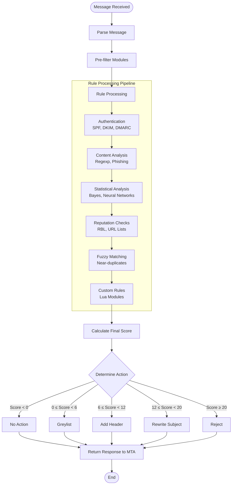
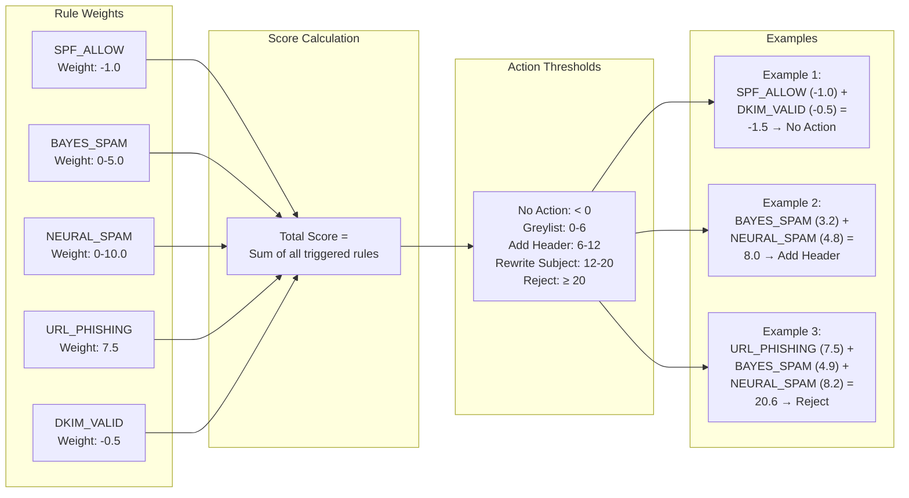

# Rspamd architecture

## Overview

Rspamd is a high-performance mail processing framework built on an event-driven, non-blocking architecture. It operates as a standalone service that integrates with Mail Transfer Agents (MTAs) through a well-defined HTTP/JSON API, maintaining strict isolation from MTA internals for enhanced security.

## Core Architecture

Rspamd's architecture consists of several key components working together to provide comprehensive mail processing capabilities:

### Main Components

- **Main Process**: Coordinates worker processes and handles configuration management
- **Normal Workers**: Handle message processing and HTTP requests  
- **Proxy Worker**: Provides Milter protocol support and forwarding capabilities
- **Controller Process**: Provides web interface and management API
- **Fuzzy Storage**: Manages fuzzy hashing for near-duplicate detection

### Message Processing Flow

Every message processed by Rspamd follows a structured pipeline that ensures thorough analysis while maintaining high performance.

```mermaid
graph TB
    subgraph "MTA Integration"
        MTA[Mail Transfer Agent]
        Milter[Milter Protocol]
        HTTP[HTTP API]
    end
    
    subgraph "Rspamd Core"
        Main[Main Process]
        Normal1[Normal Worker 1]
        Normal2[Normal Worker 2]
        Proxy[Proxy Worker]
        Controller[Controller Process]
        Fuzzy[Fuzzy Storage]
    end
    
    subgraph "Storage & Cache"
        Redis[Redis Cache]
        DB[Statistics DB]
        Files[Config Files]
    end
    
    subgraph "External Services"
        RBL[RBL Services]
        Reputation[Reputation APIs]
        LLM[LLM Services (GPT)]
        Custom[Custom Services]
    end
    
    MTA --> Milter
    MTA --> HTTP
    
    Milter --> Proxy
    HTTP --> Main
    
    Main --> Normal1
    Main --> Normal2
    Main --> Proxy
    Main --> Controller
    Main --> Fuzzy
    
    Normal1 --> Redis
    Normal2 --> Redis
    Proxy --> Redis
    
    Normal1 --> DB
    Normal1 --> RBL
    Normal1 --> Reputation
    Normal1 --> LLM
    Normal1 --> Custom
    
    Controller --> Redis
    Controller --> DB
    Controller --> Files
```

## Rules and Modules System

Rspamd uses a modular approach where functionality is implemented through **modules** that define **rules**. Each rule represents a specific message property or characteristic:



### Rule Examples
- `SPF_ALLOW` - message validated by SPF
- `BAYES_SPAM` - statistical spam classification
- `NEURAL_SPAM` - neural network spam detection
- `DKIM_VALID` - valid DKIM signature
- `URL_PHISHING` - phishing URL detected

### Module Types

Rspamd supports multiple module implementations:

**C Modules** (Internal)
- Embedded in the core binary
- High-performance critical functions
- Examples: DKIM, SPF, regexp

**Lua Modules** (External)  
- Full access to Rspamd Lua API
- Flexible and easily customizable
- Examples: multimap, rbl, phishing

**Advanced Plugins**
- Statistical and ML-based analysis
- Learn from existing symbols and patterns
- Provide adaptive classification

```mermaid
graph TB
    subgraph "Module Architecture"
        subgraph "C Modules (Internal)"
            SPF[SPF Module]
            DKIM[DKIM Module]
            Regexp[Regexp Module]
            Chartable[Chartable Module]
            Fuzzy[Fuzzy Check Module]
        end
        
        subgraph "Lua Modules (External)"
            Multimap[Multimap Module]
            RBL[RBL Module]
            Phishing[Phishing Module]
            Whitelist[Whitelist Module]
            Custom[Custom Lua Rules]
        end
        
        subgraph "Statistical & ML Plugins"
            Bayes[Bayesian Classifier]
            Neural[Neural Networks Plugin<br/>Perceptron clustering]
            Reputation[IP/URL Reputation]
            GPT[GPT Plugin<br/>LLM Integration]
        end
    end
    
    subgraph "Rspamd Core Engine"
        Scanner[Message Scanner]
        Symbols[Symbol Registry]
        Config[Configuration]
        API[Lua API]
    end
    
    subgraph "External Data Sources"
        Redis[(Redis Cache)]
        Database[(Statistics DB)]
        LLM[LLM Services]
        Files[Configuration Files]
    end
    
    SPF --> Symbols
    DKIM --> Symbols
    Regexp --> Symbols
    Chartable --> Symbols
    Fuzzy --> Symbols
    
    Multimap --> API
    RBL --> API
    Phishing --> API
    Whitelist --> API
    Custom --> API
    
    API --> Symbols
    
    Bayes --> Redis
    Neural --> Symbols
    Reputation --> Redis
    GPT --> LLM
    
    Bayes --> Symbols
    Neural --> Symbols
    Reputation --> Symbols
    GPT --> Symbols
    
    Scanner --> SPF
    Scanner --> DKIM
    Scanner --> Multimap
    Scanner --> Bayes
    
    Config --> Files
    Config --> Scanner
```



## Scoring and Actions System

### Metrics and Weights

Rules are assigned **weights** that represent their significance in determining message classification. The cumulative score determines the recommended action.

**Weight Guidelines:**
- Negative weights: decrease spam probability (ham indicators)
- Positive weights: increase spam probability (spam indicators)  
- Higher absolute values: more significant rules

### Action Thresholds

Based on the total score, Rspamd recommends one of several actions:

- **No action** (score < greylist): Message is likely legitimate
- **Greylist** (greylist ≤ score < add_header): Temporary delay recommended
- **Add header** (add_header ≤ score < rewrite_subject): Mark as likely spam
- **Rewrite subject** (rewrite_subject ≤ score < reject): Modify subject line
- **Reject** (score ≥ reject): Block message completely



### Dynamic Scoring

Advanced rules can provide **dynamic weights** based on confidence levels. For example:
- Bayesian classifier: weight varies from 0 to maximum based on probability
- Neural networks plugin: clustering-based confidence scoring
- Reputation plugins: score based on IP/URL history
- GPT plugin: LLM-based analysis with confidence scores

## Statistical Classification

Rspamd employs multiple statistical and machine learning algorithms:

### Bayesian Classification
- **OSB-Bayes algorithm** with 2-word windows
- Token-based message analysis
- Multiple backend support (Redis, SQLite, files)

### Neural Networks Plugin
- **Perceptron-based clustering** using existing symbols as features
- Adaptive learning from symbol patterns
- Provides additional classification signals

### Fuzzy Hashing
- **Near-duplicate detection** using fuzzy hashes
- Distributed fuzzy storage
- Bulk message identification

## Protocol and Integration

### HTTP API
Rspamd communicates through HTTP/JSON protocol:

- **RESTful endpoints** for all operations
- **JSON message format** for requests/responses  
- **Authentication and SSL/TLS** support
- **Compression support** (zstd) for efficient data transfer

### MTA Integration
- **Milter protocol** support via proxy worker for Postfix/Sendmail
- **HTTP proxy mode** for load balancing and forwarding
- **Direct HTTP integration** for custom MTA setups
- **After-queue processing** for existing mail flows

## Performance Optimizations

### Rule Scheduling
Rspamd optimizes rule execution through intelligent scheduling:

1. **Negative rules first**: Prevent false positives early
2. **Weight-based priority**: Important rules execute first  
3. **Frequency optimization**: Common rules get priority
4. **Early termination**: Stop processing when definitive result reached

### Caching and Memory Management
- **Redis caching** for statistical data
- **Memory-mapped files** for fast data access
- **Connection pooling** for external services
- **Asynchronous I/O** for non-blocking operations

## Configuration and Management

### Configuration System
- **UCL format** (Universal Configuration Language)
- **Hierarchical structure** with includes and overrides
- **Runtime reloading** without service interruption
- **Validation and testing** modes

### Signal Management
- **SIGHUP**: Graceful restart with config reload
- **SIGTERM**: Clean shutdown
- **SIGUSR1**: Log file rotation
- **SIGUSR2**: Worker respawn

## Extensibility

### Lua Framework
Rspamd provides a comprehensive Lua API enabling:

- **Custom rule development**
- **External service integration** 
- **Protocol extensions**
- **Advanced message manipulation**
- **Machine learning model integration**

### Plugin Architecture
- **Composable functionality** through plugins
- **Event-driven hooks** for message processing stages
- **Shared data structures** between modules
- **Runtime module loading/unloading**

