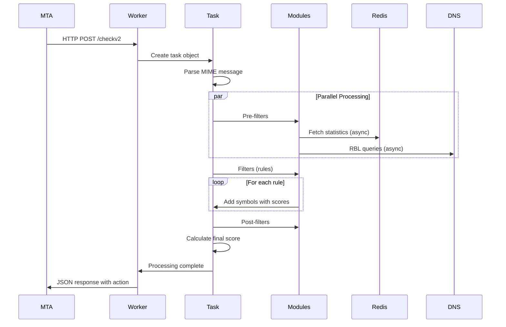

# Rspamd Architecture

## Introduction

Rspamd is a high-performance email processing daemon designed to handle millions of messages per day with minimal resource usage. Its architecture is built on several key principles:

- **Event-driven, non-blocking I/O** for handling thousands of concurrent connections
- **Multi-process model** with isolated worker processes for security and stability
- **Modular plugin system** enabling flexible functionality extension
- **Async-first design** for efficient external service integration
- **Memory efficiency** through custom memory pool allocators
- **Zero-copy operations** where possible to minimize overhead

This document describes the internal architecture, core components, and design patterns used throughout Rspamd.

## Process Model

### Overview

Rspamd uses a **master-worker process model** similar to nginx, with one main process spawning multiple worker processes:

```
┌─────────────────────────────────────────────────────────────┐
│                      Main Process                           │
│  - Configuration management                                 │
│  - Worker lifecycle management                              │
│  - Signal handling                                          │
│  - No message processing                                    │
└─────────────────┬───────────────────────────────────────────┘
                  │
                  ├─────────────┬────────────┬────────────┬─────────────┐
                  ▼             ▼            ▼            ▼             ▼
          ┌───────────┐ ┌───────────┐ ┌──────────┐ ┌──────────┐ ┌──────────┐
          │  Normal   │ │  Normal   │ │  Proxy   │ │Controller│ │  Fuzzy   │
          │ Worker 1  │ │ Worker 2  │ │  Worker  │ │  Worker  │ │  Worker  │
          └───────────┘ └───────────┘ └──────────┘ └──────────┘ └──────────┘
```

### Main Process

The main process is responsible for:

1. **Configuration Loading**: Parses UCL configuration files and validates settings
2. **Worker Spawning**: Forks worker processes with appropriate privileges
3. **Signal Handling**: Responds to system signals (HUP, TERM, USR1, USR2)
4. **Privilege Management**: Drops privileges after binding to privileged ports
5. **Worker Monitoring**: Restarts crashed workers automatically
6. **Log Coordination**: Manages centralized logging

The main process **never processes messages** directly, maintaining a clean separation of concerns.

### Worker Types

#### Normal Worker

The primary message processing worker that:

- Accepts HTTP connections with email messages
- Performs spam/ham classification
- Executes all configured rules and modules
- Communicates with external services (Redis, DNS, RBLs)
- Returns classification results via JSON

**Configuration:**
```nginx
worker "normal" {
    bind_socket = "*:11333";
    count = 4;  # Number of worker processes
    .include(try=true,priority=1,duplicate=merge) "$LOCAL_CONFDIR/local.d/worker-normal.inc"
}
```

**Typical deployment:** 1-4 workers per CPU core, depending on workload.

#### Proxy Worker

Provides Milter protocol bridging and load balancing:

- Accepts Milter protocol connections from MTAs
- Translates Milter to Rspamd HTTP protocol
- Can forward requests to multiple normal workers
- Supports encryption ([HTTPCrypt protocol](encryption.md))
- Handles connection pooling and retries

**Use cases:**
- Postfix/Sendmail integration via Milter
- Load balancing across multiple Rspamd instances
- Encryption proxy for untrusted networks
- Protocol translation for legacy systems

#### Controller Worker

Management and web interface worker:

- Serves WebUI for administration
- Provides REST API for learning and configuration
- Handles authentication with password/enable password
- Supports read-only and read-write modes
- Exposes metrics in OpenMetrics format

**Security note:** Should be bound to localhost or protected by firewall in production.

#### Fuzzy Storage Worker

Specialized worker for fuzzy hash storage:

- Maintains database of fuzzy hashes for near-duplicate detection
- Handles add/delete/check operations
- Supports sharding and replication
- Uses custom protocol over UDP/TCP
- Implements expiration and rotation policies

See [fuzzy_storage worker documentation](/workers/fuzzy_storage) for details.

## Event-Driven Architecture

### Event Loop

Rspamd uses **libevent** (or **libev** on some platforms) for event-driven I/O:

```
┌──────────────────────────────────────────────────────────┐
│                   Event Loop                             │
├──────────────────────────────────────────────────────────┤
│                                                          │
│  ┌────────────┐  ┌────────────┐  ┌────────────┐        │
│  │ I/O Events │  │   Timers   │  │  Signals   │        │
│  └──────┬─────┘  └──────┬─────┘  └──────┬─────┘        │
│         │               │                │              │
│         └───────────────┴────────────────┘              │
│                         │                               │
│                    Event Queue                          │
│                         │                               │
│         ┌───────────────┴───────────────┐              │
│         ▼                               ▼              │
│  ┌─────────────┐                 ┌─────────────┐       │
│  │  Callbacks  │                 │  Callbacks  │       │
│  └─────────────┘                 └─────────────┘       │
└──────────────────────────────────────────────────────────┘
```

### Non-Blocking I/O

All I/O operations in Rspamd are non-blocking:

1. **Network I/O**: Socket operations return immediately, callbacks invoked when data available
2. **DNS Queries**: Asynchronous DNS resolution via c-ares library
3. **Redis Operations**: Non-blocking Redis client (hiredis) with connection pooling
4. **External Services**: HTTP requests to external services (RBLs, reputation APIs) are async

This allows a single worker to handle hundreds of concurrent message scans without blocking.

### Asynchronous Session Lifecycle

A typical message processing session:

```
Client Connect
     │
     ├─ Socket Accept (non-blocking)
     │
     ├─ HTTP Request Parse (may require multiple reads)
     │
     ├─ Message Processing Start
     │   │
     │   ├─ DNS Queries (async, multiple in parallel)
     │   ├─ Redis Lookups (async)
     │   ├─ External HTTP Requests (async)
     │   ├─ Rule Processing (CPU-bound, sync)
     │   │
     │   └─ Wait for all async operations to complete
     │
     ├─ Result Aggregation
     │
     ├─ HTTP Response Send (non-blocking)
     │
     └─ Socket Close
```

All blocking operations (DNS, Redis, HTTP) run concurrently, maximizing throughput.

## Message Processing Pipeline

### High-Level Flow



### Task Object

The **task object** is the central data structure representing a message being processed:

```c
struct rspamd_task {
    /* Message data */
    struct rspamd_message *message;      // Parsed MIME structure
    const guchar *msg;                   // Raw message bytes
    gsize msg_len;                       // Message length

    /* Processing context */
    struct rspamd_task_session *s;       // Async session for pending operations
    struct event_base *ev_base;          // Event loop

    /* Results */
    GHashTable *results;                 // Symbol results by metric
    double score;                        // Current score

    /* Metadata */
    rspamd_inet_addr_t *from_addr;      // Sender IP
    gchar *deliver_to;                   // Recipient
    gchar *user;                         // SMTP AUTH user

    /* Memory management */
    rspamd_mempool_t *task_pool;        // Memory pool for task
};
```

**Key characteristics:**

- **Self-contained**: All message data and processing state in one structure
- **Memory pool**: All allocations use task-specific pool, freed at once when task completes
- **Async session**: Tracks pending async operations (DNS, Redis, HTTP)
- **Zero-copy**: Message data referenced from original buffer when possible

### Processing Phases

#### 1. Pre-filters

Run before main rule processing:

- **Purpose**: Early decisions, data preparation, short-circuit logic
- **Examples**:
  - Whitelisting (bypass spam checks for trusted senders)
  - Rate limiting (temporary reject if limits exceeded)
  - Settings application (load user-specific configuration)
- **Behavior**: Can set `pre_result` to skip remaining processing

```lua
-- Example pre-filter in Lua
rspamd_config:register_pre_filter(function(task)
    local ip = task:get_from_ip()
    if is_trusted_ip(ip) then
        task:set_pre_result('accept', 'Trusted IP')
        return true  -- Skip further processing
    end
end)
```

#### 2. Filters (Main Rules)

Core spam detection logic:

- **Rule types**: C modules and Lua plugins
- **Execution**: Can be synchronous (CPU-bound) or asynchronous (I/O-bound)
- **Symbols**: Each rule registers symbols with scores
- **Parallelism**: Async rules execute concurrently

**Common filter modules:**

| Module | Type | Purpose |
|--------|------|---------|
| `spf` | C | SPF validation |
| `dkim` | C | DKIM signature verification |
| `regexp` | C | High-performance regex matching |
| `bayes` | C | Statistical classification (OSB-Bayes) |
| `multimap` | Lua | Generic map-based rules |
| `rbl` | Lua | DNS blacklist queries |
| `phishing` | Lua | Phishing URL detection |
| `neural` | C | Neural network classification |

#### 3. Post-filters

Run after all rules complete:

- **Purpose**: Final adjustments, actions, logging
- **Examples**:
  - Composites (combine symbols into meta-symbols)
  - Force actions (override score-based actions)
  - Metadata export (send results to external systems)
- **Behavior**: Can modify final action

#### 4. Idempotent Filters

Special filters that run after all other processing:

- **Purpose**: Generate metadata, extract information
- **Execution order**: Run strictly after all filters, post-filters, and composites
- **Examples**: Email extraction, URL extraction
- **Behavior**: Never modify results, pure data extraction
- **Use case**: Safe to call at any point in code, but actual execution is deferred until the end

### Async Session Management

Rspamd uses an **async session** mechanism to track pending operations:

```c
struct rspamd_async_session {
    GHashTable *events;          // Pending async events
    event_finalizer_t fin;       // Callback when all events complete
    void *user_data;             // User data for finalizer
};
```

**How it works:**

1. **Register event**: When starting async operation, register it with session
2. **Track completion**: Operation callback marks event as complete
3. **Finalize**: When all events complete, session finalizer is called
4. **Timeout**: If events don't complete within timeout, force finalization

**Example async DNS lookup:**

```c
// Register async event
session_event = rspamd_session_add_event(task->s, dns_callback, task, "dns");

// Start DNS query
rdns_make_request_full(resolver, dns_callback, task,
                       timeout, max_retries, query, type);

// When DNS response arrives, dns_callback is invoked
void dns_callback(struct rdns_reply *reply, void *arg) {
    struct rspamd_task *task = arg;

    // Process DNS reply
    process_dns_result(task, reply);

    // Remove event from session (may trigger finalization)
    rspamd_session_remove_event(task->s, session_event);
}
```

## Module System

### Module Architecture

Rspamd modules are the primary extension mechanism:

```
┌─────────────────────────────────────────────────────────┐
│                    Module Interface                     │
├─────────────────────────────────────────────────────────┤
│                                                         │
│  module_init()      - Initialize module structures      │
│  module_config()    - Parse configuration               │
│  module_reconfig()  - Apply config changes              │
│  module_attach()    - Register callbacks                │
│                                                         │
└─────────────────────────────────────────────────────────┘
         │
         ├──────────────┬──────────────┬──────────────┐
         ▼              ▼              ▼              ▼
    ┌────────┐    ┌─────────┐    ┌─────────┐   ┌─────────┐
    │   C    │    │   Lua   │    │ Virtual │   │  Rule   │
    │ Module │    │  Module │    │ Module  │   │ Module  │
    └────────┘    └─────────┘    └─────────┘   └─────────┘
```

### C Modules

Compiled into Rspamd binary or loaded as dynamic libraries:

**Advantages:**
- Maximum performance
- Direct access to internals
- Can hook into low-level events

**Disadvantages:**
- Requires compilation
- Less flexible than Lua
- Harder to maintain

**Examples:** `spf`, `dkim`, `regexp`, `chartable`, `fuzzy_check`

### Lua Modules

Written in Lua with full API access:

**Advantages:**
- Easy to write and modify
- No compilation required
- Hot-reload support
- Full Rspamd API access

**Disadvantages:**
- Slightly slower than C (but JIT helps)
- Limited to Lua API surface

**Examples:** `multimap`, `rbl`, `phishing`, `whitelist`

**Module structure:**

```lua
-- Module registration
local mod_name = 'my_module'

-- Configuration parsing
local function configure_module(cfg)
    local opts = rspamd_config:get_all_opt(mod_name)
    if not opts then return false end

    -- Parse options
    return true
end

-- Symbol callback
local function my_symbol_callback(task)
    -- Check message
    if condition_met(task) then
        task:insert_result('MY_SYMBOL', 1.0, 'reason')
    end
end

-- Register symbol
rspamd_config:register_symbol({
    name = 'MY_SYMBOL',
    type = 'normal',
    callback = my_symbol_callback,
    score = 5.0,
    group = 'my_group'
})

-- Module initialization
if configure_module(rspamd_config) then
    rspamd_config:register_module_option(mod_name, 'enabled', 'boolean')
end
```

### Virtual Modules

Modules without code, used for organizing symbols:

```lua
-- In rspamd.conf.local
group "my_virtual_module" {
    symbols {
        "SYMBOL_ONE" {
            score = 5.0;
        }
        "SYMBOL_TWO" {
            score = 3.0;
        }
    }
}
```

### Rule Modules

Specialized modules for specific rule types:

- **Regexp module**: High-performance regex matching with PCRE/Hyperscan
- **Multimap module**: Generic map-based checks (IP, domain, header matching)
- **Composites module**: Combine symbols using boolean expressions

## Symbol and Score System

### Symbol Registration

Symbols are registered with metadata:

```lua
rspamd_config:register_symbol({
    name = 'MY_SYMBOL',           -- Symbol name
    type = 'normal',              -- Symbol type (normal, callback, virtual)
    callback = my_callback,       -- Callback function
    score = 5.0,                  -- Default score
    group = 'my_group',           -- Group for organization
    description = 'Checks X',     -- Human-readable description

    -- Execution control
    priority = 10,                -- Execution priority (higher = earlier)
    one_shot = true,              -- Execute only once per message

    -- Async control
    flags = 'explicit_disable',   -- Flags controlling behavior
})
```

### Symbol Dependencies

Symbols can depend on other symbols:

```lua
rspamd_config:register_dependency('DMARC_POLICY_ALLOW', 'R_DKIM_ALLOW')
```

This ensures `R_DKIM_ALLOW` runs before `DMARC_POLICY_ALLOW`.

### Score Calculation

Final score is calculated as:

```
Total Score = Σ (symbol_score × symbol_weight × multiplier)
```

Where:
- **symbol_score**: Base score from configuration
- **symbol_weight**: Dynamic weight returned by symbol (typically 1.0)
- **multiplier**: Per-symbol or per-group multiplier

### Metric Groups

Symbols are organized into groups for management:

```lua
group "spf" {
    max_score = 5.0;  -- Cap group's contribution to total score

    symbols {
        "R_SPF_ALLOW" { score = -2.0; }
        "R_SPF_FAIL" { score = 3.0; }
        "R_SPF_SOFTFAIL" { score = 1.0; }
    }
}
```

Groups allow:
- Score capping (max_score)
- Group-wide enable/disable
- Organizational hierarchy

## Statistical Modules

### Bayesian Classifier

Rspamd uses **OSB-Bayes** (Orthogonal Sparse Bigrams):

**Algorithm:**
1. **Tokenization**: Extract tokens from message (words, headers, etc.)
2. **Bigram generation**: Create token pairs with positional information
3. **Hashing**: Hash bigrams into fixed-size feature space
4. **Classification**: Compare against learned spam/ham distributions

**Storage backends:**
- **Redis**: Recommended for production (fast, scalable)
- **SQLite**: Suitable for single-machine deployments
- **File**: Legacy backend, not recommended

**Learning:**

```bash
# Learn as spam
rspamc learn_spam < spam_message.eml

# Learn as ham
rspamc learn_ham < ham_message.eml
```

**Auto-learning:**

Can automatically learn from high-confidence classifications:

```lua
classifier "bayes" {
    tokenizer {
        name = "osb";
    }
    cache {
        backend = "redis";
    }
    autolearn = true;
    autolearn {
        spam_threshold = 15.0;  -- Learn as spam if score > 15
        ham_threshold = -5.0;   -- Learn as ham if score < -5
    }
}
```

### Neural Networks Plugin

Uses **perceptron-based clustering** with existing symbols as features:

**How it works:**

1. **Feature extraction**: Use triggered symbols as input features
2. **Training**: Learn from explicit learning (via `/learnspam`) or auto-learning
3. **Prediction**: Output score based on symbol pattern
4. **Multiple networks**: Can train separate networks for different message types

**Advantages over Bayes:**
- Learns from symbol patterns, not message content
- Adapts to your specific rule configuration
- Provides complementary signal to Bayes

**Configuration:**

```lua
neural {
    servers = "localhost:6379";  # Redis for model storage

    train {
        max_trains = 1000;        # Train after 1000 samples
        learning_rate = 0.01;
    }

    rules {
        "NEURAL_SPAM" {
            spam_score = 5.0;
            ham_score = -5.0;
        }
    }
}
```

### Fuzzy Hashes

Near-duplicate detection using fuzzy hashing:

**Algorithm:**
- Extracts text content from message
- Computes multiple hashes (for text, images, attachments)
- Compares against database of known spam/ham hashes
- Returns match percentage

**Use cases:**
- Bulk spam detection
- Spam campaign identification
- Shared reputation across multiple servers

See [fuzzy storage documentation](/tutorials/fuzzy_storage) for details.

## Memory Management

### Memory Pools

Rspamd uses custom **memory pools** for efficient allocation:

```c
rspamd_mempool_t *pool = rspamd_mempool_new(pool_size, "task");

// Allocate from pool
void *ptr = rspamd_mempool_alloc(pool, size);

// All allocations freed at once
rspamd_mempool_delete(pool);
```

**Advantages:**

1. **No individual frees**: Bulk deallocation when pool destroyed
2. **Fast allocation**: Simple bump-pointer allocation
3. **Reduced fragmentation**: Allocations from contiguous regions
4. **Leak prevention**: All memory freed with pool

**Pool types:**

- **Task pool**: Per-message, destroyed after processing
- **Config pool**: Lives for entire config lifetime
- **Module pools**: Per-module, destroyed on module unload

### Zero-Copy Operations

Where possible, Rspamd avoids copying data:

- **Message body**: References original buffer, no copy
- **Header values**: Point into parsed message buffer
- **String views**: Use pointer+length without allocating new strings

This significantly reduces memory usage and improves cache efficiency.

## Communication and Protocols

### HTTP Protocol

Rspamd uses HTTP as its primary protocol. See [Protocol Documentation](protocol.md) for details.

**Request flow:**

1. Client sends POST request with message body
2. HTTP headers contain metadata (IP, envelope, etc.)
3. Rspamd processes message
4. Returns JSON response with results

**Compression:**

Supports `zstd` compression for large messages:

```http
POST /checkv2 HTTP/1.1
Content-Encoding: zstd
Flags: zstd
```

### HTTPCrypt Encryption

For secure communication, Rspamd supports the HTTPCrypt protocol. See [Encryption Documentation](encryption.md) for complete details.

**Key features:**
- X25519 key exchange with forward secrecy
- XChaCha20-Poly1305 authenticated encryption
- Ephemeral keys per connection
- Base32-encoded key identification

**Usage:**

```bash
# Generate keypair
rspamadm keypair

# Configure in worker
worker "normal" {
    bind_socket = "*:11333";
    keypair {
        pubkey = "...";
        privkey = "...";
    }
}
```

### Inter-Process Communication

Workers communicate via:

1. **Shared memory**: For statistics and counters (read-only)
2. **Control socket**: Commands from main process to workers
3. **Redis**: Shared state across workers and instances

Workers are **isolated** - no direct IPC between worker processes.

## Configuration System

### UCL Format

Rspamd uses **UCL (Universal Configuration Language)**:

```nginx
# Comments start with #

# Simple values
key = "value";
number = 123;
boolean = true;

# Objects
section {
    nested_key = "value";
}

# Arrays
list = ["item1", "item2"];

# Includes
.include "$CONFDIR/local.d/rspamd.local.conf"

# Macros
.define MY_VAR "value"
.define MY_LIST ["a", "b", "c"]
```

**Features:**
- Nginx-like syntax (familiar to sysadmins)
- Comments and macros
- Includes with priority and merge modes
- Type validation
- Variable substitution

### Configuration Override

Rspamd supports layered configuration:

```
/etc/rspamd/rspamd.conf              [base]
    ├── /etc/rspamd/modules.d/*.conf [module defaults]
    ├── /etc/rspamd/local.d/*.conf   [local overrides - merge]
    └── /etc/rspamd/override.d/*.conf [local overrides - replace]
```

**Override modes:**

- **local.d**: Merges with existing configuration (recommended)
- **override.d**: Completely replaces section (for advanced users)

### Runtime Reloading

Rspamd supports configuration reload without restart:

```bash
# Send HUP signal
killall -HUP rspamd

# Or via rspamadm
rspamadm configtest  # Test config first
systemctl reload rspamd
```

**Reload process:**

1. Main process receives SIGHUP
2. Parses new configuration
3. Validates configuration
4. Spawns new workers with new config
5. Waits for old workers to finish current tasks
6. Terminates old workers
7. Old workers drain connections gracefully

No messages are dropped during reload.

## Performance Architecture

### Rule Scheduling

Rspamd optimizes rule execution through intelligent scheduling:

#### Priority-Based Execution

Rules with higher priority execute first:

```lua
rspamd_config:register_symbol({
    name = 'CRITICAL_CHECK',
    priority = high,  -- Numeric value, higher = earlier
    callback = callback_fn
})
```

**Priority guidelines:**
- **High priority**: Fast rules that can short-circuit processing
- **Normal priority**: Standard checks
- **Low priority**: Expensive rules, run only if needed

#### Frequency Optimization

Frequently-triggered rules are cached and optimized:

- Hot rules kept in CPU cache
- Common patterns compiled to bytecode
- Regex compiled and cached

#### Early Termination

If score exceeds reject threshold significantly, remaining rules may be skipped:

```lua
task:set_flag('skip_process')  -- Stop processing
```

### Caching Strategy

#### Redis Caching

Used for:
- Bayesian statistics
- Neural network models
- Reputation data
- Greylisting state
- Rate limiting counters

**Connection pooling:**

```lua
redis {
    servers = "localhost:6379";
    db = 0;
    timeout = 1s;

    # Connection pool settings
    max_connections = 100;
    idle_timeout = 60s;
}
```

#### DNS Caching

Built-in DNS cache reduces external queries:

```lua
dns {
    timeout = 1s;
    retransmits = 2;

    # Cache settings
    cache_size = 1000;
    cache_ttl = 60;
}
```

#### Negative Caching

Failed lookups are cached to avoid repeated queries:

- DNS NXDOMAIN responses
- Redis connection failures
- RBL timeout results

### Connection Pooling

Rspamd maintains connection pools for:

1. **Redis connections**: Per-worker pool with configurable size
2. **HTTP connections**: Reused for external service calls
3. **DNS sockets**: Shared across all queries

This reduces connection overhead and improves latency.

## Security Architecture

### Process Isolation

Workers run with minimal privileges:

1. Main process starts as root (to bind privileged ports)
2. After binding, drops privileges to `_rspamd` user
3. Workers inherit non-root privileges
4. Each worker has isolated memory space (no shared memory for processing)

### Sandboxing

On supported platforms, Rspamd can use:

- **Capsicum** (FreeBSD): Capability-based security
- **Seccomp** (Linux): Syscall filtering
- **Pledge** (OpenBSD): Promise-based restrictions

### Input Validation

All external input is validated:

- HTTP headers parsed with strict validation
- Message size limits enforced
- MIME parsing with malformed input handling
- Configuration validated before application

### Memory Safety

- Memory pools prevent leaks and use-after-free
- Bounds checking on all array accesses
- String operations use length-aware functions
- No dynamic SQL - all queries are parameterized

## Extensibility Points

### Lua API

Comprehensive Lua API provides access to:

- **Message parsing**: Headers, body, MIME parts, attachments
- **Network operations**: HTTP requests, DNS queries, Redis commands
- **Symbol manipulation**: Insert, modify, remove symbols
- **Configuration**: Access and override settings
- **Utilities**: Cryptography, encoding, hashing, string operations

See [Lua API documentation](/lua/index) for complete reference.

### Hooks and Callbacks

Modules can register callbacks for various events:

```lua
-- Pre-filter: runs before main processing
rspamd_config:register_pre_filter(callback)

-- Symbol: main processing
rspamd_config:register_symbol({name = 'SYM', callback = callback})

-- Post-filter: runs after all rules
rspamd_config:register_post_filter(callback)

-- Idempotent: runs after all other processing (filters, post-filters, composites)
rspamd_config:register_symbol({name = 'SYM', type = 'idempotent', callback = callback})
```

### External Service Integration

Easy integration with external services:

```lua
local function check_external_service(task)
    local function callback(err, code, body)
        if not err and code == 200 then
            -- Process response
            local result = parse_json(body)
            if result.is_spam then
                task:insert_result('EXTERNAL_SPAM', 1.0)
            end
        end
    end

    rspamd_http.request({
        task = task,
        url = 'https://api.example.com/check',
        method = 'POST',
        body = task:get_content(),
        callback = callback
    })
end
```

## Monitoring and Observability

### Metrics Export

Rspamd exports metrics in OpenMetrics format:

```bash
curl http://localhost:11334/metrics
```

**Available metrics:**
- Message processing rates
- Action distribution (reject, add header, etc.)
- Module-specific statistics
- Resource usage (memory, connections)
- Latency histograms

### Logging

Structured logging with multiple levels:

```lua
logging {
    type = "file";
    filename = "/var/log/rspamd/rspamd.log";
    level = "info";

    # Log format
    log_format = "default";

    # Colored output for console
    log_color = yes;
}
```

**Log levels:**
- `error`: Critical errors only
- `warning`: Important issues
- `info`: Normal operations (default)
- `debug`: Verbose debugging

### History

Recent scan results are stored in memory (or Redis):

```bash
# Via HTTP API
curl http://localhost:11334/history

# Via rspamc
rspamc history
```

Useful for debugging and auditing.

## Scalability and Deployment Patterns

### Vertical Scaling

Single-machine scaling:

- **Worker count**: 1-4 workers per CPU core
- **Memory**: 256-512 MB per worker typical
- **Connections**: Thousands per worker with async I/O

**Recommended:** Start with `count = num_cpus` and tune based on load.

### Horizontal Scaling

Multi-machine deployment patterns:

#### 1. Proxy-Based Load Balancing

```
              ┌──────────────┐
              │     MTA      │
              └──────┬───────┘
                     │
                     ▼
              ┌──────────────┐
              │ Rspamd Proxy │
              │  (mirror: Y) │
              └──────┬───────┘
                     │
         ┏━━━━━━━━━━━┻━━━━━━━━━━━┓
         ▼ (master)              ▼ (mirror)
  ┌─────────────┐          ┌─────────────┐
  │  Rspamd 1   │          │  Rspamd 2   │
  │  (normal)   │          │  (normal)   │
  └─────────────┘          └─────────────┘
         │                        │
         └────────┬───────────────┘
                  ▼
           ┌─────────────┐
           │    Redis    │
           └─────────────┘
```

**Note:** Proxy can be configured for load balancing or mirroring:
- **Load balancing**: Distributes requests (default)
- **Mirroring**: Sends requests to all backends, uses first response

**Pros:**
- Simple setup
- Rspamd proxy handles load balancing
- Automatic failover

**Cons:**
- Proxy is single point of failure (can be replicated)
- Additional network hop

#### 2. DNS Round-Robin

```
         ┌──────────────┐
         │     MTA      │
         └──────┬───────┘
                │
                ▼
         DNS: rspamd.local
         → 10.0.1.1, 10.0.1.2
                │
    ┏━━━━━━━━━━━┻━━━━━━━━━━━┓
    ▼                        ▼
┌─────────────┐      ┌─────────────┐
│  Rspamd 1   │      │  Rspamd 2   │
│ 10.0.1.1    │      │ 10.0.1.2    │
└─────────────┘      └─────────────┘
```

**Pros:**
- No single point of failure
- Simple, no proxy needed

**Cons:**
- Client must implement failover
- No session affinity

#### 3. Hardware Load Balancer

Use HAProxy, nginx, or hardware LB:

**Pros:**
- Enterprise-grade reliability
- Advanced features (SSL termination, health checks)
- Session affinity if needed

**Cons:**
- Additional component to manage
- More complex setup

### Shared State

For multi-instance deployments, use Redis for:

- Bayesian statistics
- Neural network models
- Greylisting
- Ratelimiting
- Reputation

All instances must connect to same Redis (or Redis cluster).

## Summary

Rspamd's architecture provides:

- **High performance** through event-driven, non-blocking I/O
- **Scalability** via multi-process model and horizontal scaling
- **Flexibility** through comprehensive Lua API and plugin system
- **Reliability** with process isolation and graceful degradation
- **Security** via sandboxing, input validation, and memory safety
- **Maintainability** through modular design and runtime reloading

This design allows Rspamd to handle millions of messages per day on modest hardware while remaining extensible and easy to customize.

## Further Reading

- [Protocol Documentation](protocol.md) - HTTP/JSON protocol details
- [Encryption Documentation](encryption.md) - HTTPCrypt encryption protocol
- [Sync/Async Model](sync_async.md) - Deep dive into async processing
- [Writing Rules](writing_rules.md) - Guide to creating custom rules
- [Lua API Reference](/lua/index) - Complete API documentation
