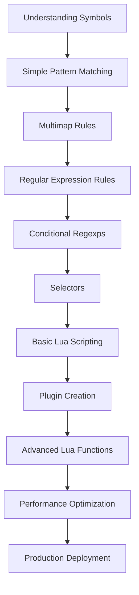

# Rule Writing Workshop

This workshop teaches you to create effective custom rules for Rspamd through progressive learning. We start with simple concepts and build toward complex, production-ready rules that solve real-world spam filtering challenges.

## Learning Path Overview



See the Tool Selection Guide for when to use each tool: [/guides/configuration/tool-selection](/guides/configuration/tool-selection)

## Prerequisites

- Working Rspamd installation - see [Installation](/getting-started/installation)
- Basic configuration understanding - see [Configuration fundamentals](/guides/configuration/fundamentals)
- Command line comfort and a safe test environment

## Level 1: Understanding Symbols

### Symbol anatomy

```lua
rspamd_config:register_symbol({
  name = 'MY_CUSTOM_RULE',
  score = 2.5,
  description = 'Detects something bad',
  callback = my_function,
  type = 'normal'
})
```

### Your first symbol

```lua
-- /etc/rspamd/local.d/custom_rules.lua
local function always_fires(task)
  return true
end

rspamd_config:register_symbol({
  name = 'WORKSHOP_FIRST_RULE',
  score = 0.1,
  description = 'My first custom rule - always fires',
  callback = always_fires
})
```

## Level 2: Simple Pattern Matching

```lua
local function check_sender_domain(task)
  local from = task:get_from('mime')
  if from and from[1] and from[1]['domain'] == 'suspicious-domain.com' then
    return true
  end
  return false
end

rspamd_config:register_symbol({
  name = 'SUSPICIOUS_SENDER_DOMAIN',
  score = 5.0,
  description = 'Message from suspicious domain',
  callback = check_sender_domain
})
```

## Level 3: Multimap Rules

```hcl
BAD_DOMAINS {
  type = "from";
  map = "/etc/rspamd/bad_domains.map";
  score = 8.0;
}
```

## Level 4: Regular Expression Rules

```lua
local function check_credit_cards(task)
  local text_parts = task:get_text_parts()
  if text_parts then
    for _, part in ipairs(text_parts) do
      local content = tostring(part:get_content())
      local cc_pattern = '%d%d%d%d[%s%-]?%d%d%d%d[%s%-]?%d%d%d%d[%s%-]?%d%d%d%d'
      if string.match(content, cc_pattern) then
        return true, 1.0
      end
    end
  end
  return false
end
```

## Level 4.1: Conditional Regular Expressions

Use `re_conditions` to validate complex patterns efficiently and avoid false positives. This lets you keep regexps fast while confirming matches with Lua.

```lua
-- Example inspired by rules/bitcoin.lua
config.regexp['BITCOIN_ADDR'] = {
  re = string.format('(%s) + (%s) > 0', normal_wallet_re, btc_bleach_re),
  expression_flags = { 'noopt' },
  re_conditions = {
    [normal_wallet_re] = function(task, txt, s, e)
      local word = lua_util.str_trim(txt:sub(s + 1, e))
      local valid = is_traditional_btc_address(word)
      if valid then
        task:insert_result('BITCOIN_ADDR', 1.0, word)
        return true
      end
      return false
    end,
    [btc_bleach_re] = function(task, txt, s, e)
      local word = tostring(lua_util.str_trim(txt:sub(s + 1, e)))
      local valid = is_segwit_bech32_address(task, word)
      if valid then
        task:insert_result('BITCOIN_ADDR', 1.0, word)
        return true
      end
      return false
    end,
  },
}
```

Tips:
- Keep regexps bounded and strict
- Use `re_conditions` to confirm structure/checksums

## Level 5: Selectors

Selectors extract and transform data from a message and can be reused across modules (regexp, multimap, ratelimit, reputation, etc.). See the full reference: [/configuration/selectors](/configuration/selectors)

Minimal examples:

```hcl
# /etc/rspamd/local.d/multimap.conf
RISKY_SUBJECT_SELECTOR {
  type = "selector";
  selector = "header('Subject').lower";
  map = "/etc/rspamd/maps/risky_subjects.list";
  score = 3.0;
}
```

You can also feed selectors into regexp rules by registering them first:

```lua
rspamd_config:register_re_selector('user_subj', "user.lower;header('Subject').lower", ' ')

config['regexp']['USER_SUBJECT_MATCH'] = {
  re = 'user_subj=/^admin .* urgent/{selector}',
  score = 2.0,
  one_shot = true,
}
```

## Level 6: Basic Lua Scripting

```lua
local function explore_task_object(task)
  local logger = require "rspamd_logger"
  logger.infox(task, "Subject: %s", task:get_header('Subject') or 'N/A')
  return false
end

rspamd_config:register_symbol({
  name = 'TASK_EXPLORER',
  score = 0.0,
  description = 'Explores task object properties',
  callback = explore_task_object
})
```

## Level 7: Plugin Creation

Use a plugin when you need configurable, reusable multi-symbol logic.

```lua
-- /etc/rspamd/local.d/my_plugin.lua (deployed in the right place for your setup)
local lua_util = require "lua_util"

local M = 'my_plugin'

local function check_one(task)
  if task:get_header('X-Flag') == 'on' then
    task:insert_result('MY_PLUGIN_SYMBOL', 1.0)
  end
end

rspamd_config:register_symbol({
  name = 'MY_PLUGIN_SYMBOL',
  callback = check_one,
  score = 0.0,
  group = 'policies',
})

return { name = M }
```

Configuration:

```hcl
# /etc/rspamd/local.d/my_plugin.conf
enabled = true;
threshold = 5;
```

## Level 8: Advanced Lua Functions

```lua
local function check_sender_reputation(task)
  local from = task:get_from('mime')
  if not from or not from[1] then return false end
  local domain = from[1]['domain']
  local function dns_callback(resolver, to_resolve, results, err)
    if results and results[1] == '127.0.0.2' then
      task:insert_result('SENDER_REPUTATION_BAD', 1.0)
    end
  end
  task:get_resolver():resolve_txt({ task = task, name = domain .. '.reputation.example.com', callback = dns_callback })
  return false
end

rspamd_config:register_symbol({ name = 'SENDER_REPUTATION_CHECK', type = 'prefilter', callback = check_sender_reputation, priority = 5 })
rspamd_config:register_symbol({ name = 'SENDER_REPUTATION_BAD', score = 5.0, parent = 'SENDER_REPUTATION_CHECK' })
```

## Level 9: Performance Optimization

- Early returns
- Prefer simple string ops over regex when possible
- Cache expensive operations
- Process selectively

## Level 10: Production Deployment

- Test with rspamc
- Monitor rule performance, log slow rules
- Add error handling with pcall

---

## Reference: Additional Technical Details

### Configuration files

```
.include(try=true,priority=1) "$CONFDIR/local.d/config.conf"
.include(try=true,priority=1) "$CONFDIR/override.d/config.conf"
```

### Rule weights

```hcl
symbol "MY_SYMBOL" { description = "my cool rule"; score = 1.5; }
```

### Symbols registration patterns

```lua
rspamd_config:register_symbol{ type = 'normal', name = 'MY_SYMBOL', callback = function(task) end, score = 1.0 }
```

### Redis requests

```lua
local lua_redis = require "lua_redis"
local redis_params = lua_redis.parse_redis_server('module')
```

### config vs rspamd_config

```lua
rspamd_config:get_all_opts('section')
rspamd_config.SYMBOL = {...}
config['regexp']['SYMBOL'] = { callback = function(task) ... end }
```

### Rules check order

| Stage | Description |
| :-- | :-- |
| Connection filters | Initial stage right after connection established |
| Message processing | Text extraction, HTML parsing, language detection |
| Pre-filters | Executed before normal filters |
| Normal filters | Main rules, dependency graph defines order |
| Statistics | Checked after normal symbols |
| Composites (pass 1) | Combine results before post-filters |
| Post-filters | After normal filters and composites |
| Composites (pass 2) | Combine results including postfilters |
| Idempotent filters | Must not change result |


