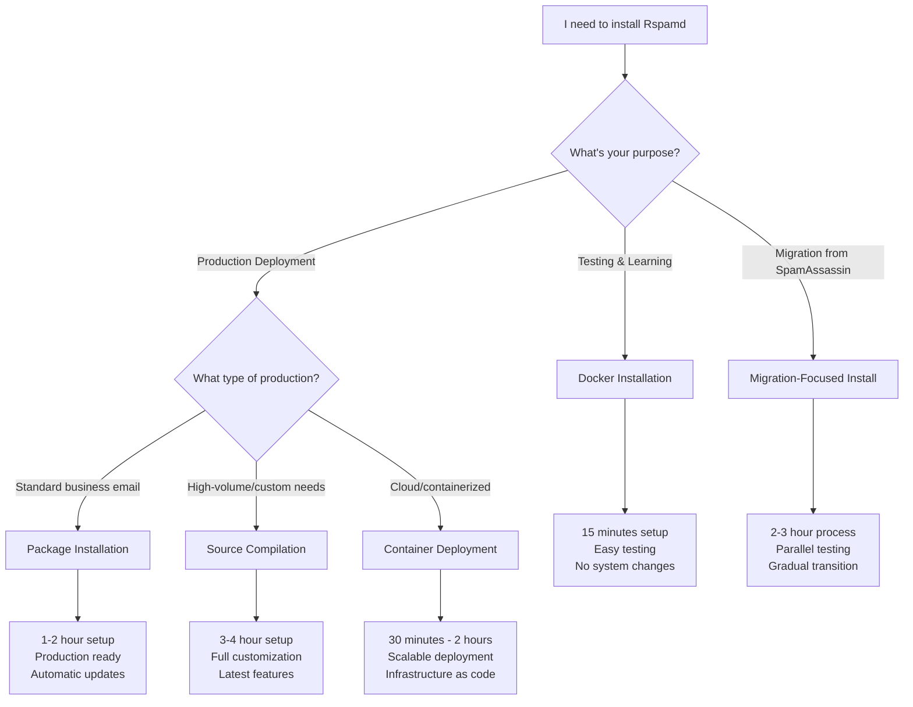

# Rspamd Installation Guide

Choosing the right installation method depends on your scenario, technical requirements, and time constraints. This guide helps you make the best choice for your situation.

## Installation Decision Tree

Use this decision tree to find your recommended installation approach:



## Installation Methods Comparison

| Method | Time Required | Best For | Pros | Cons |
|--------|--------------|----------|------|------|
| **Docker** | 15 minutes | Testing, learning, development | Quick setup, isolated, easy cleanup | Not for production, resource overhead |
| **Package Installation** | 1-2 hours | Most production deployments | Stable, updates, system integration | Less customization, distribution dependent |
| **Source Compilation** | 3-4 hours | High-volume, custom requirements | Latest features, full control, optimization | Complex, manual updates, more maintenance |
| **Container (K8s/Docker Compose)** | 30min - 2 hours | Cloud-native, scalable deployments | Scalable, reproducible, version controlled | Infrastructure complexity, orchestration knowledge |

## Quick Start: Docker Installation

**Best for**: Testing Rspamd, learning configuration, development work

### Prerequisites
- Docker installed and running
- Basic familiarity with Docker commands
- A fast local recursive DNS resolver (required – see DNS notes below)

### Step 1: Run Rspamd Container

```bash
# Create directories for configuration and data
mkdir -p rspamd-test/{config,data,logs}
cd rspamd-test

# Run Rspamd with web interface
docker run -d \
  --name rspamd-test \
  -p 11334:11334 \
  -p 11332:11332 \
  -v "$(pwd)/config:/etc/rspamd/local.d" \
  -v "$(pwd)/data:/var/lib/rspamd" \
  -v "$(pwd)/logs:/var/log/rspamd" \
  rspamd/rspamd:latest
```

### Important: DNS requirement for Docker

Rspamd performs intensive DNS lookups (RBLs, URI checks, DKIM/ARC, DMARC, etc.). For accurate and fast results, Rspamd must use a nearby recursive DNS resolver. Public resolvers (8.8.8.8, 1.1.1.1, etc.) often rate-limit or filter RBL traffic and will cause timeouts or poor accuracy.

- Recommended: run a local recursive resolver (e.g. Unbound, Knot Resolver, PowerDNS Recursor) on the host or as a sidecar container.
- Docker's embedded DNS (127.0.0.11) is only a forwarding stub; it is not a recursive resolver itself.

Configure Rspamd to use your local resolver by adding `config/options.inc`:

```hcl
# /etc/rspamd/local.d/options.inc
dns {
  # For Rspamd 3.13+ you may specify hostnames here (e.g. "unbound")
  # For older versions, use IP addresses or leave this unset to use /etc/resolv.conf
  timeout = 1s;
  sockets = 16;
}
```

If you run a resolver as a sidecar container (see docker-compose example below), set:

```hcl
dns {
  nameserver = ["unbound"];  # Requires Rspamd 3.13+ (hostname support)
}
```

For Rspamd versions prior to 3.13 (no hostname support in `dns.nameserver`), do one of the following:

- Do not set `dns.nameserver` and ensure the container's `/etc/resolv.conf` points to your local recursive resolver (configure Docker/daemon with `--dns=<resolver_ip>`), or
- Set `dns.nameserver` to the resolver's IP address explicitly.

### Step 2: Set Web Interface Password

```bash
# Generate password hash
docker exec rspamd-test rspamadm pw

# Create controller configuration
echo 'password = "$2$your_generated_hash_here";' > config/worker-controller.inc

# Restart container
docker restart rspamd-test
```

### Step 3: Access Web Interface

Open http://localhost:11334 and log in with your password.

**✅ Success Criteria**: You can access the web interface and see the Rspamd dashboard.

**Next Steps**: 
- [Test message scanning](#testing-your-installation)
- [Learn basic configuration](/getting-started/first-setup)
- Move to package installation for production

---

## Production: Package Installation

**Best for**: Most production deployments, standard business email systems

### Supported Distributions

| Distribution | Support Level | Installation Method |
|-------------|---------------|-------------------|
| **Ubuntu 20.04+** | ✅ Full support | Official repository |
| **Debian 11+** | ✅ Full support | Official repository |
| **CentOS/RHEL 8+** | ✅ Full support | Official repository |
| **Rocky Linux** | ✅ Full support | Official repository |
| **FreeBSD** | ✅ Full support | Ports collection |
| **Other Linux** | ⚠️ Community support | Source compilation |

### Ubuntu/Debian Installation

```bash
# Add Rspamd repository
curl -sSL https://rspamd.com/apt-stable/gpg.key | sudo apt-key add -
echo "deb [arch=amd64] https://rspamd.com/apt-stable/ $(lsb_release -cs) main" | \
  sudo tee /etc/apt/sources.list.d/rspamd.list

# Update package list
sudo apt update

# Install Rspamd and Redis
sudo apt install rspamd redis-server

# Start and enable services
sudo systemctl start rspamd redis-server
sudo systemctl enable rspamd redis-server
```

### CentOS/RHEL/Rocky Linux Installation

```bash
# Add Rspamd repository
curl -sSL https://rspamd.com/rpm-stable/centos-8/rspamd.repo | \
  sudo tee /etc/yum.repos.d/rspamd.repo

# Install Rspamd and Redis
sudo dnf install rspamd redis

# Start and enable services
sudo systemctl start rspamd redis
sudo systemctl enable rspamd redis
```

### FreeBSD Installation

```bash
# Install from ports
sudo pkg install rspamd redis

# Enable services
sudo sysrc rspamd_enable="YES"
sudo sysrc redis_enable="YES"

# Start services
sudo service rspamd start
sudo service redis start
```

**✅ Success Criteria**: 
```bash
sudo systemctl status rspamd
# Should show "active (running)"

sudo systemctl status redis
# Should show "active (running)"
```

**Next Steps**: [Complete basic configuration](/getting-started/first-setup)

---

## Advanced: Source Compilation

**Best for**: High-volume deployments, custom requirements, latest features

### Prerequisites

Install build dependencies:

**Ubuntu/Debian**:
```bash
sudo apt install build-essential cmake libssl-dev libpcre3-dev \
  zlib1g-dev libluajit-5.1-dev libglib2.0-dev libevent-dev \
  libsodium-dev libhyperscan-dev ragel
```

**CentOS/RHEL**:
```bash
sudo dnf groupinstall "Development Tools"
sudo dnf install cmake openssl-devel pcre-devel zlib-devel \
  luajit-devel glib2-devel libevent-devel libsodium-devel \
  hyperscan-devel ragel
```

### Compilation Steps

```bash
# Download source
wget https://github.com/rspamd/rspamd/archive/master.tar.gz
tar xzf master.tar.gz
cd rspamd-master

# Create build directory
mkdir build
cd build

# Configure build
cmake .. \
  -DCMAKE_BUILD_TYPE=Release \
  -DCONFDIR=/etc/rspamd \
  -DRUNDIR=/run/rspamd \
  -DDBDIR=/var/lib/rspamd \
  -DLOGDIR=/var/log/rspamd

# Compile (adjust -j based on your CPU cores)
make -j4

# Install
sudo make install

# Create system user
sudo useradd -r -g mail -d /var/lib/rspamd -s /bin/false rspamd

# Create directories
sudo mkdir -p /var/lib/rspamd /var/log/rspamd /run/rspamd
sudo chown rspamd:mail /var/lib/rspamd /var/log/rspamd /run/rspamd
```

### Create Systemd Service

Create `/etc/systemd/system/rspamd.service`:

```ini
[Unit]
Description=Rspamd spam filtering system
After=network.target

[Service]
Type=forking
PIDFile=/run/rspamd/rspamd.pid
ExecStart=/usr/local/bin/rspamd -f
ExecReload=/bin/kill -USR1 $MAINPID
User=rspamd
Group=mail

[Install]
WantedBy=multi-user.target
```

```bash
# Enable and start service
sudo systemctl daemon-reload
sudo systemctl enable rspamd
sudo systemctl start rspamd
```

**✅ Success Criteria**: 
```bash
sudo systemctl status rspamd
# Should show "active (running)"

rspamd --version
# Should show version and build information
```

---

## Cloud/Container Deployment

**Best for**: Kubernetes, Docker Swarm, cloud-native deployments

### Docker Compose Example

Create `docker-compose.yml`:

```yaml
version: '3.8'

services:
  rspamd:
    image: rspamd/rspamd:latest
    container_name: rspamd
    ports:
      - "11332:11332"  # Proxy worker
      - "11334:11334"  # Web interface
    volumes:
      - ./config:/etc/rspamd/local.d
      - ./data:/var/lib/rspamd
      - ./logs:/var/log/rspamd
    depends_on:
      - redis
      - unbound
    restart: unless-stopped

  redis:
    image: redis:alpine
    container_name: rspamd-redis
    volumes:
      - redis-data:/data
    restart: unless-stopped

  # Local recursive DNS resolver (recommended)
  # Note: you can use any unbound image; this is an example. Ensure it is configured for recursion
  unbound:
    image: mvance/unbound:latest
    container_name: rspamd-unbound
    restart: unless-stopped
    # Expose only to the compose network by default; no published ports are required
    # You can mount custom configs if desired:
    # volumes:
    #   - ./unbound:/opt/unbound/etc/unbound

volumes:
  redis-data:
```

Deploy:
```bash
docker-compose up -d
```

### Kubernetes Deployment

Basic Kubernetes manifests available in our [examples repository](https://github.com/rspamd/rspamd-k8s-examples).

---

## Migration-Focused Installation

**Best for**: Migrating from SpamAssassin or other spam filtering solutions

This approach allows you to run Rspamd in parallel with your existing solution for testing and gradual migration.

### Step 1: Install Rspamd (Package Method)

Follow the [package installation](#production-package-installation) steps above.

### Step 2: Configure for Parallel Testing

Create `/etc/rspamd/local.d/worker-proxy.inc`:

```hcl
# Configure for testing mode - don't take actions yet
milter = yes;
timeout = 120s;
upstream "local" {
  default = yes;
  self_scan = yes;
}

# Testing mode - only add headers, don't reject
skip_process_errors = true;
```

### Step 3: Configure Actions for Testing

Create `/etc/rspamd/local.d/actions.conf`:

```hcl
# Conservative thresholds for testing
reject = 999;       # Don't reject anything during testing
add_header = 1;     # Add headers to everything for analysis
greylist = 999;     # Don't greylist during testing
```

**✅ Success Criteria**: 
- Rspamd adds `X-Spam` headers without affecting mail delivery
- You can analyze header information to compare with existing solution

**Next Steps**: 
- [Migration planning guide](/getting-started/migration-planning)
- [SpamAssassin migration](/tutorials/migrate_sa)

---

## Testing Your Installation

Regardless of installation method, verify your setup:

### 1. Service Health Check

```bash
# Check service status
sudo systemctl status rspamd

# Check listening ports
sudo netstat -tlnp | grep rspamd
# Should show ports 11332, 11333, 11334
```

### 2. Test Message Scanning

```bash
# Test with rspamc command
echo "Test message" | rspamc
```

Expected output should include:
- Symbol analysis results
- Spam score
- Action recommendation

### 3. Web Interface Test

1. Set controller password:
```bash
# Generate password
rspamadm pw

# Add to configuration
echo 'password = "$2$your_hash_here";' | sudo tee /etc/rspamd/local.d/worker-controller.inc

# Restart Rspamd
sudo systemctl restart rspamd
```

2. Access http://your-server:11334
3. Log in and verify dashboard loads

### 4. Integration Test

Send a test email through your mail server and verify:
- Email is processed by Rspamd
- Appropriate headers are added
- Actions are taken based on configuration

## Common Installation Issues

### Permission Problems
```bash
# Fix ownership
sudo chown -R rspamd:mail /var/lib/rspamd /var/log/rspamd

# Fix SELinux (if applicable)
sudo setsebool -P antivirus_can_scan_system 1
```

### Port Conflicts
```bash
# Check what's using the ports
sudo lsof -i :11332
sudo lsof -i :11334

# Modify worker configuration if needed
```

### Redis Connection Issues
```bash
# Test Redis connectivity
redis-cli ping
# Should return "PONG"

# Check Rspamd Redis configuration
sudo rspamc stat
# Should show statistics if Redis is working
```

### DNS Resolver Problems (Docker)
```bash
# Check what resolver the container sees
docker exec rspamd-test cat /etc/resolv.conf

# If using a sidecar resolver, verify name resolution inside the container (Rspamd 3.13+)
docker exec rspamd-test getent hosts unbound || true

# Inspect Rspamd DNS stats and errors
docker exec rspamd-test rspamc stat | grep -i dns || true
```

Checklist:
- Ensure a local recursive resolver is available (host or sidecar).
- For Rspamd < 3.13, avoid hostnames in `dns.nameserver`; use IPs or rely on `/etc/resolv.conf`.
- Avoid public resolvers for RBL traffic to prevent rate limiting and timeouts.
- Keep `dns.timeout` conservative (e.g., 1s–2s) and ensure network connectivity (UDP/53).

Version note: Rspamd 3.13+ supports resolving hostnames in `dns.nameserver`. Older versions only accept IP addresses or `/etc/resolv.conf`.

## What's Next?

After successful installation:

1. **[Complete first setup](/getting-started/first-setup)** - Configure basic spam filtering
2. **[Learn configuration fundamentals](/configuration/fundamentals)** - Understand what to customize
3. **[Choose your scenario](/scenarios/)** - Find guides specific to your use case

## Getting Help

If you encounter issues:

- **[Common problems](/troubleshooting/common-problems)** - Solutions to frequent installation issues
- **[Community support](/support)** - Get help from other users and developers
- **[Official documentation](/configuration/)** - Technical reference for advanced configuration