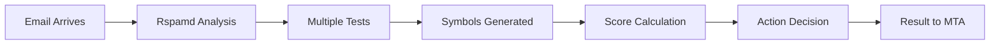
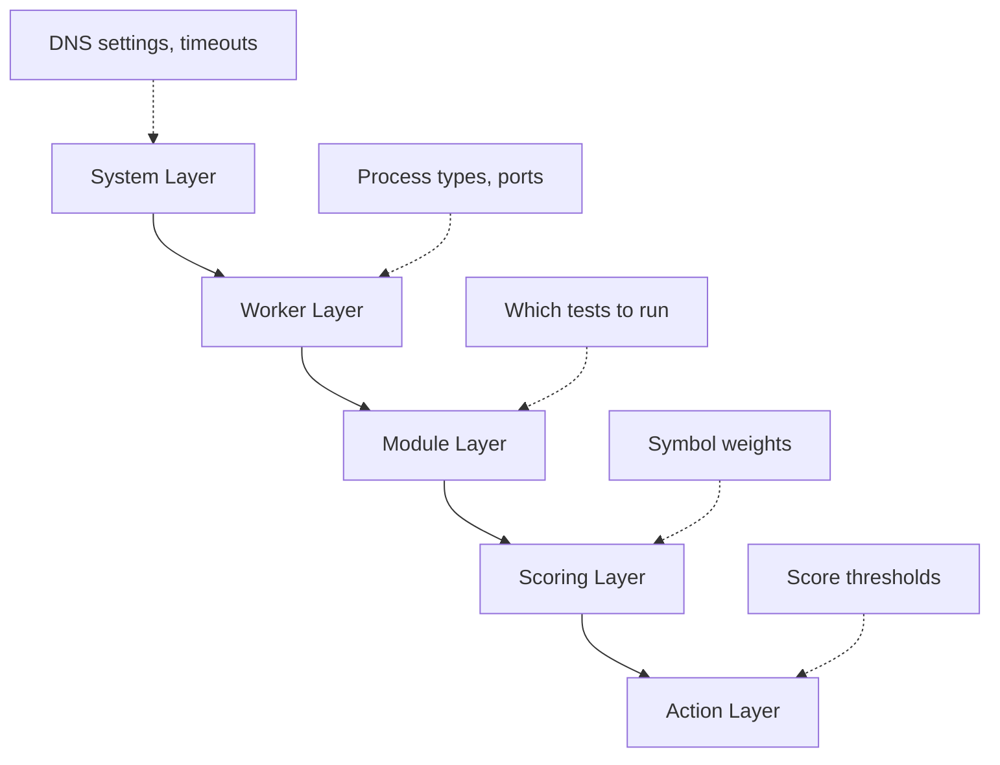

# Understanding Rspamd

Before diving into configuration and setup, it's crucial to understand **what Rspamd does** and **what you can configure**. This mental model will help you make informed decisions throughout your spam filtering journey.

## What is Rspamd?

Rspamd is an **email analysis engine** that examines messages and decides what to do with them based on their "spaminess" score. Think of it as a sophisticated bouncer for your email server.

### The Email Analysis Pipeline



Here's what happens when an email arrives:

1. **Email arrives** at your mail server (MTA)
2. **Rspamd analysis** begins - the message is passed to Rspamd
3. **Multiple tests** run simultaneously (DNS checks, content analysis, etc.)
4. **Symbols generated** - each test that matches produces a "symbol" (like `FORGED_SENDER`)
5. **Score calculation** - each symbol has a weight that adds to the total score
6. **Action decision** - based on the total score, an action is chosen
7. **Result to MTA** - Rspamd tells your mail server what to do

## Core Concepts You Need to Know

### 1. Modules - The Test Runners

**Modules** are units of code that analyze messages. Each module can run multiple tests.

| Module | What It Checks | Example Symbol |
|--------|----------------|----------------|
| **SPF** | Sender IP authorization | `R_SPF_FAIL` |
| **DKIM** | Digital signatures | `R_DKIM_INVALID` |
| **Bayesian** | Statistical analysis | `BAYES_SPAM` |
| **RBL** | DNS blacklists | `MSBL_EBL` |
| **Regexp** | Content patterns | `FORGED_SENDER` |

### 2. Symbols - Test Results

When a test matches, it produces a **symbol** - a short, descriptive name for what was detected.

**Examples**:
- `FORGED_SENDER` - Envelope and header sender addresses differ
- `BAYES_SPAM` - Bayesian classifier thinks this is spam
- `R_DKIM_INVALID` - DKIM signature verification failed

### 3. Scores - How Much Each Test Matters

Each symbol has a **score** (weight) that contributes to the message's total spam score.

**Example scoring**:
```
FORGED_SENDER: +0.30    (slightly suspicious)
BAYES_SPAM: +3.50      (strong spam indicator)  
R_DKIM_INVALID: +0.10   (minor technical issue)
                -------
Total Score: +3.90
```

### 4. Actions - What to Do at Different Score Levels

Based on the total score, Rspamd recommends an **action**:

| Action | Score Threshold | What Happens |
|--------|----------------|--------------|
| **No action** | < 4.0 | Message passes through normally |
| **Greylist** | 4.0 - 5.9 | Temporarily delay (legitimate senders retry) |
| **Add header** | 6.0 - 14.9 | Mark as spam but deliver to inbox/spam folder |
| **Reject** | 15.0+ | Refuse the message entirely |

### 5. Workers - Different Processes for Different Jobs

Rspamd runs multiple **worker** processes, each handling specific tasks:

- **Scanner** - Analyzes messages (the main worker)
- **Controller** - Provides web interface and API
- **Proxy** - Handles MTA integration (milter protocol)
- **Fuzzy Storage** - Manages fuzzy hashes for near-duplicate detection

## What Can You Configure in Rspamd?

Understanding what's configurable helps you focus your efforts where they matter most.

### 1. Which Tests to Run (Modules)

**What**: Enable/disable analysis modules
**Why configure**: Different environments need different tests
**Example**: Disable antivirus scanning if you have a separate antivirus system

### 2. Test Sensitivity (Module Settings)

**What**: Fine-tune how modules behave
**Why configure**: Adapt to your specific email patterns
**Example**: Adjust Bayesian classifier learning rates

### 3. Symbol Weights (Scores)

**What**: How much each symbol contributes to the total score
**Why configure**: Balance false positives vs. spam catch rate
**Example**: Increase weight of `FORGED_SENDER` if sender forgery is common

### 4. Action Thresholds

**What**: Score levels that trigger different actions
**Why configure**: Match your organization's spam tolerance
**Example**: Lower rejection threshold for high-security environments

### 5. Worker Configuration

**What**: How Rspamd processes operate
**Why configure**: Performance optimization and integration requirements
**Example**: Configure proxy worker for Postfix milter integration

### 6. System Behavior (General Options)

**What**: Timeouts, DNS settings, logging levels
**Why configure**: Adapt to your infrastructure and debugging needs
**Example**: Set DNS timeout for slow networks

## Configuration Mental Model

Think of Rspamd configuration in layers:



**Configuration Priority** (most common to least):
1. **Action thresholds** - Almost everyone adjusts these
2. **Symbol scores** - Fine-tuning for your environment  
3. **Module settings** - Specific feature configuration
4. **Worker settings** - Integration and performance
5. **System options** - Usually only for special requirements

## Common Configuration Patterns

### The "Quick Start" Pattern
- Adjust action thresholds only
- Use default modules and scores
- Focus on MTA integration

**Best for**: Getting started, small deployments

### The "Tuned Environment" Pattern  
- Customize symbol scores based on testing
- Enable/disable specific modules
- Adjust learning and feedback mechanisms

**Best for**: Production deployments, specific requirements

### The "High Performance" Pattern
- Optimize worker configuration
- Disable unnecessary modules
- Fine-tune system timeouts

**Best for**: High-volume email processing

## What's Next?

Now that you understand Rspamd's architecture and configuration model:

1. **[Choose your installation method](/getting-started/installation)** based on your scenario
2. **[Complete the first success experience](/getting-started/first-setup)** to get working spam filtering
3. **[Learn configuration fundamentals](/configuration/fundamentals)** to customize for your needs

## Key Takeaways

✅ **Rspamd analyzes emails and produces scores** that determine actions
✅ **Modules run tests** that produce symbols with associated scores  
✅ **You primarily configure** which tests to run, their weights, and action thresholds
✅ **Start simple** with action thresholds, then customize based on your needs
✅ **Different scenarios** require different configuration approaches

Understanding these fundamentals will make the rest of your Rspamd journey much smoother!