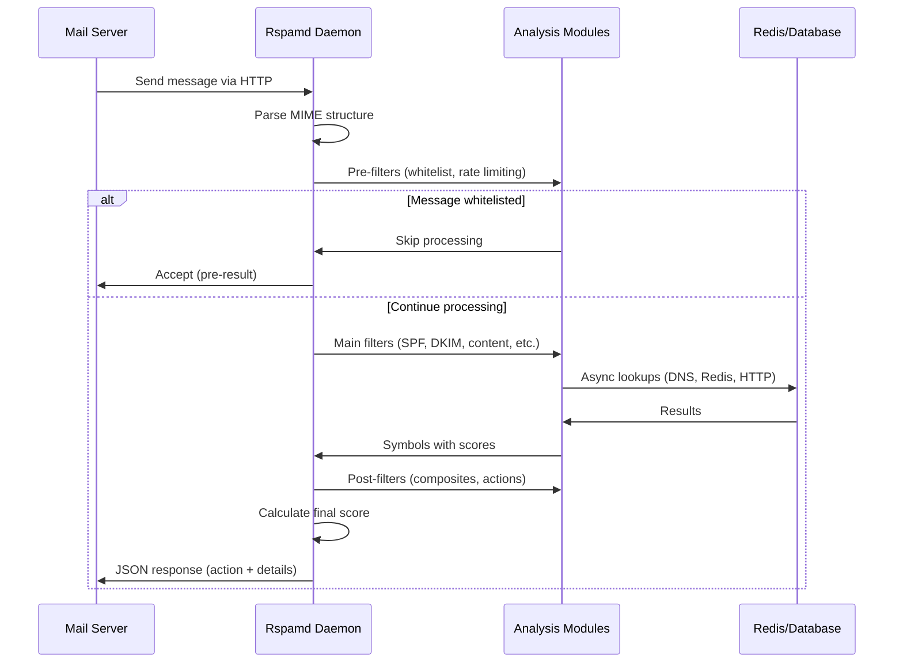

# Understanding Rspamd

Before diving into installation and configuration, it's essential to understand what Rspamd is, how it works, and what you can configure. This foundation will help you make informed decisions and avoid common pitfalls.

## What is Rspamd?

Rspamd is a **high-performance email processing daemon** that analyzes messages and provides classification results to mail transfer agents (MTAs). Unlike simple content filters, Rspamd uses a sophisticated multi-layered approach combining:

- **Authentication protocols** (SPF, DKIM, DMARC, ARC)
- **Content analysis** (regex, heuristics, HTML/text patterns)
- **Statistical classification** (Bayesian filtering, neural networks)
- **Reputation systems** (DNS blacklists, URL reputation, IP scoring)
- **Fuzzy hashing** (near-duplicate detection)
- **Machine learning** (adaptive scoring, pattern recognition)

### Key Characteristics

**Event-driven architecture**: Rspamd uses non-blocking I/O to handle thousands of concurrent connections efficiently, allowing a single server to process millions of messages per day.

**Modular design**: Functionality is organized into independent modules that can be enabled, disabled, or configured separately.

**Statistical approach**: Instead of binary decisions, Rspamd calculates a numerical score based on multiple indicators, allowing for nuanced handling of messages.

**MTA-independent**: Communicates via HTTP/JSON protocol, making it compatible with any MTA without tight coupling or MTA-specific code.

## How Rspamd Works: The Processing Pipeline

When an email arrives, it goes through a multi-stage processing pipeline:



### Stage-by-Stage Breakdown

#### 1. Message Reception

The MTA sends the message to Rspamd via HTTP POST request:

```http
POST /checkv2 HTTP/1.1
From: sender@example.com
IP: 203.0.113.42
Helo: mail.example.com

[raw message content]
```

Rspamd receives not just the message, but also **envelope data** (sender IP, SMTP commands, authentication info) that's crucial for accurate analysis.

#### 2. MIME Parsing

Rspamd parses the message structure:
- Headers (including authentication results)
- Text parts (plain text, HTML)
- Attachments and embedded content
- URLs and email addresses
- Metadata (received headers, message-ID)

This parsed structure is made available to all modules through the **task object**.

#### 3. Pre-filters: Early Decisions

**Pre-filters** run before main analysis and can short-circuit processing:

**Use cases:**
- **Whitelisting**: Trusted senders bypass spam checks entirely
- **Rate limiting**: Reject messages exceeding rate limits immediately
- **Settings application**: Load user-specific or domain-specific configuration

**Example**: A whitelisted IP address gets `no action` immediately, saving processing time.

#### 4. Main Filters: Core Analysis

This is where the bulk of spam detection happens. Multiple modules run **concurrently** (for I/O-bound checks) or sequentially (for CPU-bound checks):

**Authentication checks** (SPF, DKIM, DMARC):
```
Message: From: ceo@company.com
SPF: FAIL (IP not authorized)
DKIM: None
→ Symbols: R_SPF_FAIL, FORGED_SENDER_FORWARD
```

**Content analysis** (regexp, heuristics):
```
Subject: "BUY V1AGRA NOW!!!"
Body: Contains suspicious patterns
→ Symbols: SUBJ_ALL_CAPS, DRUGS_ERECTILE
```

**Statistical classification** (Bayes, neural networks):
```
Token analysis: 85% match with spam corpus
Neural network: 0.92 spam probability
→ Symbols: BAYES_SPAM, NEURAL_SPAM_LONG
```

**Reputation checks** (RBLs, URL lists):
```
Sender IP: Listed in zen.spamhaus.org
URL: example-spam.com listed in SURBL
→ Symbols: RBL_SPAMHAUS_PBL, SURBL_MULTI
```

#### 5. Post-filters: Final Adjustments

**Post-filters** run after all main filters complete:

**Composites** - Combine symbols using boolean logic:
```lua
-- If both SPF and DKIM fail, it's very suspicious
SUSPICIOUS_FORGERY = (R_SPF_FAIL | R_SPF_SOFTFAIL) & DKIM_REJECT
```

**Force actions** - Override score-based decisions:
```lua
-- Always reject if listed in specific RBL
if symbol('RBL_SPAMCOP') then
    action = 'reject'
end
```

**Metadata export** - Send results to external systems (ClickHouse, Elasticsearch).

#### 6. Score Calculation and Action Selection

Rspamd sums all symbol scores to get a **total score**:

```
R_SPF_FAIL:              +1.0
FORGED_SENDER_FORWARD:   +0.5
BAYES_SPAM:              +3.5
NEURAL_SPAM_LONG:        +2.0
RBL_SPAMHAUS_PBL:        +2.5
                        ------
TOTAL:                   +9.5
```

Based on configured **action thresholds**, an action is selected:

```
Score: 9.5
Threshold: reject (15.0) - No
Threshold: add header (6.0) - Yes
→ Action: add header
```

#### 7. Response to MTA

Rspamd returns a JSON response:

```json
{
    "action": "add header",
    "score": 9.5,
    "required_score": 15.0,
    "symbols": {
        "R_SPF_FAIL": {"score": 1.0},
        "BAYES_SPAM": {"score": 3.5},
        "NEURAL_SPAM_LONG": {"score": 2.0}
    },
    "message-id": "msg-12345",
    "milter": {
        "add_headers": {
            "X-Spam": {"value": "Yes", "order": 1}
        }
    }
}
```

The MTA uses this response to decide what to do with the message.

## Core Concepts in Detail

### Modules: Functional Units

**Modules** are independent units of functionality. Each module can:
- Register one or more symbols
- Perform synchronous or asynchronous checks
- Access shared resources (Redis, DNS, HTTP APIs)
- Be enabled/disabled independently

**Module types:**

**C modules** (compiled into binary):
- `spf` - SPF validation
- `dkim` - DKIM signature verification
- `regexp` - High-performance pattern matching
- `chartable` - Character set analysis
- `fuzzy_check` - Fuzzy hash checking

**Lua modules** (scripts in `/usr/share/rspamd/`):
- `rbl` - DNS blacklist queries
- `multimap` - Generic map-based checks
- `phishing` - Phishing detection
- `dmarc` - DMARC policy checking
- `arc` - ARC validation

**Configuration location:**
- Module defaults: `/etc/rspamd/modules.d/module_name.conf`
- Local overrides: `/etc/rspamd/local.d/module_name.conf`
- Complete replacement: `/etc/rspamd/override.d/module_name.conf`

### Symbols: Test Results with Scores

A **symbol** represents a specific detection or characteristic found in a message.

**Symbol anatomy:**
```
Symbol name: BAYES_SPAM
Score: 3.5
Options: ["0.95"] (probability)
Description: "Bayesian classifier: spam"
```

**Symbol naming conventions:**
- `R_` prefix: Result symbols from standard checks (e.g., `R_SPF_ALLOW`)
- `UPPERCASE_UNDERSCORES`: Descriptive names (e.g., `FORGED_SENDER`)
- Module-specific prefixes: `BAYES_`, `NEURAL_`, `DKIM_`

**Symbol properties:**

| Property | Purpose | Example |
|----------|---------|---------|
| **Name** | Unique identifier | `R_DKIM_ALLOW` |
| **Score** | Weight in score calculation | 0.0 to 20.0 (typical range) |
| **Group** | Organizational grouping | `dkim`, `bayes`, `policies` |
| **Description** | Human-readable explanation | "DKIM signature valid" |
| **Options** | Additional context | `["key=selector1"]` |

### Scores: Weighting System

Each symbol has a **configured score** that represents how much it contributes to the final spam probability.

**Score principles:**

**Positive scores** = Spam indicators:
```
BAYES_SPAM: 3.50        # Strong spam signal
R_SPF_FAIL: 1.00        # Moderate spam signal
SUBJ_ALL_CAPS: 0.50     # Weak spam signal
```

**Negative scores** = Ham indicators:
```
BAYES_HAM: -3.00        # Strong ham signal
R_SPF_ALLOW: -0.20      # Weak ham signal
DKIM_SIGNED: -0.10      # Weak ham signal
```

**Score tuning philosophy:**
- Start with defaults (years of community tuning)
- Adjust based on **observed false positives/negatives**
- Consider **score caps per group** to prevent single modules from dominating
- Use **composites** for complex scoring logic

### Actions: What to Do with Messages

Based on the total score, Rspamd recommends an **action**:

| Action | Default Threshold | Behavior | Use Case |
|--------|------------------|----------|----------|
| **no action** | Score < 0 | Deliver normally | Clean messages |
| **greylist** | 0 ≤ Score < 6 | Temporary delay | Suspicious but uncertain |
| **add header** | 6 ≤ Score < 15 | Deliver with spam marking | Probable spam (folder filtering) |
| **rewrite subject** | N/A (optional) | Modify subject line | User-visible spam marking |
| **soft reject** | N/A (special) | Temporary rejection | Rate limiting, policy violations |
| **reject** | Score ≥ 15 | Refuse message | Definite spam |

**Important notes:**

1. **Recommendations, not commands**: Rspamd suggests actions; the MTA decides whether to follow them.

2. **Thresholds are configurable**:
   ```nginx
   actions {
       reject = 15.0;
       add_header = 6.0;
       greylist = 4.0;
   }
   ```

3. **Custom actions possible**: Via force_actions module or Lua scripts.

4. **Per-user/domain thresholds**: Using settings module.

### Groups: Symbol Organization

**Groups** organize related symbols for management and score capping:

```nginx
group "spf" {
    symbols {
        "R_SPF_ALLOW" { score = -0.20; }
        "R_SPF_FAIL" { score = 1.00; }
        "R_SPF_SOFTFAIL" { score = 0.50; }
        "R_SPF_NEUTRAL" { score = 0.00; }
    }
    max_score = 3.0;  # Cap total contribution from SPF group
}
```

**Benefits of groups:**
- **Score limiting**: Prevent single authentication method from dominating
- **Bulk operations**: Enable/disable entire families of checks
- **Organization**: Logical grouping in WebUI and reports

### Workers: Process Types

Rspamd runs multiple **worker** processes, each with a specific role:

#### Normal Worker

The main message processing worker:
- Accepts HTTP connections on port 11333 (default)
- Performs spam/ham classification
- Executes all configured modules
- Returns results to MTA

**Configuration:**
```nginx
worker "normal" {
    bind_socket = "localhost:11333";
    count = 4;  # Number of worker processes
}
```

**Scaling**: Typically 1-4 workers per CPU core.

#### Controller Worker

Web interface and management API:
- Serves WebUI on port 11334 (default)
- Provides REST endpoints for learning, stats, maps
- Requires authentication (password or enable_password)
- Should be protected (localhost/firewall)

**Configuration:**
```nginx
worker "controller" {
    bind_socket = "localhost:11334";
    password = "your_password";
}
```

#### Proxy Worker

Milter protocol bridge and load balancer:
- Accepts Milter connections from MTAs (Postfix, Sendmail)
- Translates Milter ↔ HTTP protocol
- Can forward to multiple Rspamd instances
- Supports [HTTPCrypt encryption](/developers/encryption)

**Configuration:**
```nginx
worker "rspamd_proxy" {
    bind_socket = "localhost:11332";
    upstream "local" {
        default = yes;
        hosts = "localhost:11333";
    }
}
```

**Use case**: Postfix integration via `smtpd_milters = inet:localhost:11332`

#### Fuzzy Storage Worker

Manages fuzzy hash database:
- Stores fuzzy hashes for near-duplicate detection
- Handles add/check/delete operations
- Supports replication and sharding
- Uses custom protocol over UDP/TCP

**Use case**: Shared spam reputation across multiple servers.

## Configuration Overview

### The Configuration Hierarchy

Rspamd uses a **layered configuration system** with clear precedence:

```
/etc/rspamd/rspamd.conf          (main config, rarely edited)
  ├── /etc/rspamd/modules.d/     (module defaults)
  │   ├── local.d/               (merge with defaults) ← Your changes here
  │   └── override.d/            (replace defaults)    ← Advanced only
  └── /etc/rspamd/local.d/       (global overrides)
      └── actions.conf           (action thresholds)
```

**Best practice**: Use `local.d/` for all customizations. This merges your settings with defaults, surviving updates.

### What You Can Configure

#### 1. Action Thresholds (Most Common)

**File**: `/etc/rspamd/local.d/actions.conf`

```nginx
actions {
    reject = 15.0;          # Refuse message
    add_header = 6.0;       # Mark as spam
    greylist = 4.0;         # Temporary delay
}
```

**When to adjust:**
- Too much spam getting through: Lower thresholds
- Too many false positives: Raise thresholds
- Different policies per domain: Use settings module

#### 2. Symbol Scores (Fine-Tuning)

**File**: `/etc/rspamd/local.d/groups.conf` or module-specific configs

```nginx
group "content" {
    symbols {
        "FORGED_SENDER" {
            score = 0.5;      # Default: 0.3
        }
    }
}
```

**When to adjust:**
- Specific symbol causing many false positives
- Local testing shows different effectiveness
- Custom symbols need appropriate weights

#### 3. Module Settings (Feature Control)

**Example**: `/etc/rspamd/local.d/bayes.conf`

```nginx
autolearn = true;         # Learn automatically
autolearn {
    spam_threshold = 12.0;  # Score needed to learn as spam
    ham_threshold = -5.0;   # Score needed to learn as ham
}

backend = "redis";
servers = "localhost:6379";
```

**When to configure:**
- Enable/disable specific features
- Tune module behavior for your environment
- Connect to external services (Redis, databases)

#### 4. Worker Configuration (Integration)

**Example**: `/etc/rspamd/local.d/worker-proxy.inc`

```nginx
# Enable proxy worker for Postfix milter
bind_socket = "localhost:11332";
milter = yes;

upstream "local" {
    default = yes;
    self_scan = yes;
}
```

**When to configure:**
- MTA integration setup
- Performance optimization
- Multi-instance deployments

#### 5. System Options (Advanced)

**File**: `/etc/rspamd/local.d/options.inc`

```nginx
dns {
    timeout = 2s;
    retransmits = 3;
}

# Limit message size
max_message = 10485760;  # 10MB
```

**When to configure:**
- Network environment requires tuning
- Resource limits needed
- Debugging and troubleshooting

## Configuration Strategies

### Strategy 1: Minimal (Quick Start)

**Goal**: Get working spam filtering ASAP

**Changes:**
1. Adjust action thresholds only
2. Configure MTA integration
3. Use all default modules and scores

**Best for**:
- Testing and evaluation
- Small deployments (<1000 users)
- Low customization needs

**Pros**: Fast setup, easy to maintain
**Cons**: May not be optimal for your traffic

### Strategy 2: Tuned (Production)

**Goal**: Optimize for your specific environment

**Changes:**
1. Baseline with defaults for 1-2 weeks
2. Analyze false positives via WebUI
3. Adjust specific symbol scores
4. Fine-tune module settings
5. Set appropriate action thresholds

**Best for**:
- Production deployments
- Specific industry requirements (finance, healthcare)
- Environments with known patterns

**Pros**: Optimized false positive/negative balance
**Cons**: Requires monitoring and iteration

### Strategy 3: Custom (Enterprise)

**Goal**: Maximum control and integration

**Changes:**
1. All from "Tuned" strategy
2. Custom rules via multimap/regexp modules
3. External data integration (LDAP, databases)
4. Per-user/domain settings
5. Custom Lua modules

**Best for**:
- Large deployments (10,000+ users)
- Complex requirements
- Multi-tenant environments

**Pros**: Maximum flexibility
**Cons**: Requires Rspamd expertise

## Common Configuration Patterns

### Pattern: Reducing False Positives

**Problem**: Legitimate emails marked as spam

**Solution:**
1. **Identify problematic symbol**:
   ```bash
   # Check WebUI history or logs
   # Look for common symbols in false positives
   ```

2. **Reduce symbol score**:
   ```nginx
   # /etc/rspamd/local.d/groups.conf
   symbol "SUSPICIOUS_SYMBOL" {
       score = 0.1;  # Was 2.0
   }
   ```

3. **Or whitelist trusted senders**:
   ```nginx
   # /etc/rspamd/local.d/multimap.conf
   WHITELIST_IP {
       type = "ip";
       map = "/etc/rspamd/whitelist_ip.map";
       score = -10.0;
       prefilter = true;
   }
   ```

### Pattern: Stricter Spam Filtering

**Problem**: Too much spam getting through

**Solution:**
1. **Lower action threshold**:
   ```nginx
   actions {
       reject = 10.0;  # Was 15.0
   }
   ```

2. **Increase critical symbol scores**:
   ```nginx
   symbol "BAYES_SPAM" {
       score = 5.0;  # Was 3.5
   }
   ```

3. **Enable additional checks**:
   ```nginx
   # /etc/rspamd/local.d/rbl.conf
   rbls {
       spamhaus {
           rbl = "zen.spamhaus.org";
           enabled = true;
       }
   }
   ```

### Pattern: Per-Domain Settings

**Problem**: Different spam tolerance per domain

**Solution:**
```nginx
# /etc/rspamd/local.d/settings.conf
settings {
    domain_strict {
        rcpt = "@strict-domain.com";
        apply {
            actions {
                reject = 8.0;  # Stricter than default
                add_header = 4.0;
            }
        }
    }

    domain_relaxed {
        rcpt = "@relaxed-domain.com";
        apply {
            actions {
                reject = 20.0;  # More lenient
                add_header = 10.0;
            }
        }
    }
}
```

## Understanding Rspamd Behavior

### Why Scores, Not Rules?

**Traditional approach** (SpamAssassin-style):
- Each rule has fixed score
- Score directly added to total
- Binary logic: match or no match

**Rspamd approach**:
- Symbols can have **dynamic scores** (Bayes: 0-5, Neural: 0-10)
- **Composites** combine multiple conditions
- **Groups** can cap total contribution
- **Settings** can override scores per user/domain

**Advantage**: More nuanced decisions, fewer false positives.

### Why Multiple Small Checks Beat Few Large Rules?

Rspamd philosophy: **Many weak learners > Few strong rules**

**Example scenario:**
```
Traditional: "Contains 'viagra' → +10 points" (brittle)

Rspamd approach:
- SUBJ_HAS_DRUG_NAME: +0.5
- BODY_HAS_DRUG_REF: +1.0
- HTML_OBFUSCATION: +1.5
- NO_DKIM: +0.3
- SPF_SOFTFAIL: +0.5
- BAYES_SPAM: +3.5
Total: +7.3 → add header
```

**Benefits:**
- Resistant to evasion techniques
- Graceful degradation (one check fails, others still work)
- Easier to tune individual components

### Why Statistical Methods Matter

**Bayesian classifier**:
- Learns from your specific email patterns
- Adapts to evolving spam techniques
- Provides probability-based scores

**Neural networks**:
- Learn from symbol patterns (not content)
- Adapt to your unique rule configuration
- Provide complementary signal to Bayes

**Together**: Strong spam detection without manual rule updates.

## Testing and Validation

### Before Going Live

1. **Test mode**: Use `greylist` action for new installs to observe without blocking
   ```nginx
   actions {
       reject = 99999.0;  # Effectively disable
       add_header = 99999.0;
       greylist = 4.0;     # Only greylist
   }
   ```

2. **Monitor for 1-2 weeks**: Check WebUI history for patterns

3. **Gradually lower thresholds**: Based on observed scores

### Validation Commands

```bash
# Test a message file
rspamc < test_message.eml

# Check configuration
rspamadm configtest

# Verify module status
rspamc stat

# Test specific symbol
rspamadm grep -s SYMBOL_NAME /var/log/rspamd/rspamd.log
```

## Performance Expectations

**Typical performance** (modern server, default config):

| Metric | Value |
|--------|-------|
| **Messages/second** | 100-500 per worker |
| **Latency** | 50-200ms per message |
| **Memory** | 256-512MB per worker |
| **CPU** | 1-2 cores (4 workers) |

**Scaling factors:**
- **Message size**: Larger messages take longer
- **Enabled modules**: More checks = more time
- **External lookups**: DNS/Redis latency matters
- **Statistical modules**: Bayes/Neural add CPU load

## Next Steps

Now that you understand Rspamd's architecture and capabilities:

1. **[Installation Guide](/getting-started/installation)** - Choose your installation method
2. **[First Setup](/getting-started/first-setup)** - Get your first working configuration
3. **[Configuration Fundamentals](/guides/configuration/fundamentals)** - Learn UCL syntax and structure
4. **[Architecture Details](/developers/architecture)** - Deep dive for advanced users

## Key Takeaways

✅ **Rspamd is event-driven**: Handles high volume efficiently
✅ **Modular design**: Enable/disable features independently
✅ **Score-based decisions**: Nuanced handling vs. binary rules
✅ **Statistical methods**: Adapt to your email patterns
✅ **Configuration layers**: local.d/ for all customizations
✅ **Start simple**: Adjust thresholds first, tune scores later
✅ **Monitor before blocking**: Use greylist to test safely

Understanding these fundamentals will help you configure Rspamd effectively and troubleshoot issues confidently.
