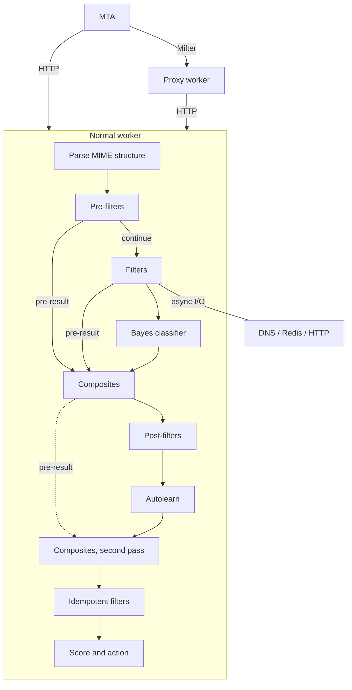

# Understanding Rspamd

This page explains what Rspamd does with a message, the terms used throughout the documentation (symbols, scores, actions, groups, workers) and where your configuration goes. Read it before you install Rspamd if you are new to it.

## What Rspamd is

Rspamd is a mail filtering daemon. Your MTA passes each message to Rspamd, which runs its checks and returns a score and an action, such as "add header" or "reject". The checks cover:

- sender authentication: SPF, DKIM, DMARC and ARC
- content: regular expression and Lua rules for headers, text and HTML parts
- statistics: the Bayes classifier and, optionally, a neural network
- reputation: DNS blocklists for sender IP addresses, domains and URLs
- fuzzy hashes: near-duplicates of known spam

### Design

Rspamd is event-driven. Each worker process scans many messages at once with non-blocking I/O, so a slow DNS or Redis lookup does not hold up other scans. Rspamd is designed to process hundreds of messages per second.

Functionality is split into modules that you can enable, disable and configure separately.

Every check that matches inserts a weighted symbol. The weights add up to the message score, and Rspamd compares the score with the action thresholds to choose the action.

Rspamd talks HTTP/JSON to any client. Its proxy worker also speaks the milter protocol, which Postfix and Sendmail use.

## How Rspamd processes a message

Each message goes through the following stages:


```mermaid
flowchart TD
    MTA[MTA] -->|Milter| Proxy[Proxy worker]
    MTA -->|HTTP| NW
    Proxy -->|HTTP| NW

    subgraph NW[Normal worker]
        direction TB
        A[Parse MIME structure] --> B[Pre-filters]
        B -->|pre-result| E
        B -->|continue| C[Filters]
        C -->|pre-result| E
        C --> D[Bayes classifier]
        D --> E[Composites]
        E --> F[Post-filters]
        E -.->|pre-result| E2
        F --> G[Autolearn]
        G --> E2[Composites, second pass]
        E2 --> H[Idempotent filters]
        H --> Reply[Score and action]
    end

    C ---|async I/O| Ext[DNS / Redis / HTTP]
```

| Stage | What runs | Can short-circuit? |
|-------|-----------|-------------------|
| 1. Parse MIME | Headers, text parts, URLs, attachments | No |
| 2. Pre-filters | Settings, rDNS and ASN lookups; ratelimit and the greylist check when Redis is configured | Yes (pre-result) |
| 3. Filters | SPF, DKIM, DMARC, RBL, regexp, phishing, fuzzy, whitelist, multimap, force_actions, ... | Yes (multimap or force_actions rules with an action) |
| 4. Classifiers | Bayes | No |
| 5. Composites | Combine symbols with boolean expressions | No |
| 6. Post-filters | Neural network and greylisting decision (both need Redis), force_actions rules with `require_action` or `honor_action` | No |
| 7. Autolearn | Optional Bayes training | No |
| 8. Composites, second pass | Composites that depend on post-filter symbols | No |
| 9. Idempotent | History, ClickHouse, metadata export, milter headers | No (always run) |

### Stage by stage

#### Message reception

The MTA sends the message either over the milter protocol to the [proxy worker](/workers/rspamd_proxy), which by default forwards it to the normal worker, or as an HTTP POST directly to the [normal worker](/workers/normal):

```http
POST /checkv2 HTTP/1.1
From: sender@example.com
Rcpt: user@example.org
IP: 203.0.113.42
Helo: mail.example.com

[raw message content]
```

Besides the message itself, Rspamd receives envelope data: the sender IP, HELO name, SMTP sender, SMTP recipients and the authenticated user. Checks such as SPF and IP blocklists depend on it.

#### MIME parsing

Rspamd parses the headers, the text parts (plain text and HTML), attachments, URLs and email addresses, and the `Received` chain. Every module can read the result through the task object.

#### Pre-filters

Pre-filters run before the main checks. By default they include the [settings](/configuration/settings) module, which applies per-user and per-domain settings, and helpers for rDNS, ASN and address aliases. When Redis is configured, the [ratelimit](/modules/ratelimit) and [greylist](/modules/greylisting) checks also run here.

Pre-filters can end processing early:

- A settings rule with `whitelist = yes` (or `want_spam = yes`) skips all checks for matching messages.
- The ratelimit module sets a "soft reject" pre-result (a temporary failure) when a limit is exceeded. It needs Redis and ships with no limits defined.

A pre-result (unless it is flagged `least`) stops most of the remaining filters, the classifiers and the post-filters. Filters flagged `fine`, such as the SPF, ARC, fuzzy and DNSWL checks, still run. So do symbols flagged `ignore_passthrough`, such as DKIM signing by the [dkim_signing](/modules/dkim_signing) module, and the idempotent filters, such as history and ClickHouse export. Composites are still evaluated, except for messages that a settings rule skips entirely.

The [whitelist](/modules/whitelist) module runs in the filters stage, not as a pre-filter. Its rules (`WHITELIST_SPF`, `WHITELIST_DMARC` and others) add negative scores and do not skip any checks.

#### Filters

Most checks run here. Checks that wait for the network (DNS, Redis, HTTP) run concurrently: while one waits for a reply, the worker carries on with others.

Filters can also short-circuit. A [multimap](/modules/multimap) rule with `action`, or a [force_actions](/modules/force_actions) rule that does not use `require_action` or `honor_action`, runs early in this stage and, when it matches, sets a pre-result. Use these to accept trusted sources or reject known-bad ones without running most of the remaining checks.

Authentication checks (SPF, DKIM, DMARC):

```
From: ceo@example.com  (example.com publishes SPF "-all" and DMARC "p=reject")
SPF: fail, the sending IP is not authorized
DKIM: no signature
→ Symbols: R_SPF_FAIL, R_DKIM_NA, DMARC_POLICY_REJECT
```

Content checks (regexp and Lua rules):

```
Subject: BUY CHEAP PILLS NOW!
→ Symbol: SUBJ_ALL_CAPS
```

Reputation checks (DNS blocklists for IPs and URLs):

```
Sender IP: listed in Spamhaus PBL (zen.spamhaus.org)
URL: domain listed in SURBL as abused
→ Symbols: RBL_SPAMHAUS_PBL, ABUSE_SURBL
```

#### Classifiers

After the filters, the Bayes classifier compares the message's tokens (OSB tokenizer) with the spam and ham it has learned, which are stored in Redis. It inserts `BAYES_SPAM` (weight 5.1) or `BAYES_HAM` (weight -3.0), scaled by its confidence:

```
Bayes: 95.00% spam → BAYES_SPAM 3.38 (of a possible 5.1)
```

The neural network is not part of this stage; it runs as a post-filter.

#### Composites

Composites combine symbols with boolean expressions into a new symbol, and can remove the symbols they combine or their weights:

```hcl
# /etc/rspamd/local.d/composites.conf
SPF_AND_DKIM_FAIL {
  expression = "(R_SPF_FAIL | R_SPF_SOFTFAIL) & R_DKIM_REJECT";
  score = 3.0;
}
```

The shipped composites use this to cancel false positives. For example, `SPF_FAIL_FORWARDING` removes the weight of an SPF failure when the message was forwarded. See [composites](/configuration/composites).

#### Post-filters

Post-filters run after composites and can change the action. Without Redis, the default configuration has none. With Redis configured, they are:

- the [neural network](/modules/neural) (`NEURAL_CHECK`), which inserts `NEURAL_SPAM` or `NEURAL_HAM`
- the greylisting decision (`GREYLIST_SAVE`), which answers "soft reject" to the first delivery attempt of a message that scores at or above the greylist threshold but below reject

Rules of the force_actions module that use `require_action` or `honor_action` also run here, as do optional modules such as `gpt` when you enable them.

#### Autolearn, second composites pass and idempotent filters

If autolearn is configured, Rspamd then trains Bayes with the message as spam or ham, depending on its action and score. Learning does not change the score.

Composites that depend on post-filter symbols are evaluated next, in a second pass. The final score and action are known after this pass.

Idempotent filters run last and cannot change the result. Examples are [history_redis](/modules/history_redis), [ClickHouse](/modules/clickhouse), [metadata exporter](/modules/metadata_exporter) and [milter_headers](/modules/milter_headers). The milter_headers module adds only the header routines listed in its `use` option, which is empty by default.

The reply goes to the MTA after the idempotent stage.

### Score and action

Rspamd adds up the symbol scores. For a message that triggers all the examples above, the breakdown looks like this (simplified; a real scan shows more symbols):

```
R_SPF_FAIL            1.00
R_DKIM_NA             0.00
DMARC_POLICY_REJECT   2.00
SUBJ_ALL_CAPS         1.50   (3.0, scaled by subject length)
RBL_SPAMHAUS_PBL      2.00
ABUSE_SURBL           5.00
BAYES_SPAM            3.38   (5.1, scaled by 95.00% confidence)
                     -----
Total                14.88
```

With the default thresholds, 14.88 is below the `reject` threshold (15) but above the `add_header` threshold (6), so the action is "add header".

### Reply to the MTA

Over HTTP, Rspamd replies with JSON. An abridged reply for the message above:

```json
{
    "is_skipped": false,
    "score": 14.88,
    "required_score": 15.0,
    "action": "add header",
    "thresholds": {
        "reject": 15.0,
        "add header": 6.0,
        "greylist": 4.0
    },
    "symbols": {
        "R_SPF_FAIL": {
            "name": "R_SPF_FAIL",
            "score": 1.0,
            "metric_score": 1.0,
            "description": "SPF verification failed"
        },
        "BAYES_SPAM": {
            "name": "BAYES_SPAM",
            "score": 3.38,
            "metric_score": 5.1,
            "description": "Message probably spam, probability: ",
            "options": ["95.00%"]
        }
    },
    "message-id": "msg-12345"
}
```

The reply has no `milter` block by default. One appears only when a module, such as milter_headers, asks for header changes. In milter mode the proxy itself adds `X-Spam: Yes` for the "add header" action (worker option `spam_header`). How the action is applied is described under [Actions](#actions).

## Core concepts

### Modules

A module registers one or more symbols and runs the checks behind them, often asynchronously over DNS, Redis or HTTP. You can enable and disable each module on its own.

Four modules are written in C and compiled into the binary: `chartable`, `dkim`, `regexp` and `fuzzy_check`. The rest are Lua plugins, including `spf`, `dmarc`, `arc`, `rbl`, `multimap`, `phishing`, `ratelimit`, `greylist` and `neural`. Packages install them in `/usr/share/rspamd/plugins/`; your own plugins go in `/etc/rspamd/plugins.d/`.

Each module's defaults are in `/etc/rspamd/modules.d/<module>.conf`. Do not edit those files. Instead:

- `/etc/rspamd/local.d/<module>.conf` is merged with the defaults.
- `/etc/rspamd/override.d/<module>.conf` replaces the default value of each key it sets (an object is replaced, not merged). Keys you do not mention keep their defaults.

To disable a module, put `enabled = false;` in its `local.d` file.

### Symbols

A symbol records one finding about a message. `BAYES_SPAM` from the scan above:

```
Name:        BAYES_SPAM
Weight:      5.1 (scaled by the classifier's confidence; 3.38 in this scan)
Options:     ["95.00%"]
Group:       statistics
Description: "Message probably spam, probability: "
```

Many symbols carry their module's name as a prefix (`BAYES_`, `DMARC_`, `ARC_`, `NEURAL_`). Some older ones have an `R_` prefix (`R_SPF_*`, `R_DKIM_*`).

| Property | Meaning | Example |
|----------|---------|---------|
| Name | Unique identifier | `R_DKIM_ALLOW` |
| Score | Weight added to the total: positive for spam indicators, negative for ham indicators. Default scores run from -7.0 to +15.0 | `-0.1` |
| Group | Primary group; a symbol can also belong to extra groups | `policies` (extra group `dkim`) |
| Description | Human-readable explanation | "DKIM verification succeed" |
| Options | Details added by the check | `["example.com:s=selector1"]` |

### Scores

Each symbol has a configured weight, which adds to (or subtracts from) the message's total score. Some rules scale the weight by a factor, as Bayes does with its confidence and `SUBJ_ALL_CAPS` with the subject length.

```
# Spam indicators
BAYES_SPAM       up to  5.10
SUBJ_ALL_CAPS    up to  3.00
R_SPF_FAIL              1.00

# Ham indicators
BAYES_HAM        up to -3.00
R_SPF_ALLOW            -0.20
R_DKIM_ALLOW           -0.10
```

Start with the default scores. Change a score when you see it cause false positives or negatives, cap a family of checks with a group `max_score`, and use composites when a combination of symbols means something different from each symbol alone.

### Actions

Rspamd picks the action from the total score:

| Action | Default threshold | What happens |
|--------|-------------------|--------------|
| no action | score below 4 | Deliver normally |
| greylist | 4 to 6 | Temporary delay. Needs the greylist module, which needs Redis. In milter mode without it, the message is accepted |
| add header | 6 to 15 | Deliver with a spam header (`X-Spam: Yes` in milter mode), which the delivery agent or mail client can use to file the message into a spam folder |
| rewrite subject | not set | Deliver with the subject changed, by default to `*** SPAM *** <subject>` |
| soft reject | no threshold | Temporary failure (4xx); set by modules such as ratelimit and greylist |
| reject | 15 and above | Reject the message (5xx) |

How the action is applied depends on the integration. With the milter proxy, the default for Postfix and Sendmail, Rspamd applies it through milter replies: reject, temporary failure or header changes. Clients that talk to the normal worker directly, such as Exim (legacy RSPAMC protocol, through `spamd_address ... variant=rspamd`) or Haraka (HTTP), receive the action in the reply and decide what to do with it.

You change thresholds in `/etc/rspamd/local.d/actions.conf` (see [action thresholds](#1-action-thresholds) below), and per user or domain with the [settings](/configuration/settings) module.

You can declare custom actions in the same file. An action with the `no_threshold` flag is never chosen by score, only set by rules:

```hcl
# /etc/rspamd/local.d/actions.conf
my_action {
  flags = ["no_threshold"];
}
```

A force_actions rule or Lua code can then set it. Rules cannot set an action that is not declared.

### Groups

Groups organize symbols and can cap their combined contribution with `max_score`. A symbol has one primary group and can belong to extra groups; the cap of each of its groups applies. To limit how much the DNS blocklists in the `rbl` group can add together:

```hcl
# /etc/rspamd/local.d/groups.conf
group "rbl" {
  max_score = 6.0;
}
```

Groups also let you switch families of checks on or off. A [settings](/configuration/settings) rule can disable whole groups for a user or domain with `groups_disabled`, or run only the groups listed in `groups_enabled`.

The WebUI Symbols tab shows each symbol's group.

### Workers

Rspamd runs several kinds of worker processes:

| Worker | Default socket | Role |
|--------|----------------|------|
| normal | localhost:11333 | Scans messages received over HTTP |
| controller | localhost:11334 | WebUI and management API |
| rspamd_proxy | localhost:11332 | Milter interface for the MTA; forwards to the normal worker |
| fuzzy | localhost:11335 | Fuzzy hash storage; disabled by default |

Worker options go in `/etc/rspamd/local.d/worker-normal.inc`, `worker-controller.inc`, `worker-proxy.inc` and `worker-fuzzy.inc`. These files are already included inside the right `worker { }` section, so write the options without a wrapper.

#### Normal worker

The [normal worker](/workers/normal) runs the checks and returns results. By default Rspamd starts as many normal worker processes as there are CPU cores minus two, with a minimum of 1 and a maximum of 4. On a busy server you can raise the count:

```hcl
# /etc/rspamd/local.d/worker-normal.inc
count = 8;
```

#### Controller worker

The [controller](/workers/controller) serves the WebUI and the API for learning, statistics and maps. Requests from `secure_ip` addresses (127.0.0.1 and ::1 by default) and from unix sockets need no password. Remote clients must authenticate with the password set in `password`. If you also set `enable_password`, state-changing commands such as learning require that password, and `password` gives read-only access. Store a hash made with `rspamadm pw`, not plain text. The placeholder `q1` in the shipped config is refused for remote access.

```hcl
# /etc/rspamd/local.d/worker-controller.inc
password = "$2$...";  # output of: rspamadm pw
```

The controller listens on localhost by default. If you open it to other hosts, set a password and restrict access with a firewall.

#### Proxy worker

The [proxy worker](/workers/rspamd_proxy) is enabled by default in milter mode on localhost:11332. It forwards each message to the normal worker on localhost:11333. It can also balance load across several Rspamd hosts and [encrypt](/developers/encryption) the traffic. Point Postfix at it (see [MTA integration](/tutorials/integration#using-rspamd-with-postfix-mta)):

```ini
# /etc/postfix/main.cf
smtpd_milters = inet:localhost:11332
```

The default proxy configuration needs no changes. To have the proxy scan messages itself instead of forwarding them:

```hcl
# /etc/rspamd/local.d/worker-proxy.inc
upstream "local" {
  self_scan = yes;  # scan in the proxy instead of forwarding to the normal worker
}
```

#### Fuzzy storage worker

The [fuzzy storage](/workers/fuzzy_storage) worker stores fuzzy hashes and answers `fuzzy_check` queries over UDP and TCP. Out of the box, `fuzzy_check` queries the public rspamd.com storage, which is configured read-only. Run your own storage to learn your own hashes and share them between your servers. The worker keeps hashes in Redis (the default backend); use Redis replication for redundancy.

The local worker is disabled by default. It needs Redis: configure servers in `/etc/rspamd/local.d/redis.conf` or set `servers` in `worker-fuzzy.inc`. Without Redis the worker exits at startup. Once Redis is configured, enable the worker:

```hcl
# /etc/rspamd/local.d/worker-fuzzy.inc
count = 1;
```

## Configuration overview

### Where configuration lives

| Location | Purpose |
|----------|---------|
| `/etc/rspamd/rspamd.conf`, `common.conf`, `actions.conf`, `groups.conf`, `options.inc`, `statistic.conf`, `worker-*.inc`, `modules.d/*.conf` | Shipped defaults. Do not edit: upgrades ship new versions of these files, and local edits conflict with them |
| `/etc/rspamd/local.d/<same file name>` | Merged into the section that file configures (see the exceptions below). Put most changes here |
| `/etc/rspamd/override.d/<same file name>` | Replaces the default value of each key it sets |
| `/etc/rspamd/rspamd.conf.local`, `/etc/rspamd/rspamd.conf.override` | Additions and overrides at the top level of the configuration |

Almost every `local.d` and `override.d` file is included inside its section, so do not repeat the section name: write `reject = 12;` in `local.d/actions.conf`, not `actions { reject = 12; }`. Two files differ:

- `groups.conf` is merged at the top level. It takes `group "name" { ... }` blocks, or a top-level `symbols { ... }` block that changes weights without moving symbols to another group (see [Changing a score](/guides/configuration/fundamentals#changing-a-score)).
- `statistic.conf` is included at the top level without merging. A `classifier "bayes" { ... }` block there replaces the whole shipped classifier, statfiles included. Put Bayes changes in `local.d/classifier-bayes.conf` instead, without a wrapper.

### What you can configure

#### 1. Action thresholds

```hcl
# /etc/rspamd/local.d/actions.conf
reject = 12;     # default 15
add_header = 5;  # default 6
```

Lower the thresholds if too much spam gets through; raise them if you see false positives. For different thresholds per domain, use the settings module.

#### 2. Symbol scores

Change a score inside the symbol's own group. If you set it under a different group, you also move the symbol into that group. `rspamadm configdump -d` shows each symbol's own group (`group`) and its extra groups (`groups`).

```hcl
# /etc/rspamd/local.d/groups.conf
group "headers" {
  symbols {
    "FORGED_SENDER" {
      weight = 0.5;  # default 0.3
    }
  }
}
```

The same change in the group's own file, without the `group` block:

```hcl
# /etc/rspamd/local.d/headers_group.conf
symbols {
  "FORGED_SENDER" {
    weight = 0.5;  # default 0.3
  }
}
```

#### 3. Module settings

For example, Bayes autolearning:

```hcl
# /etc/rspamd/local.d/classifier-bayes.conf
autolearn {
  spam_threshold = 15.0;  # learn as spam: "reject" action
  junk_threshold = 6.0;   # also learn "add header" messages as spam
  ham_threshold = -0.5;   # learn as ham: "no action" and score <= -0.5
  check_balance = true;
}
```

Autolearn checks the action before the score. Without `junk_threshold`, only messages with the "reject" action are learned as spam, so with the default `reject` threshold of 15 no message scoring below 15 would be learned as spam. See [Bayes autolearn](/getting-started/first-setup#bayes-autolearn-optional) for what each option does.

Bayes uses the Redis servers from `/etc/rspamd/local.d/redis.conf` unless you set `servers` in this file.

#### 4. Worker settings

Worker options go in `/etc/rspamd/local.d/worker-<name>.inc`, written without a `worker { }` wrapper. See [Workers](#workers) for examples.

#### 5. Global options

Use a local recursive resolver. Spamhaus, for example, answers queries that come through open resolvers with an error code instead of a listing, which Rspamd reports as `RBL_SPAMHAUS_BLOCKED_OPENRESOLVER`.

```hcl
# /etc/rspamd/local.d/options.inc
dns {
  nameserver = ["127.0.0.1"];  # default: the servers in /etc/resolv.conf
}
max_message = 10mb;  # 10 MiB, default 50 MiB
```

`max_message` sets the largest message Rspamd accepts for scanning.

## How much to customize

- To evaluate Rspamd or run a small server, keep the default modules and scores, connect your MTA and adjust the action thresholds if needed.
- For production tuning, review false positives and negatives in the WebUI history, then adjust individual symbol scores, module settings and thresholds.
- For multi-tenant setups or custom policies, add per-domain settings, multimap rules backed by file, HTTP, Redis or CDB maps, and your own Lua plugins.

## Common configuration patterns

### Reducing false positives

Find the symbol responsible in the WebUI history, or search the log for the message:

```bash
rspamadm grep -s '<message-id>' /var/log/rspamd/rspamd.log
```

Lower that symbol's score in its group:

```hcl
# /etc/rspamd/local.d/hfilter_group.conf
symbols {
  "HFILTER_HOSTNAME_UNKNOWN" {
    weight = 1.0;  # default 2.5
  }
}
```

Or give trusted senders a negative score:

```hcl
# /etc/rspamd/local.d/multimap.conf
WHITELIST_IP {
  type = "ip";
  map = "${LOCAL_CONFDIR}/local.d/maps.d/whitelist_ip.map";
  score = -10.0;
  # action = "accept";  # uncomment to skip most of the remaining checks for matching IPs
}
```

### Stricter filtering

Lower `reject` and `add_header` in `local.d/actions.conf` (see [action thresholds](#1-action-thresholds)).

Raise the scores of symbols you trust:

```hcl
# /etc/rspamd/local.d/statistics_group.conf
symbols {
  "BAYES_SPAM" {
    weight = 6.0;  # default 5.1
  }
}
```

Enable checks that are off by default. Spamhaus ZEN is already enabled; Sender Score is not:

```hcl
# /etc/rspamd/local.d/rbl.conf
rbls {
  senderscore {
    enabled = true;  # needs a registered Validity account
  }
}
```

### Per-domain settings

To use different action thresholds for different recipient domains, add [settings](/configuration/settings) rules:

```hcl
# /etc/rspamd/local.d/settings.conf
domain_strict {
  rcpt = "@strict-domain.com";
  apply {
    actions {
      reject = 8.0;
      add_header = 4.0;
    }
  }
}

domain_relaxed {
  rcpt = "@relaxed-domain.com";
  apply {
    actions {
      reject = 20.0;
      add_header = 10.0;
    }
  }
}
```

## Understanding Rspamd behavior

### How the score is built

Like SpamAssassin, Rspamd adds up rule scores and compares the total with thresholds. A few features shape that total:

- A rule can scale its configured weight. `BAYES_SPAM` contributes from 0 to +5.1 and `BAYES_HAM` from 0 to -3.0, depending on the classifier's confidence. `NEURAL_SPAM` and `NEURAL_HAM` scale whatever score you assign them by the network's output.
- Composites combine symbols and can remove the symbols they combine, or their weights.
- Group `max_score` caps how much a family of checks can add.
- Settings change scores, thresholds and enabled checks per user, domain or IP address.

### Why many small checks

In the [breakdown above](#score-and-action), no single symbol reaches the "add header" threshold of 6, yet together they score 14.88. A spammer who gets past one check still has to get past the others. If one check fails, for example a DNS list times out, the rest still produce a score. Each symbol can be tuned on its own.

### Statistical methods

The Bayes classifier learns from the mail you train it with, by hand or through autolearn, so it adapts to your own traffic.

The [neural network](/modules/neural) needs Redis. By default it learns from the pattern of symbols in each message. Through feature providers it can also use content features: LLM, fastText and static embeddings, and text hashes. `NEURAL_SPAM` and `NEURAL_HAM` have no score until you set one in `/etc/rspamd/local.d/neural_group.conf`.

## Testing and validation

### Before going live

To see what Rspamd would do without rejecting or delaying any mail, set `reject = null;` and `greylist = null;` in `local.d/actions.conf` and disable the greylist module. [Testing alongside SpamAssassin](/getting-started/installation#testing-alongside-spamassassin) has the exact settings and the headers to enable for comparing results. Review the scores in the WebUI history or the logs, and remove these settings once you are confident in the results.

### Validation commands

```bash
# Scan a message and show its symbols
rspamc < test_message.eml

# Check the configuration
rspamadm configtest

# Show which modules are enabled or disabled
rspamadm configdump -m

# Show scan and learning counters
rspamc stat

# Show log lines for scans that mention a symbol
rspamadm grep -s SYMBOL_NAME /var/log/rspamd/rspamd.log
```

## Performance

Throughput and latency depend mostly on your DNS resolver, Redis and other network lookups, on message size and on which modules are enabled. Measure on your own traffic: the WebUI has a throughput graph and a scan time column in the history, and `rspamc --profile` shows how long each symbol took.

## Next steps

1. [Installation](/getting-started/installation): choose an installation method
2. [First setup](/getting-started/first-setup): get a first working configuration
3. [UCL configuration language](/configuration/ucl): the syntax of Rspamd configuration files
4. [Configuration fundamentals](/guides/configuration/fundamentals): an overview of modules, scores, actions and workers
5. [Architecture](/developers/architecture): internals for advanced users
