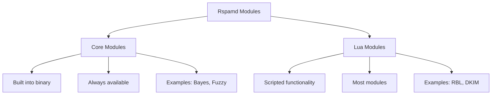
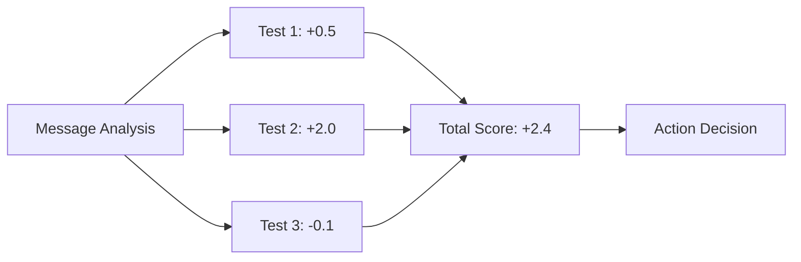
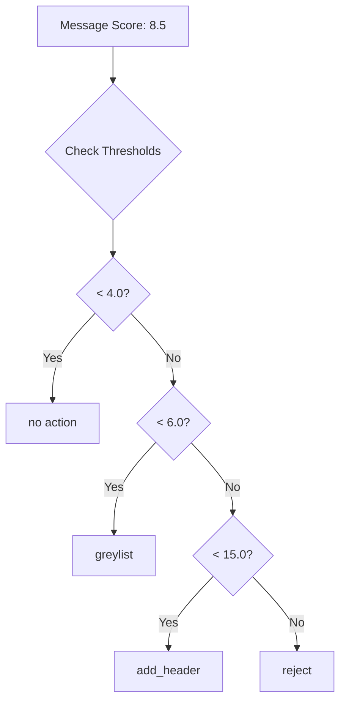

# Configuration Fundamentals

Now that you have [working spam filtering](/getting-started/first-setup), let's understand **what you can configure** and **how to configure it effectively**. This knowledge will help you customize Rspamd for your specific needs.

## The "What and How" Framework

Based on user feedback and common questions, here's what there is to configure in Rspamd:

| Configuration Area | What It Controls | How to Configure | When to Modify | Common Pitfalls |
|-------------------|------------------|------------------|----------------|-----------------|
| **[Modules](#modules-what-tests-to-run)** | Which tests run on messages | `local.d/` files | Different security needs | Disabling core modules |
| **[Scores](#scores-how-much-tests-matter)** | Symbol weights in spam calculation | Actions & metrics files | Fine-tuning accuracy | Score inflation |
| **[Actions](#actions-what-to-do-with-scores)** | Response at different score levels | Actions configuration | Setting spam tolerance | Missing greylisting |
| **[Workers](#workers-how-rspamd-operates)** | Process behavior and integration | Worker-specific configs | MTA integration, performance | Port conflicts |
| **[General Options](#general-options-system-behavior)** | System timeouts, DNS, logging | Global settings | Infrastructure adaptation | DNS timeouts |

## Modules: What Tests to Run

**Modules** are the workhorses of Rspamd - they analyze messages and produce symbols when tests match.

### Understanding Module Types



### Essential Modules You Should Know

| Module | Purpose | Configuration File | Default Status |
|--------|---------|-------------------|----------------|
| **[bayes](/modules/bayes)** | Statistical classification | N/A (core module) | ✅ Enabled |
| **[rbl](/modules/rbl)** | DNS blacklist checks | `rbl.conf` | ✅ Enabled |
| **[dkim](/modules/dkim)** | DKIM signature validation | `dkim.conf` | ✅ Enabled |
| **[spf](/modules/spf)** | SPF record validation | `spf.conf` | ✅ Enabled |
| **[dmarc](/modules/dmarc)** | DMARC policy validation | `dmarc.conf` | ✅ Enabled |
| **[fuzzy_check](/modules/fuzzy_check)** | Fuzzy hash matching | `fuzzy_check.conf` | ✅ Enabled (check usage policies) |
| **[multimap](/modules/multimap)** | Custom rule engine | `multimap.conf` | ⚠️ Requires setup |
| **[antivirus](/modules/antivirus)** | Virus scanning integration | `antivirus.conf` | ❌ Manual setup |

### How to Configure Modules

**Enable/Disable Modules**:
```bash
# Disable a module (create empty file)
sudo touch /etc/rspamd/local.d/module_name.conf
echo 'enabled = false;' | sudo tee /etc/rspamd/local.d/module_name.conf

# Enable with custom settings
sudo nano /etc/rspamd/local.d/module_name.conf
```

**Example: Configure RBL Module**:
```hcl
# /etc/rspamd/local.d/rbl.conf
# Add custom DNS blacklist

rbls {
  "CUSTOM_RBL" {
    symbol = "CUSTOM_RBL";
    rbl = "custom.blocklist.example.com";
    ipv6 = true;
    score = 2.0;
  }
}

# Exclude internal networks from RBL checks
local_networks = "192.168.0.0/16, 10.0.0.0/8, 172.16.0.0/12";
```

**Important: Fuzzy Check Usage Policies**

The fuzzy_check module connects to external fuzzy storage servers. Be aware of usage policies:

- **Public fuzzy servers** (like rspamd.com) have usage limits and policies
- **Commercial environments** should consider running private fuzzy storage
- **High-volume sites** may need to configure custom fuzzy servers
- **Privacy concerns** - fuzzy hashes are sent to external servers

```hcl
# /etc/rspamd/local.d/fuzzy_check.conf
# Configure custom fuzzy server for privacy/policy compliance
rule "local" {
  servers = "fuzzy.internal.example.com:11335";
  symbol = "LOCAL_FUZZY_DENIED";
  mime_types = ["*"];
  read_only = false;
  skip_unknown = true;
}
```

### When to Modify Modules

| Scenario | Action | Example |
|----------|--------|---------|
| **Performance issues** | Disable expensive modules | Disable antivirus if external scanning exists |
| **False positives** | Adjust module sensitivity | Lower RBL scores, exclude internal networks |
| **Custom requirements** | Add specialized modules | Enable multimap for custom business rules |
| **Compliance needs** | Enable specific checks | Add antivirus for regulatory requirements |

## Scores: How Much Tests Matter

**Scores** (also called weights) determine how much each test contributes to the message's spam score.

### Understanding the Scoring System



### Default Score Categories

| Score Range | Meaning | Examples | Typical Actions |
|-------------|---------|----------|-----------------|
| **+5.0 to +15.0** | Strong spam indicators | `BAYES_SPAM`, `FORGED_SENDER` | Major score contribution |
| **+1.0 to +4.9** | Moderate indicators | `R_SPF_FAIL`, `RBL hits` | Moderate score contribution |
| **+0.1 to +0.9** | Minor indicators | `MISSING_DATE`, formatting issues | Small score contribution |
| **0.0** | Informational only | `R_DKIM_ALLOW` | No score impact |
| **-0.1 to -2.0** | Ham indicators | `BAYES_HAM`, `DKIM_VALID` | Reduce spam score |

### How to Adjust Scores

**Method 1: Actions Configuration** (Recommended for beginners)
```bash
sudo nano /etc/rspamd/local.d/actions.conf
```

```hcl
# Adjust thresholds instead of individual scores
reject = 15;        # Increase to reduce false positives
add_header = 6;     # Decrease to catch more spam
greylist = 4;       # Adjust based on tolerance for delays
```

**Method 2: Metrics Configuration** (Advanced users)
```bash
sudo nano /etc/rspamd/local.d/metrics.conf
```

```hcl
# Override specific symbol scores
symbol "FORGED_SENDER" {
  score = 1.0;     # Increase from default 0.3
}

symbol "BAYES_SPAM" {
  score = 4.0;     # Adjust Bayesian spam weight
}
```

### Score Tuning Strategy

**Step 1: Collect Data**
```bash
# Analyze current scoring patterns
rspamc stat | grep "Total messages"

# Review recent message scores in web interface
# Look for patterns in false positives/negatives
```

**Step 2: Identify Problem Areas**
```bash
# Find messages with wrong classifications
# Check web interface History tab
# Look for common symbols in misclassified messages
```

**Step 3: Make Incremental Adjustments**
```hcl
# Example: Reducing false positives from SPF failures
# /etc/rspamd/local.d/metrics.conf

symbol "R_SPF_FAIL" {
  score = 0.5;     # Reduced from default 1.0
}
```

**Step 4: Test and Monitor**
```bash
# Restart Rspamd after changes  
sudo systemctl restart rspamd

# Monitor for 24-48 hours before further adjustments
# Use web interface to track effectiveness
```

## Actions: What to Do with Scores

**Actions** define what happens when messages reach certain spam score thresholds.

### Standard Action Types

| Action | Purpose | When It Triggers | Effect |
|--------|---------|------------------|--------|
| **no action** | Clean message | Score below greylist threshold | Normal delivery |
| **greylist** | Temporary delay | Score between greylist and add_header | Message delayed, legitimate senders retry |
| **add_header** | Mark as spam | Score between add_header and reject | Headers added, usually filed to spam folder |
| **reject** | Refuse message | Score above reject threshold | Message bounced back to sender |

### How Actions Work



### Configuration Examples

**Conservative Setup** (Avoid false positives):
```hcl
# /etc/rspamd/local.d/actions.conf
reject = 20;        # Very high threshold
add_header = 8;     # Conservative spam marking
greylist = 5;       # Moderate greylisting
```

**Aggressive Setup** (Catch more spam):
```hcl
# /etc/rspamd/local.d/actions.conf  
reject = 12;        # Lower reject threshold
add_header = 4;     # Mark more messages as spam
greylist = 3;       # More aggressive greylisting
```

**Balanced Setup** (Default recommendation):
```hcl
# /etc/rspamd/local.d/actions.conf
reject = 15;        # Standard threshold
add_header = 6;     # Balanced spam detection  
greylist = 4;       # Standard greylisting
```

### Action Tuning Guidelines

**Adjust `reject` threshold when**:
- ⬆️ **Increase** if you're getting false positive rejections
- ⬇️ **Decrease** if obvious spam is getting through

**Adjust `add_header` threshold when**:
- ⬆️ **Increase** if too many legitimate messages marked as spam
- ⬇️ **Decrease** if spam is reaching inboxes

**Adjust `greylist` threshold when**:
- ⬆️ **Increase** if legitimate senders complain about delays
- ⬇️ **Decrease** if you want more aggressive spam blocking

## Workers: How Rspamd Operates

**Workers** are different processes that handle specific Rspamd functions.

### Worker Types and Their Roles

| Worker | Purpose | Configuration File | Default Port |
|--------|---------|-------------------|--------------|
| **normal** | Message scanning | `worker-normal.inc` | 11333 |
| **controller** | Web interface, API | `worker-controller.inc` | 11334 |
| **proxy** | MTA integration | `worker-proxy.inc` | 11332 |
| **fuzzy** | Fuzzy hash storage | `worker-fuzzy.inc` | 11335 |

### Essential Worker Configurations

**Controller Worker** (Web Interface):
```hcl
# /etc/rspamd/local.d/worker-controller.inc
password = "$2$your_password_hash";
bind_socket = "localhost:11334";
secure_ip = "127.0.0.1";  # Restrict access
```

**Proxy Worker** (MTA Integration):
```hcl
# /etc/rspamd/local.d/worker-proxy.inc
milter = yes;                    # Enable milter protocol
timeout = 120s;                  # MTA timeout

# For small installations, proxy can work in self-scan mode
# (combines proxy and scanner functionality)
upstream "local" {
  default = yes;
  self_scan = yes;               # Enable self-scan for small setups
}

# Benefits of self-scan mode:
# - Reduces process overhead for small installations
# - Simplifies configuration (no separate scanner worker needed)
# - Maintains full scanning functionality
# - Suitable for installations with < 1000 messages/day
```

**Normal Worker** (Scanning):
```hcl
# /etc/rspamd/local.d/worker-normal.inc
bind_socket = "localhost:11333";
task_timeout = 8s;               # Per-message timeout
max_tasks = 0;                   # Unlimited concurrent tasks
```

### When to Modify Worker Configuration

| Scenario | Worker | Modification | Example |
|----------|--------|--------------|---------|
| **Performance tuning** | normal | Adjust timeouts, limits | Increase `max_tasks` for high volume |
| **Security hardening** | controller | Restrict access | Bind to specific IP addresses |
| **MTA integration** | proxy | Configure milter settings, self-scan mode | Set appropriate timeouts, enable self-scan for small installations |
| **High availability** | all | Multiple instances | Configure load balancing |

## General Options: System Behavior

**General options** control system-wide behavior like DNS resolution, logging, and timeouts.

### Key General Options

```hcl
# /etc/rspamd/local.d/options.inc

# DNS Configuration
dns {
  timeout = 1s;                  # DNS query timeout
  sockets = 16;                  # Concurrent DNS queries
  # Use local resolver - avoid public DNS servers like 8.8.8.8
  # Public DNS servers can cause:
  # - Higher latency and timeouts
  # - Rate limiting issues
  # - Different RBL responses than your ISP expects
  # - Privacy concerns (DNS queries visible to third parties)
  # nameserver = ["127.0.0.1"];  # Use system resolver (recommended)
}

# Logging
logging {
  level = "info";                # Logging verbosity
  log_file = "/var/log/rspamd/rspamd.log";
}

# Performance
tempdir = "/tmp";                # Temporary files location
max_message = 50M;               # Maximum message size
```

### Common Configuration Scenarios

**Slow Network Environment**:
```hcl
# Increase timeouts for slow networks
dns {
  timeout = 3s;
  retransmits = 5;
  # Still use local resolver even with increased timeouts
  # nameserver = ["127.0.0.1"];
}
```

**High Security Environment**:
```hcl
# Restrict message size
max_message = 10M;

# Note: Debug logging is very verbose and not recommended for production
# Use "info" level for normal operations
```

**Performance Optimization**:
```hcl
# Optimize for high volume
dns {
  sockets = 32;                  # More concurrent queries
}
```

## Configuration File Structure

Understanding where and how to place configuration files:

### Directory Structure

```
/etc/rspamd/
├── rspamd.conf                  # Main config (don't edit)
├── local.d/                     # Your customizations
│   ├── actions.conf
│   ├── metrics.conf
│   └── worker-*.inc
├── override.d/                  # Complete replacements
└── modules.d/                   # Module defaults (don't edit)
```

### Configuration Precedence

1. **`override.d/`** - Completely replaces default configuration
2. **`local.d/`** - Merges with default configuration  
3. **`modules.d/`** - Default module configuration
4. **`rspamd.conf`** - Main configuration file

**Best Practice**: Always use `local.d/` unless you need to completely replace a configuration section.

## Configuration Testing and Validation

### Test Configuration Syntax

```bash
# Check configuration for syntax errors
sudo rspamadm configtest

# Check configuration with verbose output
sudo rspamadm configtest -v
```

### Monitor Configuration Changes

```bash
# View configuration dump
rspamc configdump

# Check specific symbols and scores
rspamc configdump | grep -A5 -B5 "symbol_name"

# Monitor real-time changes
tail -f /var/log/rspamd/rspamd.log
```

### Validate Changes with Test Messages

```bash
# Test message processing after configuration changes
echo "Test message" | rspamc

# Check specific symbols are working
echo "Test message with suspicious content" | rspamc | grep "SYMBOL_NAME"
```

## Common Configuration Patterns

### The Minimal Configuration Pattern
- Only modify action thresholds
- Use default modules and scores
- Focus on MTA integration

**Files to modify**:
- `local.d/actions.conf`
- `local.d/worker-proxy.inc`
- `local.d/worker-controller.inc`

### The Tuned Environment Pattern
- Customize scores based on testing
- Enable/disable specific modules
- Adjust learning mechanisms

**Additional files**:
- `local.d/metrics.conf`
- `local.d/rbl.conf`
- `local.d/multimap.conf`

### The High Performance Pattern
- Optimize worker configuration
- Tune system limits
- Focus on speed over features

**Additional considerations**:
- Worker timeouts and limits
- DNS configuration optimization
- Memory and CPU tuning

## What's Next?

Now that you understand configuration fundamentals:

1. **[Choose the right tools](/configuration/tool-selection)** for your specific tasks
2. **[Apply scenario-specific configurations](/scenarios/)** for your environment
3. **[Learn rule writing](/developers/writing_rules)** for custom detection logic
4. **[Set up monitoring](/maintenance/monitoring/)** to track configuration effectiveness

## Key Takeaways

✅ **Configuration has five main areas**: modules, scores, actions, workers, and general options
✅ **Start with actions and thresholds** before diving into detailed score tuning  
✅ **Use `local.d/` for customizations** to preserve upgradeability
✅ **Test configuration changes** before applying to production
✅ **Monitor effectiveness** and adjust based on real-world performance