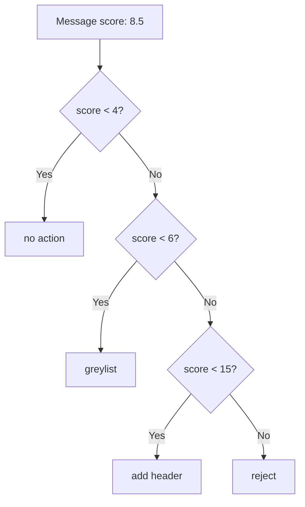

# Configuration fundamentals

This page follows [first setup](/getting-started/first-setup). It explains what you can change in Rspamd and which file each change goes in.

## Configuration areas

| Area | What it controls | Where you change it |
|------|------------------|---------------------|
| [Modules](#modules) | Which checks run and how they are set up | `local.d/<module>.conf` |
| [Scores](#scores) | How much each symbol adds to the message score | `local.d/groups.conf` or `local.d/<group>_group.conf`, or the web interface (WebUI) |
| [Actions](#actions) | What Rspamd tells the MTA to do at each score | `local.d/actions.conf` |
| [Workers](#workers) | The processes that scan mail, serve the WebUI and talk to the MTA | `local.d/worker-<name>.inc` |
| [General options](#general-options) | DNS, timeouts, size limits | `local.d/options.inc` |
| [Logging](#logging) | Log level, destination and format | `local.d/logging.inc` |

Paths on this page are relative to `/etc/rspamd/`. A file in `local.d/` holds only the settings you change, and Rspamd merges it with the shipped defaults. Don't wrap its content in the section name: `local.d/actions.conf` contains `reject = 20;`, not `actions { reject = 20; }`. [Configuration file structure](#configuration-file-structure) has the details.

## Modules

Modules run the checks. When a check matches, it adds a symbol to the result, and the symbol's score is added to the message score.

Four modules are compiled into the binary: `chartable`, `dkim`, `regexp` and `fuzzy_check`. The `filters` option lists the built-in modules to load, and these four are its default value. The others are Lua plugins, for example `rbl`, `spf`, `dmarc`, `multimap` and `dkim_signing`. You configure and disable both kinds the same way.

| Module | What it does | Default state |
|--------|--------------|---------------|
| [rbl](/modules/rbl) | DNS blocklist lookups for IP addresses, domains and URLs | Enabled |
| [spf](/modules/spf) | SPF checks | Enabled |
| [dkim](/modules/dkim) | DKIM signature verification | Enabled |
| [dmarc](/modules/dmarc) | DMARC policy checks | Enabled |
| [fuzzy_check](/modules/fuzzy_check) | Fuzzy hash lookups, by default against the rspamd.com storage | Enabled; free use has limits, see [Fuzzy check and the usage policy](#fuzzy-check-and-the-usage-policy) |
| [multimap](/modules/multimap) | Rules based on lists (maps) | Enabled with shipped freemail, disposable and redirector rules; add your own in `local.d/multimap.conf` |
| [greylist](/modules/greylisting) | Greylisting | Enabled, but switches itself off until Redis is configured |
| [antivirus](/modules/antivirus) | Passes messages to a virus scanner | Inactive until you configure a scanner |

Bayesian filtering is not a module. It is the statistical classifier, configured in `local.d/classifier-bayes.conf` (see [statistics](/configuration/statistic)). It keeps its data in Redis, so it needs Redis servers, usually set in `local.d/redis.conf` (see [Redis configuration](/configuration/redis)). It adds `BAYES_SPAM` or `BAYES_HAM` only after it has learned at least 200 spam and 200 ham messages.

### Changing and disabling modules

Put only the options you want to change in `local.d/<module>.conf`, without a `<module> { }` wrapper. To turn a module off, set `enabled = false;` in that file:

```bash
# Replace MODULE with the module name, for example phishing.
# This overwrites any settings already in the file.
echo 'enabled = false;' | sudo tee /etc/rspamd/local.d/MODULE.conf
```

If the file already has settings, add the line to it instead. An empty file does not disable anything. `rspamadm configdump -m` lists the enabled modules and the reason each of the others is disabled.

### Example: add a DNS blocklist

```hcl
# /etc/rspamd/local.d/rbl.conf
rbls {
  "CUSTOM_RBL" {
    symbol = "CUSTOM_RBL";
    rbl = "custom.blocklist.example.com";
    checks = ["from"];   # look up the IP address that sent the message
  }
}
```

An RBL rule has no `score` option. Rspamd disables a rule that contains an unknown option and logs an error. Set the score in the `rbl` group instead:

```hcl
# /etc/rspamd/local.d/rbl_group.conf
symbols {
  "CUSTOM_RBL" {
    weight = 2.0;
  }
}
```

RBL rules skip loopback addresses and the networks in the global `local_addrs` option (private and link-local ranges by default), so you don't need to exclude your internal networks. To exclude more addresses from RBL checks only, set `local_exclude_ip_map` in `local.d/rbl.conf` to a map of addresses.

### Fuzzy check and the usage policy

`fuzzy_check` sends hashes of message parts to the public rspamd.com fuzzy storage. That feed is free only for non-commercial use below 5,000 queries per day; see the [usage policy](/other/usage_policy). Commercial sites, and sites that send more queries than that, must either use the premium feed or turn off the rspamd.com rule:

```hcl
# /etc/rspamd/local.d/fuzzy_check.conf
rule "rspamd.com" {
  enabled = false;
}
```

You can also run your own fuzzy storage. It holds only the hashes you learn yourself and does not replace the rspamd.com data. The storage worker is disabled by default and keeps its data in Redis, using the servers from `local.d/redis.conf`. To start it:

```hcl
# /etc/rspamd/local.d/worker-fuzzy.inc
count = 1;
```

It listens on `localhost:11335` and accepts learning only from the addresses in `allow_update` (`localhost` by default). If the scanners reach it over the network, as in the rule below, also set `bind_socket` in this file (for example `bind_socket = "*:11335";`) and list the hosts that learn in `allow_update`. A list set in `local.d/` is added to the default `localhost`. The [fuzzy storage tutorial](/tutorials/fuzzy_storage) covers access control and encryption.

To query your storage, add a rule for it:

```hcl
# /etc/rspamd/local.d/fuzzy_check.conf
rule "local" {
  algorithm = "mumhash";
  servers = "fuzzy.internal.example.com:11335";
  symbol = "LOCAL_FUZZY_UNKNOWN";
  mime_types = ["*"];
  read_only = false;     # allow learning to this storage
  skip_unknown = true;   # ignore flags that are not in fuzzy_map
  fuzzy_map = {
    LOCAL_FUZZY_DENIED {
      hits_limit = 20.0;
      flag = 11;
    }
  }
}
```

Symbols from `fuzzy_map` have no score by default, so a match adds 0 to the message score (Rspamd also logs `symbol ... has no score registered` at startup). Give them one:

```hcl
# /etc/rspamd/local.d/fuzzy_group.conf
symbols {
  "LOCAL_FUZZY_DENIED" {
    weight = 12.0;
  }
}
```

## Scores

A symbol's weight, also called its score, is the amount it adds to the message score. The message score is the sum of the weights of all symbols that matched. Some symbols scale their weight by the confidence of the check: `BAYES_SPAM`, for example, adds up to 5.1 depending on the Bayes probability.

Some default weights:

| Symbol | Default weight | Meaning |
|--------|----------------|---------|
| `FUZZY_DENIED` | 12.0 | Matches a hash in the rspamd.com fuzzy blocklist |
| `SPOOF_DISPLAY_NAME` | 8.0 | Display name is used to spoof the recipient |
| `BAYES_SPAM` | up to 5.1 | Bayes classifier says spam |
| `MISSING_MID` | 2.5 | No Message-ID header |
| `R_SPF_FAIL` | 1.0 | SPF verification failed |
| `MISSING_DATE` | 1.0 | No Date header |
| `FORGED_SENDER` | 0.3 | From header and SMTP MAIL FROM differ |
| `R_DKIM_NA` | 0.0 | No DKIM signature |
| `R_DKIM_ALLOW` | -0.1 | DKIM signature verified |
| `R_SPF_ALLOW` | -0.2 | SPF allows the sender |
| `DMARC_POLICY_ALLOW` | -0.5 | DMARC check passed |
| `BAYES_HAM` | down to -3.0 | Bayes classifier says ham |

`rspamadm configdump -g` prints every symbol with the score set in the configuration files. It does not include scores saved from the WebUI (see below); the WebUI Symbols tab shows the scores the running Rspamd uses.

### Changing a score

Set weights in `local.d/groups.conf`:

```hcl
# /etc/rspamd/local.d/groups.conf
symbols {
  "FORGED_SENDER" {
    weight = 1.0;
  }
  "R_SPF_FAIL" {
    weight = 0.5;
  }
}
```

The same `symbols { }` block also works in the file of the symbol's group, for example `local.d/headers_group.conf` for `FORGED_SENDER` or `local.d/policies_group.conf` for `R_SPF_FAIL`. The `group` line in `rspamadm configdump -d` output tells you which group a symbol belongs to.

Scores you change in the WebUI are saved to `/var/lib/rspamd/rspamd_dynamic` and take precedence over `local.d/`. If a `local.d/` change has no effect, check whether `rspamd_dynamic` holds a value for the same symbol.

Older guides set scores in `local.d/metrics.conf`. That file has been deprecated since Rspamd 1.7; use the group files.

### Tuning scores

Adjust the action thresholds first (see [Setting thresholds](#setting-thresholds)). Change individual weights when specific symbols cause wrong results.

1. Check the counters:
   ```bash
   rspamc stat | grep -E 'Messages (scanned|with action|treated)'
   ```
2. In the WebUI History tab, open misclassified messages and note which symbols matched.
3. Change one weight at a time, run `sudo rspamadm configtest`, then restart Rspamd with `sudo systemctl restart rspamd`.
4. Watch the History tab and `rspamc stat` before you make the next change.

## Actions

The action is Rspamd's verdict for the MTA. Rspamd compares the message score with the action thresholds and picks the action with the highest threshold that the score has reached (score >= threshold).

| Action | Default threshold | Result |
|--------|-------------------|--------|
| no action | below 4 | The message is accepted. |
| greylist | 4 | If the [greylist](/modules/greylisting) module is active (it needs Redis), first-time senders get a temporary failure (soft reject) and must retry. Messages that score high enough for `add header` or `rewrite subject` are greylisted too; rejected messages are not. Without Redis the message is accepted. |
| add header | 6 | The message is delivered with a spam header (`X-Spam: Yes` when the MTA uses the milter proxy). Mail filters or the mail client usually move it to a spam folder. |
| rewrite subject | none | The subject line is rewritten. Applies only if you set a threshold. |
| soft reject | none | Temporary failure. Modules such as greylist and ratelimit set it. |
| reject | 15 | The MTA refuses the message during the SMTP session (`554 5.7.1 Spam message rejected` with the milter proxy). The sending server reports the failure to its user; your server sends no bounce. |

With the default thresholds, a message that scores 8.5 gets `add header` (if greylisting is active, a first-time sender gets a soft reject first):


```mermaid
graph TB
    A[Message score: 8.5] --> C{score < 4?}
    C -->|Yes| D[no action]
    C -->|No| E{score < 6?}
    E -->|Yes| F[greylist]
    E -->|No| G{score < 15?}
    G -->|Yes| H[add header]
    G -->|No| I[reject]
```

### Setting thresholds

`local.d/actions.conf` is merged with the defaults, so list only the thresholds you change. In this file, action names are written with underscores (`add_header`, `rewrite_subject`):

```hcl
# /etc/rspamd/local.d/actions.conf
reject = 20;       # default 15
add_header = 8;    # default 6
```

Which way to move each threshold:

| Threshold | Raise it when | Lower it when |
|-----------|---------------|---------------|
| `reject` | legitimate mail gets rejected | obvious spam is only marked, not rejected |
| `add_header` | legitimate mail lands in spam folders | spam reaches inboxes unmarked |
| `greylist` | legitimate senders complain about delays | spam that scores just below the threshold is delivered without greylisting |

## Workers

Each worker type has its own file in `local.d/`. Put only the options you change in it, without a `worker { }` wrapper.

| Worker type | Role | Local file | Default socket |
|-------------|------|------------|----------------|
| `normal` | Scans messages | `local.d/worker-normal.inc` | `localhost:11333` |
| `controller` | WebUI, HTTP API, learning, statistics | `local.d/worker-controller.inc` | `localhost:11334` |
| `rspamd_proxy` | Milter interface for the MTA; passes messages to scanners or scans them itself | `local.d/worker-proxy.inc` | `localhost:11332` |
| `fuzzy` | Local fuzzy hash storage (Redis backend) | `local.d/worker-fuzzy.inc` | `localhost:11335`, disabled by default |

### Controller

Set a password for the WebUI and API. `rspamadm pw` asks for a password and prints its hash:

```hcl
# /etc/rspamd/local.d/worker-controller.inc
password = "$2$...";   # hash printed by rspamadm pw
```

`secure_ip` lists the addresses that may use the controller without a password (`127.0.0.1` and `::1` by default). It does not restrict who can connect: use `bind_socket` (default `localhost:11334`) and a firewall for that. A `secure_ip` value in `local.d/` replaces the default list instead of adding to it.

### Proxy

The proxy is enabled by default. It speaks the milter protocol on port 11332 and passes messages to the normal worker on localhost. On a single server it can scan messages itself (self-scan mode):

```hcl
# /etc/rspamd/local.d/worker-proxy.inc
upstream "local" {
  self_scan = yes;
}
```

The normal worker keeps running after this change. If nothing else uses it, disable it:

```hcl
# /etc/rspamd/local.d/worker-normal.inc
enabled = false;
```

`rspamc` then has to use the controller port (11334). It does so by default when it connects to localhost; for a remote host, pass `-h host:11334`. See [self-scan mode](/workers/rspamd_proxy#self-scan-mode) for details.

### Normal worker

To scan more messages in parallel, run more scanner processes with `count`:

```hcl
# /etc/rspamd/local.d/worker-normal.inc
count = 8;
```

The default `count` is the number of CPU cores minus two, at least 1 and at most 4. `max_tasks` (default 0, unlimited) caps how many messages one process handles at the same time, so set it only to limit load, not to increase throughput.

## General options

Global options go in `local.d/options.inc`. The ones you are most likely to change:

| Option | Default | Meaning |
|--------|---------|---------|
| `dns.nameserver` | servers from `/etc/resolv.conf` | DNS servers Rspamd queries |
| `dns.timeout` | 1s | Time to wait for each DNS attempt |
| `dns.retransmits` | 5 | Attempts before a lookup fails |
| `dns.sockets` | 16 | Sockets per DNS server |
| `dns_max_requests` | 64 | DNS requests allowed per message |
| `task_timeout` | 8s | Maximum processing time for one message |
| `max_message` | 50 MiB | Largest message Rspamd scans |
| `max_urls` | 10240 | Maximum number of URLs processed per message |
| `max_recipients` | 1024 | Maximum number of recipients processed per message |
| `local_addrs` | private and link-local ranges | Addresses treated as local, for example skipped by RBL checks |

### DNS

Use a local recursive resolver; [DNS resolver](/getting-started/installation#dns-resolver) explains why.

```hcl
# /etc/rspamd/local.d/options.inc
dns {
  nameserver = ["127.0.0.1"];   # local recursive resolver
}
```

Without `nameserver`, Rspamd uses the servers listed in `/etc/resolv.conf`. Set `127.0.0.1` only if a resolver listens there.

On a slow network, raise the DNS timeout and keep `task_timeout` above the longest DNS wait. Each attempt waits a full timeout, so one lookup can take up to `timeout` × `retransmits`:

```hcl
# /etc/rspamd/local.d/options.inc
dns {
  timeout = 3s;      # 5 attempts (default): up to 15s per lookup
}
task_timeout = 20s;
```

### Message size limit

Rspamd does not scan messages larger than `max_message`, so keep it at or above the message size limit of your MTA:

```hcl
# /etc/rspamd/local.d/options.inc
max_message = 100mb;
```

Write sizes with `mb`. In UCL, `mb` means 1024 × 1024 bytes and `M` means 1,000,000 bytes, so `max_message = 50M;` sets a limit slightly below the 50 MiB default.

## Logging

Logging has its own section and file, `local.d/logging.inc`. Logging settings placed in `options.inc` are ignored. By default Rspamd logs at `info` level to `/var/log/rspamd/rspamd.log`. To get debug output from one module without switching the whole log to `debug`:

```hcl
# /etc/rspamd/local.d/logging.inc
debug_modules = ["dkim"];
```

See [logging](/configuration/logging) for all options.

## Configuration file structure

```
/etc/rspamd/
├── rspamd.conf          # main file (shipped, do not edit)
├── actions.conf         # shipped defaults, one file per section
├── groups.conf
├── options.inc
├── worker-*.inc
├── modules.d/           # shipped module defaults (do not edit)
├── scores.d/            # shipped symbol scores (do not edit)
├── local.d/             # your changes, merged with the defaults
│   ├── actions.conf
│   ├── groups.conf
│   ├── options.inc
│   └── worker-normal.inc
└── override.d/          # your changes, replacing defaults key by key
```

A comment at the top of most shipped files names the `local.d/` and `override.d/` files that extend them. Don't edit the shipped files: upgrades bring new versions of them, and an edited file is either replaced (FreeBSD) or left for you to merge by hand (`.rpmnew` files, dpkg prompts). See [Key paths](/getting-started/installation#key-paths).

### Precedence

From lowest to highest:

1. Shipped defaults: `rspamd.conf` and the files next to it, `modules.d/`, `scores.d/`.
2. `local.d/` (priority 1): merged into the defaults. Settings you don't mention keep their default values.
3. Scores and action thresholds saved from the WebUI (`/var/lib/rspamd/rspamd_dynamic`). They take precedence over `local.d/` but not over `override.d/`.
4. `override.d/` (priority 10): every key or block you define replaces the default as a whole, without merging. Keys you don't define keep their defaults.

For example, `override.d/actions.conf` containing only `reject = 20;` keeps the default `add_header` and `greylist` thresholds. But `override.d/options.inc` containing `dns { timeout = 3s; }` replaces the whole `dns` block: the `sockets` and `retransmits` lines from the shipped `options.inc` no longer apply, and Rspamd uses its built-in values for them.

Use `local.d/` unless you need to replace a whole block. Top-level sections that have no file in `local.d/` go into `rspamd.conf.local`, or `rspamd.conf.override` to override at priority 10.

## Testing changes

```bash
sudo rspamadm configtest      # prints "syntax OK" or the errors
sudo rspamadm configtest -s   # also fails if any module logged an error
```

Plain `configtest` can print `syntax OK` while a module has rejected part of its configuration. An RBL rule with an unknown option, for example, is disabled with an error message. With `-s`, any logged error makes the test fail with `syntax BAD`.

Check the configuration as Rspamd loads it:

```bash
rspamadm configdump actions                      # one section
rspamadm configdump -g                           # symbol groups with scores from the config files
rspamadm configdump -d | grep -A10 'MISSING_DATE {'   # details of one symbol
rspamadm configdump -m                           # enabled and disabled modules
```

Plain `rspamadm configdump` shows only the configuration files, so symbols registered by Lua rules, such as `MISSING_DATE`, do not appear in it. Use `-g` or `-d` to see scores, including those of Lua rules. Neither includes scores saved from the WebUI.

Scan a message and follow the log:

```bash
rspamc /path/to/message.eml
rspamc /path/to/message.eml | grep SYMBOL_NAME
tail -f /var/log/rspamd/rspamd.log
```

## Common setups

| Setup | What you change | Files |
|-------|-----------------|-------|
| Minimal | Redis, the controller password and MTA integration; modules, scores and thresholds stay at their defaults | `local.d/redis.conf`, `local.d/worker-controller.inc`; `local.d/worker-proxy.inc` only if the MTA runs on another host |
| Tuned | Also action thresholds, symbol scores, extra blocklists, your own map rules, Bayes | adds `local.d/actions.conf`, `local.d/groups.conf` (or `<group>_group.conf`), `local.d/rbl.conf`, `local.d/multimap.conf`, `local.d/classifier-bayes.conf` |
| High volume | Number of scanner processes, DNS and timeouts, separate scanner hosts behind the proxy | `local.d/worker-normal.inc`, `local.d/options.inc`, `local.d/worker-proxy.inc` |

## Next steps

- [Tool selection guide](/guides/configuration/tool-selection): which mechanism to use for a custom check
- [MTA integration](/tutorials/integration)
- [Writing rules](/developers/writing_rules)
- [Actions and scores reference](/configuration/metrics)
- Monitoring: [metric exporter](/modules/metric_exporter) and [log analysis with rspamadm](/administration/rspamadm/log-analysis)
