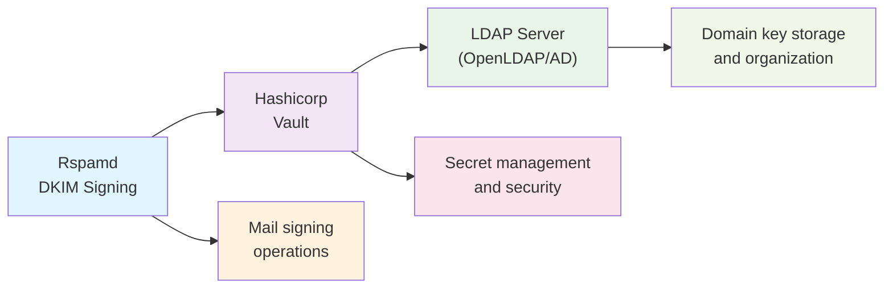

# DKIM Signing: Complete Setup Guide

**DKIM (DomainKeys Identified Mail)** signing allows you to cryptographically sign outbound emails, proving they originated from your domain and haven't been tampered with. This tutorial provides step-by-step instructions for implementing DKIM signing with Rspamd.

## What is DKIM?

DKIM adds a digital signature to your outbound emails using public-key cryptography:
- **Private key**: Kept on your mail server to sign messages
- **Public key**: Published in DNS for verification
- **Selector**: Allows multiple keys per domain

DKIM helps with:
- Email authentication and deliverability
- Protection against spoofing
- Building domain reputation
- Meeting security compliance requirements

## Basic Setup

### Step 1: Generate DKIM Keys

Create DKIM key pairs for your domains:

```bash
# Generate keys for your main domain
sudo mkdir -p /etc/rspamd/dkim
cd /etc/rspamd/dkim

# Generate a 2048-bit RSA key (recommended)
rspamadm dkim_keygen -s mail -d example.com -k mail.key

# This creates:
# - mail.key (private key)  
# - mail.txt (DNS record to publish)
```

Example output:
```
# DNS record to publish:
mail._domainkey.example.com. IN TXT "v=DKIM1; k=rsa; p=MIIBIjANBgkqhkiG9w0BAQEFAAOCAQ8AMIIBCgKCAQEA..."

# Private key written to mail.key
```

### Step 2: Configure DKIM Signing

Create the DKIM signing configuration:

```hcl
# /etc/rspamd/local.d/dkim_signing.conf

# Enable DKIM signing
enabled = true;

# Default signing configuration
domain {
  example.com {
    selector = "mail";
    path = "/etc/rspamd/dkim/mail.key";
  }
}

# Sign outbound mail only
sign_authenticated = true;
sign_local = true;
sign_inbound = false;

# Default settings
use_esld = true;
check_pubkey = true;
```

### Step 3: Set File Permissions

Secure the private keys:

```bash
# Set proper ownership and permissions
sudo chown -R _rspamd:_rspamd /etc/rspamd/dkim/
sudo chmod 600 /etc/rspamd/dkim/*.key
sudo chmod 644 /etc/rspamd/dkim/*.txt
```

### Step 4: Publish DNS Records

Add the DNS record from the generated `.txt` file:

```dns
; Add this to your DNS zone
mail._domainkey.example.com. IN TXT "v=DKIM1; k=rsa; p=MIIBIjANBgkqhkiG9w0BAQEFAAOCAQ8AMIIBCgKCAQEA4f5wg5l2hKdVBqpxdqTqDPbaohNcGI94vs9lxjzHZl9j7u2B..."
```

### Step 5: Test and Restart

```bash
# Test configuration
sudo rspamadm configtest

# Restart Rspamd
sudo systemctl restart rspamd

# Test DKIM signing
echo "Test message" | rspamc -d example.com -f test@example.com
```

## Advanced Configurations

### Multi-Domain Setup

Configure signing for multiple domains:

```hcl
# /etc/rspamd/local.d/dkim_signing.conf

enabled = true;

# Multiple domain configuration
domain {
  example.com {
    selector = "mail";
    path = "/etc/rspamd/dkim/example.com/mail.key";
  }
  
  subdomain.example.com {
    selector = "sub";
    path = "/etc/rspamd/dkim/subdomain.example.com/sub.key";
  }
  
  anotherdomain.org {
    selector = "rspamd";
    path = "/etc/rspamd/dkim/anotherdomain.org/rspamd.key";
  }
}

# Sign authenticated and local mail
sign_authenticated = true;
sign_local = true;
```

Generate keys for each domain:

```bash
# Create directory structure
sudo mkdir -p /etc/rspamd/dkim/{example.com,subdomain.example.com,anotherdomain.org}

# Generate keys for each domain
rspamadm dkim_keygen -s mail -d example.com -k /etc/rspamd/dkim/example.com/mail.key
rspamadm dkim_keygen -s sub -d subdomain.example.com -k /etc/rspamd/dkim/subdomain.example.com/sub.key  
rspamadm dkim_keygen -s rspamd -d anotherdomain.org -k /etc/rspamd/dkim/anotherdomain.org/rspamd.key
```

### Enterprise Configuration: DKIM with Hashicorp Vault and LDAP Backend

This section provides a comprehensive guide for implementing an enterprise-grade DKIM signing solution using Hashicorp Vault with LDAP backend storage for per-domain key management.

#### Architecture Overview



#### Prerequisites

- Hashicorp Vault server (version 1.8+)
- LDAP server (OpenLDAP, Active Directory, or similar)
- Rspamd (version 1.9.3+)
- Administrative access to all systems
- SSL/TLS certificates for secure communication

#### Step 1: LDAP Server Setup

First, configure your LDAP server to store DKIM keys. This example uses OpenLDAP:

**1.1 Create LDAP Schema for DKIM Keys**

```ldif
# /etc/ldap/schema/dkim.ldif
dn: cn=dkim,cn=schema,cn=config
objectClass: olcSchemaConfig
cn: dkim
olcAttributeTypes: ( 1.3.6.1.4.1.99999.1.1 NAME 'dkimPrivateKey'
  DESC 'DKIM Private Key in PEM format'
  EQUALITY caseExactMatch
  SYNTAX 1.3.6.1.4.1.1466.115.121.1.15 SINGLE-VALUE )
olcAttributeTypes: ( 1.3.6.1.4.1.99999.1.2 NAME 'dkimSelector'
  DESC 'DKIM Selector'
  EQUALITY caseExactMatch
  SYNTAX 1.3.6.1.4.1.1466.115.121.1.15 SINGLE-VALUE )
olcAttributeTypes: ( 1.3.6.1.4.1.99999.1.3 NAME 'dkimKeyType'
  DESC 'DKIM Key Type (rsa, ed25519)'
  EQUALITY caseExactMatch
  SYNTAX 1.3.6.1.4.1.1466.115.121.1.15 SINGLE-VALUE )
olcAttributeTypes: ( 1.3.6.1.4.1.99999.1.4 NAME 'dkimKeySize'
  DESC 'DKIM Key Size in bits'
  EQUALITY integerMatch
  SYNTAX 1.3.6.1.4.1.1466.115.121.1.27 SINGLE-VALUE )
olcAttributeTypes: ( 1.3.6.1.4.1.99999.1.5 NAME 'dkimPublicKey'
  DESC 'DKIM Public Key for DNS record'
  EQUALITY caseExactMatch
  SYNTAX 1.3.6.1.4.1.1466.115.121.1.15 SINGLE-VALUE )
olcObjectClasses: ( 1.3.6.1.4.1.99999.2.1 NAME 'dkimKey'
  DESC 'DKIM Key Object'
  SUP top
  STRUCTURAL
  MUST ( cn $ dkimPrivateKey $ dkimSelector $ dkimKeyType )
  MAY ( dkimKeySize $ dkimPublicKey $ description ) )
```

**1.2 Apply the Schema**

```bash
# Add the schema to LDAP
sudo ldapadd -Y EXTERNAL -H ldapi:/// -f /etc/ldap/schema/dkim.ldif
```

**1.3 Create Organizational Structure**

```ldif
# /tmp/dkim_structure.ldif
dn: ou=dkim,dc=example,dc=com
objectClass: organizationalUnit
ou: dkim
description: DKIM Keys Storage

dn: ou=domains,ou=dkim,dc=example,dc=com
objectClass: organizationalUnit
ou: domains
description: Domain-specific DKIM keys

dn: ou=selectors,ou=dkim,dc=example,dc=com
objectClass: organizationalUnit
ou: selectors
description: DKIM selectors management
```

```bash
# Apply the structure
ldapadd -x -D "cn=admin,dc=example,dc=com" -W -f /tmp/dkim_structure.ldif
```

#### Step 2: Hashicorp Vault Setup

**2.1 Install and Initialize Vault**

```bash
# Download and install Vault (adjust version as needed)
curl -O https://releases.hashicorp.com/vault/1.15.0/vault_1.15.0_linux_amd64.zip
unzip vault_1.15.0_linux_amd64.zip
sudo mv vault /usr/local/bin/

# Create vault user and directories
sudo useradd --system --home /etc/vault --shell /bin/false vault
sudo mkdir -p /etc/vault /opt/vault/data
sudo chown vault:vault /etc/vault /opt/vault/data
```

**2.2 Configure Vault**

```hcl
# /etc/vault/vault.hcl
storage "file" {
  path = "/opt/vault/data"
}

listener "tcp" {
  address     = "127.0.0.1:8200"
  tls_disable = 1  # Only for development; use TLS in production
}

# Production configuration should include:
# listener "tcp" {
#   address       = "0.0.0.0:8200"
#   tls_cert_file = "/etc/vault/tls/vault.crt"
#   tls_key_file  = "/etc/vault/tls/vault.key"
# }

api_addr = "http://127.0.0.1:8200"
cluster_addr = "https://127.0.0.1:8201"
ui = true

# Enable audit logging
audit {
  file {
    file_path = "/opt/vault/logs/audit.log"
  }
}
```

**2.3 Start and Initialize Vault**

```bash
# Create systemd service
sudo tee /etc/systemd/system/vault.service > /dev/null <<EOF
[Unit]
Description=HashiCorp Vault
Documentation=https://www.vaultproject.io/docs/
Requires=network-online.target
After=network-online.target
ConditionFileNotEmpty=/etc/vault/vault.hcl

[Service]
Type=notify
User=vault
Group=vault
ProtectSystem=full
ProtectHome=read-only
PrivateTmp=yes
PrivateDevices=yes
SecureBits=keep-caps
AmbientCapabilities=CAP_IPC_LOCK
NoNewPrivileges=yes
ExecStart=/usr/local/bin/vault server -config=/etc/vault/vault.hcl
ExecReload=/bin/kill -HUP \$MAINPID
KillMode=process
Restart=on-failure
RestartSec=5

[Install]
WantedBy=multi-user.target
EOF

# Start Vault
sudo systemctl enable vault
sudo systemctl start vault

# Set environment variables
export VAULT_ADDR='http://127.0.0.1:8200'

# Initialize Vault (save these keys securely!)
vault operator init -key-shares=5 -key-threshold=3

# Unseal Vault with 3 of the 5 keys
vault operator unseal <key1>
vault operator unseal <key2>
vault operator unseal <key3>

# Authenticate with root token
vault auth <root_token>
```

**2.4 Configure LDAP Secrets Engine**

```bash
# Enable LDAP secrets engine
vault secrets enable -path=ldap-dkim ldap

# Configure LDAP connection
vault write ldap-dkim/config \
    binddn="cn=admin,dc=example,dc=com" \
    bindpass="admin_password" \
    url="ldap://localhost:389" \
    userdn="ou=domains,ou=dkim,dc=example,dc=com"

# Create a role for DKIM key management
vault write ldap-dkim/role/dkim-manager \
    creation_ldif='dn: cn={{.Username}},ou=domains,ou=dkim,dc=example,dc=com
objectClass: dkimKey
cn: {{.Username}}
dkimPrivateKey: {{.Password}}
dkimSelector: {{.DisplayName}}
dkimKeyType: rsa' \
    deletion_ldif='dn: cn={{.Username}},ou=domains,ou=dkim,dc=example,dc=com
changetype: delete' \
    rollback_ldif='dn: cn={{.Username}},ou=domains,ou=dkim,dc=example,dc=com
changetype: delete'
```

**2.5 Configure KV Secrets Engine for DKIM Keys**

```bash
# Enable KV version 1 for DKIM keys
vault secrets enable -path=dkim -version=1 kv

# Create policies for DKIM access
vault policy write dkim-read - <<EOF
path "dkim/*" {
  capabilities = ["read", "list"]
}
EOF

vault policy write dkim-admin - <<EOF
path "dkim/*" {
  capabilities = ["create", "read", "update", "delete", "list"]
}

path "ldap-dkim/*" {
  capabilities = ["create", "read", "update", "delete", "list"]
}
EOF

# Create token for Rspamd
vault token create -policy=dkim-read -ttl=24h -renewable=true
```

#### Step 3: Integration Scripts

**3.1 DKIM Key Management Script**

```bash
#!/bin/bash
# /usr/local/bin/dkim-vault-manager.sh

set -euo pipefail

VAULT_ADDR="${VAULT_ADDR:-http://127.0.0.1:8200}"
VAULT_TOKEN="${VAULT_TOKEN:-}"
LDAP_BASE="ou=domains,ou=dkim,dc=example,dc=com"
LDAP_BIND_DN="cn=admin,dc=example,dc=com"
LDAP_PASSWORD="${LDAP_PASSWORD:-}"

usage() {
    cat << EOF
Usage: $0 <command> <domain> [options]

Commands:
    create      Create new DKIM key for domain
    rotate      Rotate existing DKIM key
    delete      Delete DKIM key
    list        List all domains with DKIM keys
    sync        Sync LDAP keys to Vault

Options:
    -s, --selector     DKIM selector (default: auto-generated)
    -t, --type         Key type: rsa or ed25519 (default: rsa)
    -b, --bits         Key size for RSA (default: 2048)
    -h, --help         Show this help

Examples:
    $0 create example.com
    $0 create example.com -s mail2024 -t rsa -b 4096
    $0 rotate example.com
    $0 list
    $0 sync
EOF
}

generate_selector() {
    local domain="$1"
    local key_type="${2:-rsa}"
    echo "${key_type}-$(date +%Y%m)"
}

create_dkim_key() {
    local domain="$1"
    local selector="${2:-$(generate_selector "$domain" "$3")}"
    local key_type="${3:-rsa}"
    local key_size="${4:-2048}"
    
    echo "Creating DKIM key for domain: $domain"
    echo "Selector: $selector"
    echo "Key type: $key_type"
    
    # Generate key using rspamadm
    local temp_dir=$(mktemp -d)
    local private_key_file="$temp_dir/private.key"
    local public_key_file="$temp_dir/public.txt"
    
    if [[ "$key_type" == "ed25519" ]]; then
        rspamadm dkim_keygen -s "$selector" -d "$domain" -t ed25519 -k "$private_key_file" -o plain > "$public_key_file"
    else
        rspamadm dkim_keygen -s "$selector" -d "$domain" -b "$key_size" -k "$private_key_file" -o plain > "$public_key_file"
    fi
    
    # Read the generated keys
    local private_key=$(cat "$private_key_file")
    local public_key=$(cat "$public_key_file")
    
    # Store in Vault
    vault kv put "dkim/$domain" \
        private_key="$private_key" \
        public_key="$public_key" \
        selector="$selector" \
        key_type="$key_type" \
        key_size="$key_size" \
        created_at="$(date -Iseconds)"
    
    # Store in LDAP
    ldif_file="$temp_dir/dkim.ldif"
    cat > "$ldif_file" << EOF
dn: cn=$domain,$LDAP_BASE
objectClass: dkimKey
cn: $domain
dkimPrivateKey: $(echo "$private_key" | tr '\n' '|' | sed 's/|$//')
dkimPublicKey: $(echo "$public_key" | tr '\n' ' ')
dkimSelector: $selector
dkimKeyType: $key_type
dkimKeySize: $key_size
description: DKIM key for $domain created $(date)
EOF
    
    ldapadd -x -D "$LDAP_BIND_DN" -w "$LDAP_PASSWORD" -f "$ldif_file"
    
    echo "DKIM key created successfully!"
    echo "DNS record to publish:"
    echo "$public_key"
    
    # Cleanup
    rm -rf "$temp_dir"
}

rotate_dkim_key() {
    local domain="$1"
    local key_type="${2:-rsa}"
    
    echo "Rotating DKIM key for domain: $domain"
    
    # Get current key info
    local current_info=$(vault kv get -format=json "dkim/$domain" 2>/dev/null || echo "{}")
    local current_selector=$(echo "$current_info" | jq -r '.data.selector // empty')
    
    if [[ -z "$current_selector" ]]; then
        echo "No existing key found for $domain. Use 'create' command instead."
        exit 1
    fi
    
    # Archive current key
    vault kv put "dkim/$domain/archive/$(date +%Y%m%d)" \
        private_key="$(echo "$current_info" | jq -r '.data.private_key')" \
        selector="$current_selector" \
        key_type="$(echo "$current_info" | jq -r '.data.key_type')" \
        archived_at="$(date -Iseconds)"
    
    # Create new key
    create_dkim_key "$domain" "" "$key_type"
    
    echo "Key rotation completed. Update DNS records and remove old ones after TTL expires."
}

list_domains() {
    echo "Domains with DKIM keys:"
    vault kv list dkim/ 2>/dev/null | tail -n +3 || echo "No domains found"
}

sync_ldap_to_vault() {
    echo "Syncing LDAP keys to Vault..."
    
    # Search for all DKIM entries in LDAP
    ldapsearch -x -D "$LDAP_BIND_DN" -w "$LDAP_PASSWORD" -b "$LDAP_BASE" \
        "(objectClass=dkimKey)" cn dkimPrivateKey dkimSelector dkimKeyType dkimKeySize \
        | awk '/^dn:/ {domain=""} /^cn:/ {domain=$2} /^dkimPrivateKey:/ {key=$2} 
               /^dkimSelector:/ {selector=$2} /^dkimKeyType:/ {type=$2} 
               /^dkimKeySize:/ {size=$2} 
               /^$/ && domain && key {
                   printf "vault kv put dkim/%s private_key=\"%s\" selector=\"%s\" key_type=\"%s\" key_size=\"%s\"\n", 
                   domain, key, selector, type, size
               }' | bash
    
    echo "Sync completed."
}

# Parse command line arguments
COMMAND="${1:-}"
DOMAIN="${2:-}"
SELECTOR=""
KEY_TYPE="rsa"
KEY_SIZE="2048"

shift 2 2>/dev/null || true

while [[ $# -gt 0 ]]; do
    case $1 in
        -s|--selector)
            SELECTOR="$2"
            shift 2
            ;;
        -t|--type)
            KEY_TYPE="$2"
            shift 2
            ;;
        -b|--bits)
            KEY_SIZE="$2"
            shift 2
            ;;
        -h|--help)
            usage
            exit 0
            ;;
        *)
            echo "Unknown option: $1" >&2
            usage >&2
            exit 1
            ;;
    esac
done

# Validate Vault connectivity
if ! vault status >/dev/null 2>&1; then
    echo "Error: Cannot connect to Vault at $VAULT_ADDR" >&2
    exit 1
fi

# Execute command
case "$COMMAND" in
    create)
        [[ -n "$DOMAIN" ]] || { echo "Domain required for create command" >&2; exit 1; }
        create_dkim_key "$DOMAIN" "$SELECTOR" "$KEY_TYPE" "$KEY_SIZE"
        ;;
    rotate)
        [[ -n "$DOMAIN" ]] || { echo "Domain required for rotate command" >&2; exit 1; }
        rotate_dkim_key "$DOMAIN" "$KEY_TYPE"
        ;;
    delete)
        [[ -n "$DOMAIN" ]] || { echo "Domain required for delete command" >&2; exit 1; }
        vault kv delete "dkim/$DOMAIN"
        ldapdelete -x -D "$LDAP_BIND_DN" -w "$LDAP_PASSWORD" "cn=$DOMAIN,$LDAP_BASE"
        echo "DKIM key deleted for $DOMAIN"
        ;;
    list)
        list_domains
        ;;
    sync)
        sync_ldap_to_vault
        ;;
    "")
        echo "Command required" >&2
        usage >&2
        exit 1
        ;;
    *)
        echo "Unknown command: $COMMAND" >&2
        usage >&2
        exit 1
        ;;
esac
```

**3.2 Make the script executable**

```bash
chmod +x /usr/local/bin/dkim-vault-manager.sh
```

#### Step 4: Rspamd Configuration

**4.1 Configure DKIM Signing with Vault**

```hcl
# /etc/rspamd/local.d/dkim_signing.conf

# Enable DKIM signing
enabled = true;

# Use Vault for key storage
use_vault = true;

# Vault configuration
vault_url = "http://127.0.0.1:8200";
vault_token = "{= VAULT_DKIM_TOKEN =}";  # Use environment variable

# Domains to load from Vault
vault_domains = "/etc/rspamd/vault_domains.map";

# Fallback settings
try_fallback = false;  # Only use Vault keys

# Signing conditions
sign_authenticated = true;
sign_local = true;
sign_inbound = false;

# Additional security settings
check_pubkey = true;
allow_pubkey_mismatch = false;

# Use domain from header
use_domain = "header";
use_esld = true;
```

**4.2 Create Vault Domains Map**

```bash
# /etc/rspamd/vault_domains.map
# List domains that should use Vault for DKIM keys
example.com
subdomain.example.com
anotherdomain.org
test.example.com
*.marketing.example.com  # Wildcard support
```

**4.3 Environment Configuration**

```bash
# /etc/systemd/system/rspamd.service.d/vault.conf
[Service]
Environment="VAULT_DKIM_TOKEN=s.AhTThjWhKZAf97VowxG6blyu"
Environment="VAULT_ADDR=http://127.0.0.1:8200"
```

#### Step 5: Automated Key Management

**5.1 Key Rotation Cron Job**

```bash
# /etc/cron.d/dkim-rotation
# Rotate DKIM keys monthly
0 2 1 * * root /usr/local/bin/dkim-vault-manager.sh rotate example.com
0 2 2 * * root /usr/local/bin/dkim-vault-manager.sh rotate subdomain.example.com
0 2 3 * * root /usr/local/bin/dkim-vault-manager.sh rotate anotherdomain.org

# Sync LDAP to Vault daily
0 3 * * * root /usr/local/bin/dkim-vault-manager.sh sync
```

**5.2 Monitoring Script**

```bash
#!/bin/bash
# /usr/local/bin/dkim-monitor.sh

VAULT_ADDR="${VAULT_ADDR:-http://127.0.0.1:8200}"
LOG_FILE="/var/log/dkim-monitor.log"

log() {
    echo "$(date '+%Y-%m-%d %H:%M:%S') $*" | tee -a "$LOG_FILE"
}

check_vault_connectivity() {
    if vault status >/dev/null 2>&1; then
        log "INFO: Vault connectivity OK"
        return 0
    else
        log "ERROR: Cannot connect to Vault"
        return 1
    fi
}

check_ldap_connectivity() {
    if ldapsearch -x -D "cn=admin,dc=example,dc=com" -w "$LDAP_PASSWORD" \
                 -b "ou=dkim,dc=example,dc=com" -s base >/dev/null 2>&1; then
        log "INFO: LDAP connectivity OK"
        return 0
    else
        log "ERROR: Cannot connect to LDAP"
        return 1
    fi
}

check_key_expiration() {
    log "INFO: Checking for expiring keys..."
    
    # Check keys older than 11 months (rotate monthly)
    local expire_date=$(date -d "11 months ago" +%Y%m)
    
    vault kv list dkim/ 2>/dev/null | tail -n +3 | while read domain; do
        local key_info=$(vault kv get -format=json "dkim/$domain" 2>/dev/null)
        local created_at=$(echo "$key_info" | jq -r '.data.created_at // empty')
        
        if [[ -n "$created_at" ]]; then
            local created_month=$(date -d "$created_at" +%Y%m)
            if [[ "$created_month" < "$expire_date" ]]; then
                log "WARNING: Key for $domain is approaching expiration (created: $created_at)"
            fi
        fi
    done
}

check_dns_records() {
    log "INFO: Checking DNS records..."
    
    vault kv list dkim/ 2>/dev/null | tail -n +3 | while read domain; do
        local key_info=$(vault kv get -format=json "dkim/$domain" 2>/dev/null)
        local selector=$(echo "$key_info" | jq -r '.data.selector // empty')
        
        if [[ -n "$selector" ]]; then
            if dig TXT "${selector}._domainkey.${domain}" +short | grep -q "v=DKIM1"; then
                log "INFO: DNS record OK for $domain (selector: $selector)"
            else
                log "WARNING: DNS record missing or invalid for $domain (selector: $selector)"
            fi
        fi
    done
}

check_rspamd_signing() {
    log "INFO: Testing DKIM signing..."
    
    # Test signing with a sample message
    local test_result=$(echo "Test message" | rspamc -d example.com -f test@example.com 2>&1)
    
    if echo "$test_result" | grep -q "DKIM-Signature:"; then
        log "INFO: DKIM signing test passed"
    else
        log "ERROR: DKIM signing test failed: $test_result"
    fi
}

main() {
    log "INFO: Starting DKIM monitoring check"
    
    check_vault_connectivity || exit 1
    check_ldap_connectivity || exit 1
    check_key_expiration
    check_dns_records
    check_rspamd_signing
    
    log "INFO: DKIM monitoring check completed"
}

main "$@"
```

**5.3 Make monitoring script executable and schedule it**

```bash
chmod +x /usr/local/bin/dkim-monitor.sh

# Add to crontab
echo "0 4 * * * root /usr/local/bin/dkim-monitor.sh" >> /etc/cron.d/dkim-monitor
```

#### Step 6: Testing and Validation

**6.1 Create Test Keys**

```bash
# Set required environment variables
export VAULT_ADDR="http://127.0.0.1:8200"
export VAULT_TOKEN="your_vault_token"
export LDAP_PASSWORD="your_ldap_password"

# Create DKIM keys for test domains
/usr/local/bin/dkim-vault-manager.sh create example.com
/usr/local/bin/dkim-vault-manager.sh create subdomain.example.com -s mail2024 -t rsa -b 4096
```

**6.2 Verify Configuration**

```bash
# Test Rspamd configuration
rspamadm configtest

# Check Vault connectivity from Rspamd
rspamc stat

# Test DKIM signing
echo "Test message" | rspamc -d example.com -f test@example.com
```

**6.3 Monitor Logs**

```bash
# Watch Rspamd logs for DKIM operations
tail -f /var/log/rspamd/rspamd.log | grep -i dkim

# Watch Vault logs
journalctl -u vault -f

# Monitor DKIM operations
tail -f /var/log/dkim-monitor.log
```

#### Step 7: Production Hardening

**7.1 Secure Vault Configuration**

```hcl
# /etc/vault/vault.hcl (Production)
storage "consul" {
  address = "127.0.0.1:8500"
  path    = "vault/"
}

listener "tcp" {
  address       = "0.0.0.0:8200"
  tls_cert_file = "/etc/vault/tls/vault.crt"
  tls_key_file  = "/etc/vault/tls/vault.key"
  tls_min_version = "tls12"
}

seal "awskms" {
  region     = "us-west-2"
  kms_key_id = "alias/vault-seal-key"
}

ui = true
api_addr = "https://vault.example.com:8200"
cluster_addr = "https://vault.example.com:8201"
```

**7.2 LDAP Security**

```bash
# Enable TLS for LDAP
# /etc/ldap/ldap.conf
TLS_REQCERT allow
TLS_CACERT /etc/ssl/certs/ca-certificates.crt

# Update Vault LDAP config for TLS
vault write ldap-dkim/config \
    binddn="cn=admin,dc=example,dc=com" \
    bindpass="$LDAP_PASSWORD" \
    url="ldaps://ldap.example.com:636" \
    userdn="ou=domains,ou=dkim,dc=example,dc=com" \
    certificate="/etc/ssl/certs/ldap-ca.crt"
```

**7.3 Access Controls**

```bash
# Create limited policies for different roles
vault policy write dkim-operator - <<EOF
# Read-only access to DKIM keys
path "dkim/*" {
  capabilities = ["read", "list"]
}

# No access to archived keys
path "dkim/*/archive/*" {
  capabilities = ["deny"]
}
EOF

vault policy write dkim-admin - <<EOF
# Full access to DKIM keys
path "dkim/*" {
  capabilities = ["create", "read", "update", "delete", "list"]
}

# Full access to LDAP backend
path "ldap-dkim/*" {
  capabilities = ["create", "read", "update", "delete", "list"]
}
EOF

# Create service tokens with appropriate policies
vault token create -policy=dkim-operator -ttl=30d -renewable=true
```

This comprehensive guide provides a complete enterprise-grade DKIM signing solution integrating Rspamd, Hashicorp Vault, and LDAP for secure, scalable key management across multiple domains.

### Key Rotation Strategy

Implement regular key rotation for security:

```hcl
# /etc/rspamd/local.d/dkim_signing.conf

domain {
  example.com {
    # Current key
    selector = "2024a";
    path = "/etc/rspamd/dkim/example.com/2024a.key";
    
    # Alternative selectors for rotation
    selector_map = "/etc/rspamd/dkim_selectors.map";
  }
}
```

Create selector mapping:

```bash
# /etc/rspamd/dkim_selectors.map
# Format: domain selector_name path_to_key

example.com 2024a /etc/rspamd/dkim/example.com/2024a.key
example.com 2024b /etc/rspamd/dkim/example.com/2024b.key
example.com 2023  /etc/rspamd/dkim/example.com/2023.key
```

Key rotation script:

```bash
#!/bin/bash
# rotate_dkim.sh

DOMAIN="example.com"
NEW_SELECTOR="2024b"
OLD_SELECTOR="2024a"

# Generate new key
rspamadm dkim_keygen -s $NEW_SELECTOR -d $DOMAIN -k /etc/rspamd/dkim/$DOMAIN/$NEW_SELECTOR.key

# Update DNS with new public key
echo "Publish this DNS record:"
cat /etc/rspamd/dkim/$DOMAIN/$NEW_SELECTOR.txt

echo "After DNS propagation, update selector in configuration"
echo "Then remove old DNS record after 30 days"
```

### Conditional Signing

Sign based on specific conditions:

```hcl
# /etc/rspamd/local.d/dkim_signing.conf

enabled = true;

# Basic domain configuration
domain {
  example.com {
    selector = "mail";
    path = "/etc/rspamd/dkim/mail.key";
  }
}

# Conditional signing rules
sign_condition = <<EOD
return function(task)
  local from = task:get_from('mime')
  if not from or not from[1] then
    return false
  end
  
  local from_domain = from[1]['domain']
  local from_addr = from[1]['addr']
  
  -- Only sign if sender is authenticated
  if not task:get_user() then
    return false
  end
  
  -- Don't sign forwarded mail
  if task:has_symbol('FORWARDED') then
    return false
  end
  
  -- Don't sign if From domain differs from auth domain
  local auth_domain = task:get_user():match("@(.+)")
  if from_domain ~= auth_domain then
    return false
  end
  
  return true
end
EOD
```

### Per-User DKIM Signing

Different keys based on authenticated user:

```hcl
# /etc/rspamd/local.d/dkim_signing.conf

enabled = true;

# Use selector based on user domain
selector_map = "/etc/rspamd/user_selectors.map";
path_map = "/etc/rspamd/user_keys.map";

# Fallback configuration
domain {
  "*" {
    selector = "default";
    path = "/etc/rspamd/dkim/default.key";
  }
}
```

Create user mapping files:

```bash
# /etc/rspamd/user_selectors.map
@sales.example.com     sales2024
@support.example.com   support
@marketing.example.com marketing

# /etc/rspamd/user_keys.map  
@sales.example.com     /etc/rspamd/dkim/sales/sales2024.key
@support.example.com   /etc/rspamd/dkim/support/support.key
@marketing.example.com /etc/rspamd/dkim/marketing/marketing.key
```

### DKIM with ARC Signing

Enable both DKIM and ARC signing:

```hcl
# /etc/rspamd/local.d/dkim_signing.conf
enabled = true;

# DKIM configuration
domain {
  example.com {
    selector = "mail";
    path = "/etc/rspamd/dkim/mail.key";
  }
}

# /etc/rspamd/local.d/arc.conf
enabled = true;

# ARC signing configuration  
domain {
  example.com {
    selector = "arc";
    path = "/etc/rspamd/dkim/arc.key";
  }
}

sign_authenticated = true;
sign_local = true;
```

## Integration Examples

### Postfix Integration

DKIM signing works automatically with Postfix milter integration:

```bash
# /etc/postfix/main.cf
# Rspamd milter configuration
smtpd_milters = inet:localhost:11332
non_smtpd_milters = inet:localhost:11332  # Important for DKIM signing
milter_default_action = accept
milter_protocol = 6
```

### Multi-Server Setup

For multiple mail servers sharing DKIM keys:

```hcl
# /etc/rspamd/local.d/dkim_signing.conf

enabled = true;

# Shared key location (e.g., NFS mount)
domain {
  example.com {
    selector = "shared";
    path = "/shared/dkim/example.com/shared.key";
  }
}

# Server-specific keys
server_keys = "/etc/rspamd/local_dkim_keys.map";
```

```bash
# /etc/rspamd/local_dkim_keys.map
# server-specific keys for different mail servers
mx1.example.com mx1 /etc/rspamd/dkim/mx1.key
mx2.example.com mx2 /etc/rspamd/dkim/mx2.key
```

### Cloud Provider Setup

Configuration for cloud email services:

```hcl
# /etc/rspamd/local.d/dkim_signing.conf

enabled = true;

# Use environment-specific selectors
domain {
  example.com {
    selector = "aws-prod";
    path = "/etc/rspamd/dkim/aws-prod.key";
  }
}

# Cloud-specific settings
sign_networks = [
  "10.0.0.0/8",      # AWS VPC
  "172.16.0.0/12",   # Docker networks
  "192.168.0.0/16"   # Local networks
];
```

## Best Practices

### Security

1. **Secure key storage**:
   ```bash
   # Proper permissions
   chmod 600 /etc/rspamd/dkim/*.key
   chown _rspamd:_rspamd /etc/rspamd/dkim/*.key
   
   # Consider using external key storage
   # - Hardware Security Modules (HSM)
   # - Cloud key management services
   # - Encrypted filesystems
   ```

2. **Key rotation**:
   ```bash
   # Rotate keys annually
   # Keep old keys available for 30 days
   # Use date-based selectors: 2024a, 2024b, etc.
   ```

3. **Monitoring**:
   ```bash
   # Monitor DKIM signing
   grep "dkim.*signed" /var/log/rspamd/rspamd.log
   
   # Check for signing failures
   grep "dkim.*failed" /var/log/rspamd/rspamd.log
   ```

### DNS Configuration

1. **Recommended DNS record**:
   ```dns
   ; Use specific flags
   mail._domainkey.example.com. IN TXT "v=DKIM1; k=rsa; t=s; p=MIIBIjAN..."
   
   ; Flags explanation:
   ; v=DKIM1 - Version
   ; k=rsa   - Key type  
   ; t=s     - Strict mode (recommended)
   ; p=...   - Public key
   ```

2. **DNS testing**:
   ```bash
   # Test DNS propagation
   dig TXT mail._domainkey.example.com
   
   # Test DKIM validation
   rspamadm dkim_keygen -t -s mail -d example.com
   ```

### Performance Optimization

1. **Key caching**:
   ```hcl
   # /etc/rspamd/local.d/dkim_signing.conf
   
   # Cache keys in memory
   cache_key = true;
   cache_expiry = 3600;
   ```

2. **Selective signing**:
   ```hcl
   # Only sign necessary mail
   sign_authenticated = true;   # Sign authenticated mail
   sign_local = false;          # Skip local mail if not needed
   sign_inbound = false;        # Never sign inbound
   ```

## Troubleshooting

### Common Issues

1. **Keys not loading**:
   ```bash
   # Check file permissions
   ls -la /etc/rspamd/dkim/
   
   # Check configuration syntax
   rspamadm configtest
   
   # Check key format
   openssl rsa -in /etc/rspamd/dkim/mail.key -check
   ```

2. **DNS issues**:
   ```bash
   # Verify DNS record
   dig TXT mail._domainkey.example.com

   ```

3. **Signing not working**:
   ```bash
   # Enable debug logging
   # /etc/rspamd/local.d/logging.inc
   debug_modules = ["dkim_signing"];
   
   # Check logs
   tail -f /var/log/rspamd/rspamd.log | grep -i dkim
   
   # Test manually
   echo "test" | rspamc -d example.com -f test@example.com
   ```

### Testing DKIM

1. **Manual testing**:
   ```bash
   # Test signing with rspamc
   rspamc -d example.com -f sender@example.com -r recipient@test.com < test_message.eml
   
   # Check for DKIM-Signature header
   ```

2. **External validation**:
   ```bash
   # Send test message to:
   # - Gmail (check Authentication-Results header)
   # - mail-tester.com
   # - dkimvalidator.com
   ```

3. **Automated testing**:
   ```bash
   #!/bin/bash
   # dkim_test.sh
   
   DOMAIN="example.com"
   SELECTOR="mail"
   
   # Test key generation
   if rspamadm dkim_keygen -t -s $SELECTOR -d $DOMAIN; then
     echo "DKIM validation: PASS"
   else
     echo "DKIM validation: FAIL"
   fi
   
   # Test signing
   if echo "test" | rspamc -d $DOMAIN | grep -q "DKIM-Signature"; then
     echo "DKIM signing: PASS"
   else
     echo "DKIM signing: FAIL"
   fi
   ```

## Monitoring and Maintenance

### Monitoring Scripts

```bash
#!/bin/bash
# dkim_monitor.sh

# Check key file permissions
find /etc/rspamd/dkim/ -name "*.key" ! -perm 600 -exec echo "Bad permissions: {}" \;

# Check expiring certificates (if using cert-based keys)
for key in /etc/rspamd/dkim/*.key; do
  if openssl rsa -in "$key" -noout -check 2>/dev/null; then
    echo "Key OK: $key"
  else
    echo "Key ERROR: $key"
  fi
done

# Check DNS records
for domain in $(awk '/domain.*{/ {print $1}' /etc/rspamd/local.d/dkim_signing.conf); do
  if dig TXT mail._domainkey.$domain +short | grep -q "v=DKIM1"; then
    echo "DNS OK: $domain"
  else
    echo "DNS MISSING: $domain"
  fi
done
```

### Log Analysis

```bash
# Analyze DKIM signing statistics
grep "dkim.*signed" /var/log/rspamd/rspamd.log | \
  awk '{print $6}' | sort | uniq -c | sort -rn

# Check for signing failures
grep "dkim.*failed\|dkim.*error" /var/log/rspamd/rspamd.log | tail -20

# Monitor key usage
grep "dkim.*selector" /var/log/rspamd/rspamd.log | \
  awk '{print $8}' | sort | uniq -c
```

This comprehensive guide covers all aspects of DKIM signing with Rspamd, from basic setup to advanced enterprise configurations. 