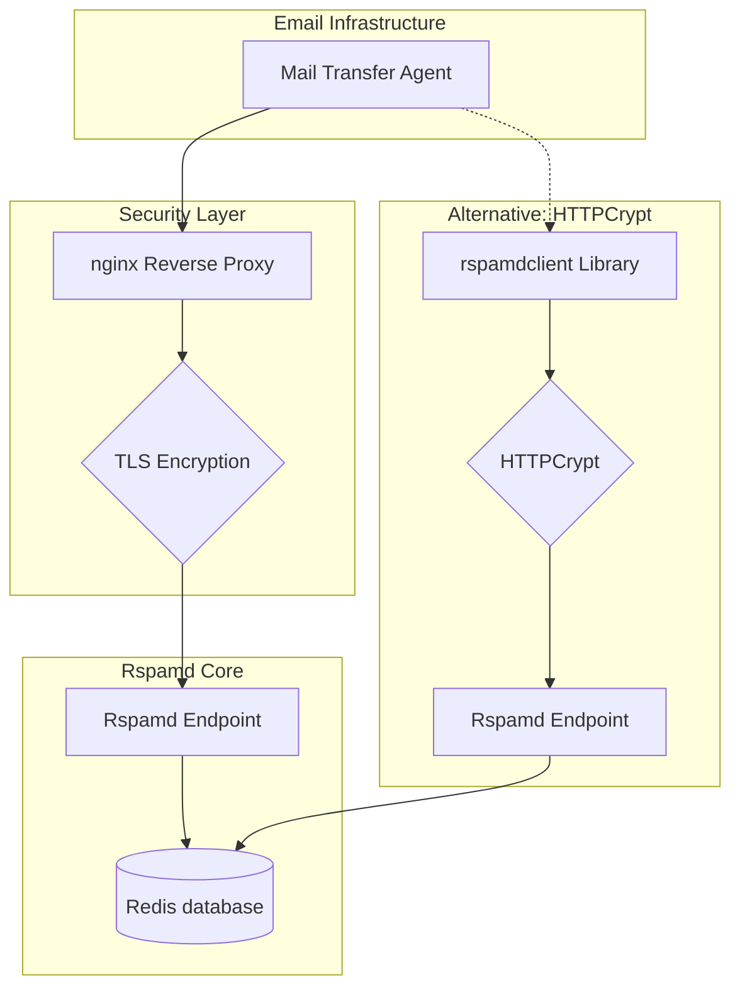
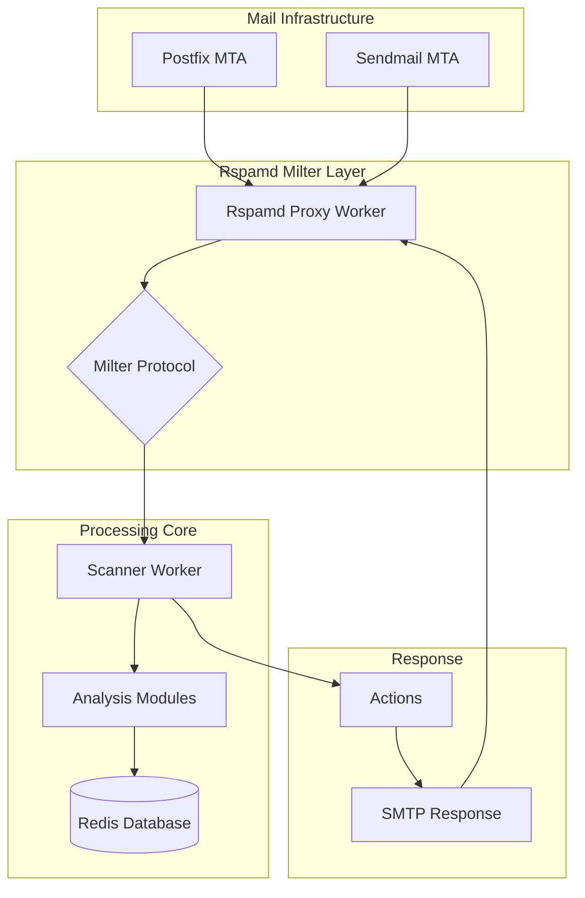

# MTA integration

Rspamd provides flexible integration options with mail transfer agents (MTAs) through two primary methods: **HTTP-based integration** and **Milter protocol integration**. Each method has its advantages and is suitable for different deployment scenarios.

## Integration Methods Overview

### HTTP-based Integration (Recommended)

HTTP integration is the **preferred method** when supported by your MTA, offering several advantages:

- **Enhanced Security**: Traffic can be secured using HTTPS through reverse proxies like nginx
- **Encrypted Communication**: HTTPCrypt protocol support via libraries like the [rspamdclient Rust library](https://github.com/rspamd/rspamdclient-rs)
- **Scalability**: Better load balancing and horizontal scaling capabilities
- **Network Flexibility**: Can work across different network segments and remote servers
- **Protocol Simplicity**: Standard HTTP/HTTPS protocols with JSON payloads

### Milter Protocol Integration

Milter integration is widely supported by traditional MTAs and offers:

- **Broad Compatibility**: Supported by Postfix, Sendmail, and other milter-compatible MTAs
- **Direct Integration**: Native integration without requiring HTTP libraries
- **Real-time Processing**: Stream-based processing during SMTP session
- **Legacy Support**: Works with older MTA configurations

## Integration Architecture Diagrams

### HTTP-based Integration with HTTPS Security



### Milter Protocol Integration



## Supported MTAs and Integration Methods

The table below shows integration options available for different MTAs:

| MTA | HTTP Integration | Milter Integration | License |
| --- | :--------------: | :----------------: | ------- |
| [Apache James](tutorials/integration#integration-with-apache-james) | ✅ | ❌ | Apache 2.0 |
| Axigen | ❌ | ✅ | Proprietary |
| Communigate Pro | ✅ | ❌ | Proprietary |
| [EmailSuccess](tutorials/integration#integration-with-emailsuccess-mta) | ✅ | ❌ | Proprietary |
| [**Exim**](tutorials/integration#integration-with-exim-mta) | ✅ | ❌ | GPL v2 |
| [Haraka](tutorials/integration#integration-with-haraka-mta) | ✅ | ❌ | MIT |
| [Maddy](https://maddy.email/reference/checks/rspamd) | ✅ | ❌ | GPL v3 |
| [OpenSMTPD](https://github.com/poolpOrg/filter-rspamd) | ✅ | ❌ | ISC, BSD |
| [**Postfix**](tutorials/integration#using-rspamd-with-postfix-mta) | ❌ | ✅ | IBM Public License |
| [Sendmail](tutorials/integration#using-rspamd-with-sendmail-mta) | ❌ | ✅ | Sendmail License |
| SmarterMail | ✅ | ❌ | Proprietary |
| [Stalwart Mail](tutorials/integration#integration-with-stalwart-mail-server) | ❌ | ✅ | AGPL v3 or Commercial |

:::tip Security Recommendation
When using HTTP integration, always implement HTTPS encryption using either:
- **nginx reverse proxy** with TLS certificates
- **HTTPCrypt protocol** for end-to-end encryption
- **VPN or private networks** for additional network security
:::

In addition to the primary integration methods, [LDA mode](#lda-mode) provides a versatile solution that can be employed by virtually any MTA for message processing.

## Using Rspamd with Postfix MTA

Starting with version 1.6, for integrating Rspamd with Postfix, it is recommended to utilize the Rspamd proxy worker in Milter mode, as described in [rspamd proxy worker](../workers/rspamd_proxy).

### Configuring Postfix

Configuring Postfix to scan messages using the milter protocol with the Rspamd daemon is straightforward:

```sh
#smtpd_milters = unix:/var/lib/rspamd/milter.sock
# or for TCP socket
smtpd_milters = inet:localhost:11332

# skip mail without checks if something goes wrong
milter_default_action = accept

# 6 is the default milter protocol version;
# prior to Postfix 2.6 the default protocol was 2.
# milter_protocol = 6
```

## Integration with exim MTA

Starting with version 4.86, Exim can integrate with Rspamd in a similar fashion as SpamAssassin. The diagram below illustrates the interaction between Exim and Rspamd:


For versions 4.70 through 4.84, integration can be enabled by applying a patch. In the Exim source directory, run the command: `patch -p1 < ../rspamd/contrib/exim/patch-exim-src_spam.c.diff`.

For version 4.85, the following command should be run from the `contrib/exim` directory in the Rspamd source directory:
`patch patch-exim-src_spam.c.diff < patch-exim-src_spam.c.diff.exim-4.85.diff`
Then, follow the steps above to apply the patch.

For versions 4.86 and 4.87, it is advisable to apply a patch to disable half-closed sockets. Run the command:
`patch -p1 < ../rspamd/contrib/exim/shutdown.patch`

Alternatively, you can set `enable_shutdown_workaround = true` in `$LOCAL_CONFDIR/local.d/options.inc`

Here is an example of the Exim configuration:

```sh
# This is the global (top) section of the configuration file
# Please note the variant parameter in spamd_address setting
spamd_address = 127.0.0.1 11333 variant=rspamd

acl_smtp_data = acl_check_spam

begin acl

acl_check_spam:
  # do not scan messages submitted from our own hosts
  # +relay_from_hosts is assumed to be a list of hosts in configuration
  accept hosts = +relay_from_hosts

  # skip scanning for authenticated users (if desired?)
  accept authenticated = *

  # scan the message with rspamd
  warn spam = nobody:true
  # This will set variables as follows:
  # $spam_action is the action recommended by rspamd
  # $spam_score is the message score (we unlikely need it)
  # $spam_score_int is spam score multiplied by 10
  # $spam_report lists symbols matched & protocol messages
  # $spam_bar is a visual indicator of spam/ham level

  # use greylisting available in rspamd v1.3+
  defer message    = Please try again later
        condition  = ${if eq{$spam_action}{soft reject}}

  deny  message    = Message discarded as high-probability spam
        condition  = ${if eq{$spam_action}{reject}}

  # Remove foreign headers
  warn remove_header = x-spam-bar : x-spam-score : x-spam-report : x-spam-status

  # add spam-score and spam-report header when "add header" action is recommended by rspamd
  warn
    condition  = ${if eq{$spam_action}{add header}}
    add_header = X-Spam-Score: $spam_score ($spam_bar)
    add_header = X-Spam-Report: $spam_report

  # add x-spam-status header if message is not ham
  # do not match when $spam_action is empty (e.g. when rspamd is not running)
  warn
    ! condition  = ${if match{$spam_action}{^no action\$|^greylist\$|^\$}}
    add_header = X-Spam-Status: Yes

  # add x-spam-bar header if score is positive
  warn
    condition = ${if >{$spam_score_int}{0}}
    add_header = X-Spam-Bar: $spam_bar

  accept
```

For further information please refer to the [Exim specification](https://www.exim.org/exim-html-current/doc/html/spec_html/), especially the [chapter about content scanning](https://www.exim.org/exim-html-current/doc/html/spec_html/ch-content_scanning_at_acl_time.html).

## Using Rspamd with Sendmail MTA

Sendmail can also utilize Rspamd through the milter protocol and the configuration process is similar to that of Postfix. An example of the Sendmail configuration is as follows:

	MAIL_FILTER(`rspamd', `S=inet:11332@localhost, F=T')
	define(`confINPUT_MAIL_FILTERS', `rspamd')

Once this is done, the standard procedure of compiling m4 to cf should be followed.

## Integration with Haraka MTA

The Haraka email server, version 2.7.0 and above, offers support for Rspamd through the [Haraka Rspamd plugin](https://haraka.github.io/plugins/rspamd/).

To activate this feature: run `npm install haraka-plugin-rspamd`, add `rspamd` to the `DATA` section of your `config/plugins` file and create a `config/rspamd.ini` file to suit your needs if needed.

For more information, see the [Haraka rspamd plugin documentation](https://haraka.github.io/plugins/rspamd/).

## Integration with EmailSuccess MTA

Support for rspamd is available from [EmailSuccess v11.19](https://www.emailsuccess.com/emailsuccess-introduces-rspamd-integration).

To enable it, navigate to the administration console and type `filter-module-set rspamd enabled true`. Customize your filtering options using the `filter-module-show rspamd` and `filter-module-set rspamd` commands to suit your preferences.

Additionally, you will need to enable the filter for each input interface (both SMTP and API) using the `input-set INPUT1 filter enabled`, `ws-set rest_filter true` and `ws-set soap_filter true` commands.

For further information, refer to the [EmailSuccess documentation](https://doc.emailsuccess.com).

## LDA mode

In LDA (Local Delivery Agent) mode, the MTA (Mail Transfer Agent) invokes the Rspamd client, `rspamc`, a message using Rspamd and appends the scan results to the source message. The overall process is illustrated in the following image:


To enable LDA mode, `rspamc` has the following options available:

- `--exec "/path/to/lda params"`: executes the binary specified to deliver modified message
- `--mime`: modify message instead of printing scan results only
- `--json`: optionally add the full output as base64 encoded `JSON`

Here is an example of using `rspamc` + `dovecot` as LDA implemented using `fetchmail`:

    mda "/usr/bin/rspamc --mime --exec \"/usr/lib/dovecot/deliver -d %T\""

In this mode, `rspamc` cannot reject or greylist messages, but it appends the following headers that can be used for further filtering by means of the LDA (for example, `sieve` or `procmail`):

- `X-Spam-Scanner`: name and version of rspamd
- `X-Spam`: has value `yes` if rspamd detects that a message as a spam (either `reject` or `add header` actions)
- `X-Spam-Action`: the desired action for a message (e.g. `no action`, `add header` or `reject`)
- `X-Spam-Result`: contains base64 encoded `JSON` reply from rspamd if `--json` option was given to `rspamc`

It's important to note that while this method can be used with any MTA (or even without an MTA), it has more overhead than other methods and cannot apply certain actions such as greylisting. However, greylisting could also be implemented using external tools.

## Integration with Apache James

Apache James can integrate Rspamd as an extension by customizing its mailbox listeners and mailet processing. 

Specifically, James utilizes the HTTP API to communicate with Rspamd, allowing it to query Rspamd during email processing (receiving or sending) and then decide whether to reject or accept the email. 

Additionally, James can also be used as a feedback source for enriching Rspamd's spam/ham database, through live feedback (via mailbox listener) or through a CRON batch job (by calling web-admin tasks). 

For further information, please refer to the James' extensions for Rspamd documentation on [GitHub](https://github.com/apache/james-project/tree/master/third-party/rspamd)

## Integration with Stalwart Mail Server

Rspamd can easily be integrated with Stalwart Mail Server using the `milter` protocol. In order to enable Milter support in rspamd, follow the instructions in the [proxy worker](../workers/rspamd_proxy) chapter.

After setting up the proxy worker to handle milter requests, configure Stalwart Mail Server to use rspamd via milter by adding the following entries to the `etc/config.toml` configuration file:

```toml
[session.data.milter."rspamd"]
enable = [ { if = "listener", eq = "smtp", then = true }, 
           { else = false } ]
hostname = "127.0.0.1"
port = 11332

[session.data.milter."rspamd".options]
tempfail-on-error = true
max-response-size = 52428800 # 50mb
version = 6
```

For more details please refer to the [milter filters](https://stalw.art/docs/smtp/filter/milter) documentation for Stalwart Mail Server.
