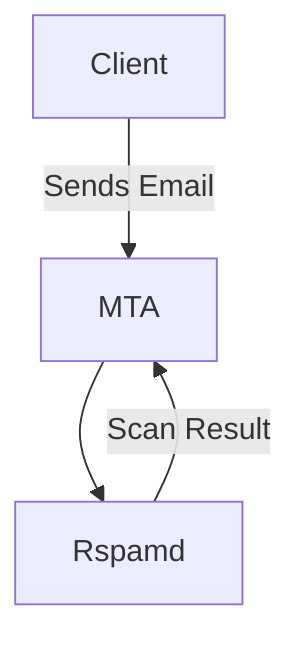

# Contributing to Rspamd Documentation

This guide explains how to contribute to the Rspamd documentation website, which is built using [Docusaurus](https://docusaurus.io/).

## Prerequisites

Before you begin, ensure you have the following installed:

- [Node.js](https://nodejs.org/) version 18.0 or above
- [Git](https://git-scm.com/)
- A text editor or IDE of your choice
- A GitHub account

## Getting Started

### 1. Fork and Clone the Repository

1. Fork the [docs.rspamd.com](https://github.com/rspamd/docs.rspamd.com) repository on GitHub
2. Clone your fork locally:

```bash
git clone https://github.com/YOUR-USERNAME/docs.rspamd.com.git
cd docs.rspamd.com
```

### 2. Install Dependencies

Install the required Node.js packages:

```bash
npm install
```

### 3. Run the Development Server

Start the local development server:

```bash
npm start
```

This will start a local server at `http://localhost:3000`. The site will automatically reload when you make changes to the documentation.

## Project Structure

```
docs.rspamd.com/
├── blog/               # Blog posts
├── docs/               # Documentation files
│   ├── about/         # About Rspamd
│   ├── configuration/ # Configuration guides
│   ├── modules/       # Module documentation
│   ├── tutorials/     # Tutorial content
│   └── ...           # Other documentation sections
├── src/               # Custom components and pages
├── static/            # Static assets (images, files)
├── docusaurus.config.js  # Site configuration
├── sidebars.js        # Sidebar navigation configuration
└── package.json       # Project dependencies
```

## Writing Documentation

### Creating New Pages

1. Add new Markdown files in the appropriate directory under `docs/`
2. Use the following frontmatter format at the beginning of each file:

```markdown
---
title: Your Page Title
description: Brief description of the page content
---

# Your Page Title

Your content here...
```

### Formatting Guidelines

- Use Markdown for all documentation
- Follow the existing structure and naming conventions
- Keep paragraphs concise and focused
- Use code blocks with appropriate language highlighting:

```lua
-- Lua example
local function example()
  return "Hello, Rspamd!"
end
```

### Adding Images

1. Place images in the `static/img/` directory
2. Reference them in your Markdown:

```markdown

```

### Internal Links

Docusaurus automatically handles internal links. Use relative paths without file extensions:

```markdown
<!-- Link to another doc -->
[Configuration Guide](/configuration/basic)

<!-- Link to a section in another doc -->
[Worker Configuration](/configuration/workers#normal-worker)
```

### External Links

External links work as usual in Markdown:

```markdown
[Rspamd GitHub](https://github.com/rspamd/rspamd)
```

## Advanced Features

### Admonitions

Use admonitions to highlight important information:

```markdown
:::note
This is a note
:::

:::tip
This is a tip
:::

:::warning
This is a warning
:::

:::danger
This is a danger warning
:::

:::info
This is an info box
:::
```

### Mermaid Diagrams

You can include Mermaid diagrams directly in your Markdown:

````markdown

````

### Code Tabs

For showing code in multiple languages or configurations:

````markdown
import Tabs from '@theme/Tabs';
import TabItem from '@theme/TabItem';

<Tabs>
  <TabItem value="lua" label="Lua" default>

```lua
-- Lua configuration
```

  </TabItem>
  <TabItem value="ucl" label="UCL">

```ucl
# UCL configuration
```

  </TabItem>
</Tabs>
````

## Testing Your Changes

### Local Testing

1. Run the development server and check your changes at `http://localhost:3000`
2. Navigate through your new/modified pages
3. Test all links to ensure they work correctly
4. Check that images load properly
5. Verify code syntax highlighting

### Building for Production

To test the production build locally:

```bash
npm run build
npm run serve
```

This will build the static site and serve it locally, allowing you to test the final output.

### Running tests and publishing preview with GitHub Actions

Alternatively, you can configure GitHub Actions to publish a GitHub Pages preview for each branch in your fork.

To enable GitHub Actions workflows:

1. On GitHub, navigate to your fork repository.
1. Under your repository name, click **Actions**, then click **I understand my workflows, go ahead and enable them**.

To configure your site for publishing from GitHub Actions:

1. On GitHub, navigate to your fork repository.
1. Under your repository name, click **Settings**.
1. In the "Code and automation" section of the left sidebar, click **Pages**.
1. Under "Build and deployment", set "Source" to **Deploy from a branch**, then choose the **gh-pages** branch and the **/ (root)** folder.

Your website will be accessible for each branch at:

```
https://<user>.github.io/<repository>/branches/<branch>/
```

GitHub Actions also creates a separate preview for each pull request:

```
https://<user>.github.io/<repository>/pr/<number>/
```

A comment with the preview link is automatically added to the pull request after the GitHub Pages deployment is complete — both for the initial PR and for subsequent updates.
If the site content hasn’t changed, the workflow exits early without posting a comment.

#### Cleaning up stale previews

To avoid accumulating outdated previews, a GitHub Actions workflow included in the repository:

- **On branch deletion** (same repo only) removes `branches/<branch>/` folders for branches that no longer exist.
- **On PR events** (`opened`, `reopened`, `synchronize`, or `closed`) removes any `pr/<number>/` folders whose PRs are no longer open.

> **Note:** The `delete` event only triggers this workflow if the workflow file is present in the repository’s default branch (usually `main` or `master`). If the workflow is in a non-default branch, branch deletions won’t trigger it.

No manual intervention is needed — stale previews are cleaned up automatically.

## Submitting Your Contribution

### 1. Commit Your Changes

```bash
git add .
git commit -m "Add/Update: Brief description of your changes"
```

### 2. Push to Your Fork

```bash
git push origin main
```

### 3. Create a Pull Request

1. Go to your fork on GitHub
2. Click "Pull Request"
3. Provide a clear description of your changes
4. Reference any related issues
5. Submit the pull request

## Style Guide

### Writing Style

- Use clear, concise language
- Write in the present tense
- Use active voice when possible
- Define technical terms on first use
- Include practical examples

### File Naming

- Use lowercase letters
- Separate words with underscores (e.g., `getting_started.md`)
- Be descriptive but concise

### Commit Messages

- Use present tense ("Add feature" not "Added feature")
- Be descriptive but concise
- Reference issues when applicable

## Common Tasks

### Updating the Sidebar

Edit `sidebars.js` to modify the navigation structure:

```javascript
module.exports = {
  docs: [
    {
      type: 'category',
      label: 'Your Category',
      items: ['your-doc-id', 'another-doc-id'],
    },
  ],
};
```

### Adding to the Changelog

Changelogs are managed in the `changelogs/` directory. Follow the existing format when adding new entries.

## Getting Help

If you need assistance:

1. Check the [Docusaurus documentation](https://docusaurus.io/docs)
2. Open an issue on the [docs.rspamd.com repository](https://github.com/rspamd/docs.rspamd.com/issues)
3. Join the Rspamd community discussions

## License

By contributing to the Rspamd documentation, you agree that your contributions will be licensed under the same license as the project.
